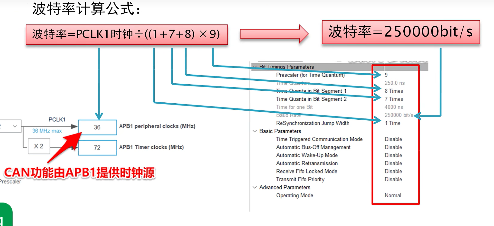
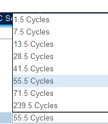
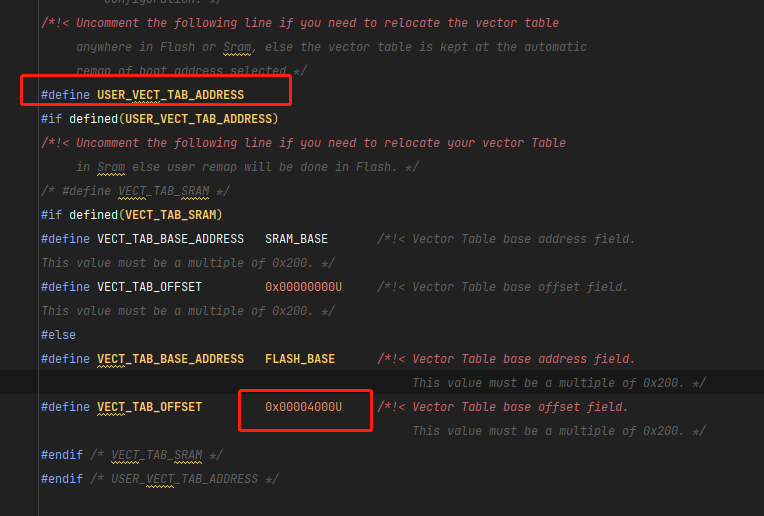
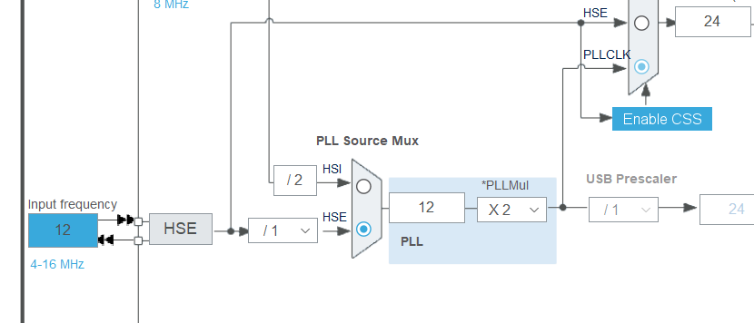
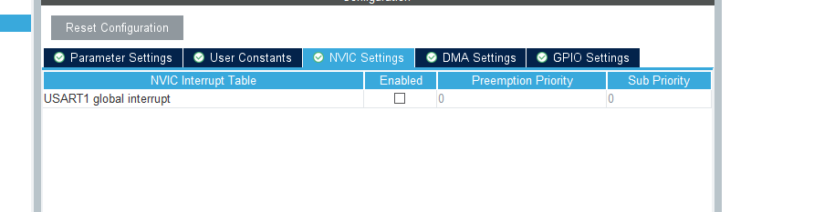
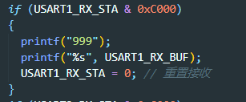
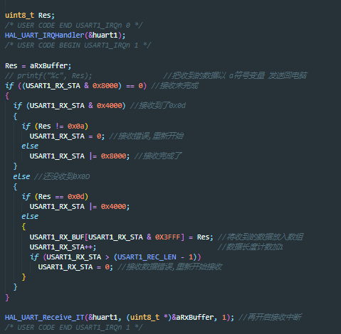
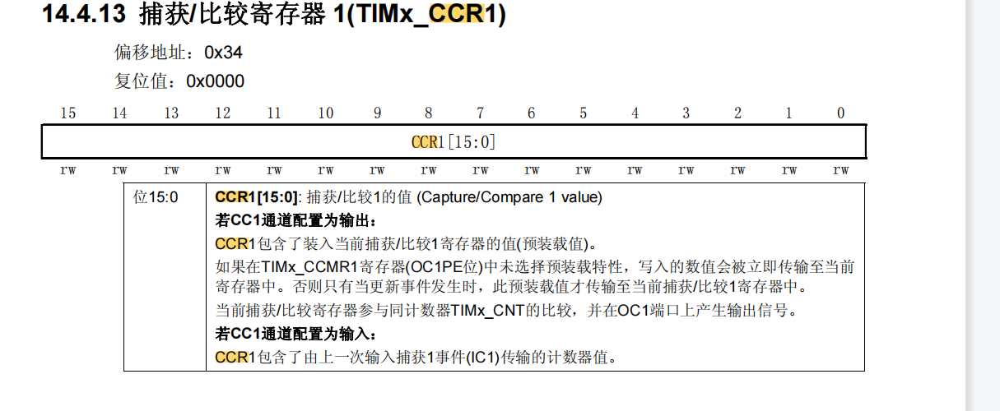
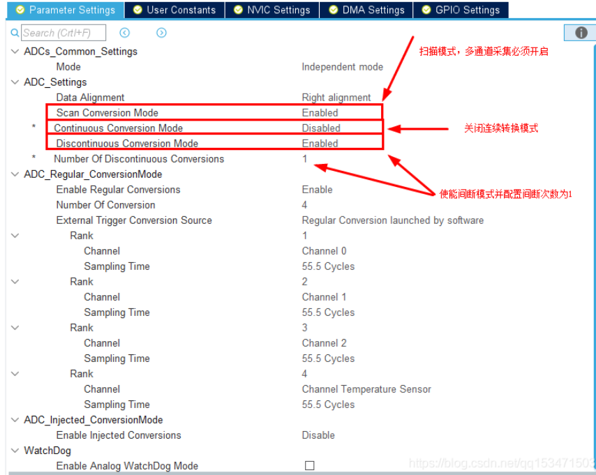

| 信息         | 内容                          |
| ------------ | ----------------------------- |
| **姓名**     | 黄远灿                        |
| **联系方式** | 18878448766                   |
| **邮箱**     | hthousandflame@gmail.com   |
| **Github**   | https://github.com/FlameKm |

# 单片机（STM32为主）

## 编码器

### 相关函数

```c
void TIM_EncoderInterfaceConfig(TIM_TypeDef* TIMx, uint16_t TIM_EncoderMode, uint16_t TIM_IC1Polarity, uint16_t TIM_IC2Polarity)
```

`TIMx`参数就是使用哪个定时器作为编码器接口的捕捉定时器.

`TIM_EncoderMode`参数是模式,是单相计数（只能反映速度）还是两相计数（速度和方向）.

`TIM_IC1Polarity`和`TIM_IC2Polarity`参数就是通道1、2的捕捉极性.


图 1-1

## PWM

### 注意事项


### 代码框架

```c
//TIM1 CH1 PWM 输出设置
//PWM 输出初始化
//arr：自动重装值
//psc：时钟预分频数
void TIM1_PWM_Init(u16 arr,u16 psc)
{
GPIO_InitTypeDef GPIO_InitStructure;
TIM_TimeBaseInitTypeDef TIM_TimeBaseStructure;
TIM_OCInitTypeDef TIM_OCInitStructure;
RCC_APB2PeriphClockCmd(RCC_APB2Periph_TIM1, ENABLE); //使能 TIMx 外设
RCC_APB2PeriphClockCmd(RCC_APB2Periph_GPIOB, ENABLE); //使能 PA 时钟
//设置该引脚为复用输出功能,输出 TIM1 CH1 的 PWM 脉冲波形
GPIO_InitStructure.GPIO_Pin = GPIO_Pin_8; //TIM1_CH1
GPIO_InitStructure.GPIO_Mode = GPIO_Mode_AF_PP; //复用功能输出
GPIO_InitStructure.GPIO_Speed = GPIO_Speed_50MHz;
GPIO_Init(GPIOA, &GPIO_InitStructure); //初始化 GPIO
TIM_TimeBaseStructure.TIM_Period = arr; //设置自动重装载周期值
TIM_TimeBaseStructure.TIM_Prescaler =psc; //设置预分频值 不分频
TIM_TimeBaseStructure.TIM_ClockDivision = 0; //设置时钟分割:TDTS = Tck_tim
TIM_TimeBaseStructure.TIM_CounterMode = TIM_CounterMode_Up; //向上计数
TIM_TimeBaseInit(TIM1, &TIM_TimeBaseStructure); //初始化 TIMx
TIM_OCInitStructure.TIM_OCMode = TIM_OCMode_PWM2; //CH1 PWM2 模式
TIM_OCInitStructure.TIM_OutputState = TIM_OutputState_Enable; //比较输出使能
TIM_OCInitStructure.TIM_Pulse = 0; //设置待装入捕获比较寄存器的脉冲值
TIM_OCInitStructure.TIM_OCPolarity = TIM_OCPolarity_Low; //OC1 低电平有效
TIM_OC1Init(TIM1, &TIM_OCInitStructure); //根据指定的参数初始化外设 TIMx
TIM_OC1PreloadConfig(TIM1, TIM_OCPreload_Enable); //CH1 预装载使能
TIM_ARRPreloadConfig(TIM1, ENABLE); //使能 TIMx 在 ARR 上的预装载寄存器
TIM_CtrlPWMOutputs(TIM1,ENABLE); //MOE 主输出使能,高级定时器必须开启
TIM_Cmd(TIM1, ENABLE); //使能 TIMx
}
```

## **复用功能**

中文手册105页

## 时钟

在STM32中

APB1(低速外设)上的设备有：电源接口、备份接口、CAN、USB、I2C1、I2C2、UART2、UART3、SPI2、窗口看门狗、Timer2、Timer3、Timer4 。

APB2(高速外设)上的设备有：GPIO_A-E、USART1、ADC1、ADC2、ADC3、TIM1、TIM8、SPI1、ALL。

具体参考时钟树

## CAN

参考链接

https://zhuanlan.zhihu.com/p/548772223

CAN不能与USB从设备同时使用，因为他们共用一组RAM，如果需要使用USB功能时，需要调用关闭CAN总线的初始化函数。需要使用CAN的时候，需要调用开启CAN总线的初始化函数。

在HAL库中，

```c
HAL_CAN_MspDeInit(&hcan); //关闭
HAL_CAN_MspInit(&hcan)； //初始化
```

### 标准帧

### 报文

报文是短帧结构，短的传送时间使其受干扰概率低，CAN有很好的校验机制，这些都保证了CAN通信的可靠性。

### 邮箱

有两个队列，fifo0和fifo1，每一个队列又存在三个邮箱BOX1-BOX3。

fifo0和fifo1不同的中断

### 波特率



波特率 = PCLK1时钟 / （（1 + 7 + 8）*9）

### 过滤器

### 模式

Lookback，用于测试代码，无法从接收外部数据

### **过滤器**

```c
static void CANFilter_Config(void)
{
    CAN_FilterTypeDef sFilterConfig;
    sFilterConfig.FilterBank = 0; //CAN过滤器编号，范围0-27
    sFilterConfig.FilterMode = CAN_FILTERMODE_IDMASK; //CAN过滤器模式，掩码模式或列表模式
    sFilterConfig.FilterScale = CAN_FILTERSCALE_32BIT; //CAN过滤器尺度，16位或32位
    sFilterConfig.FilterIdHigh = 0x000 << 5; //32位下，存储要过滤ID的高16位
    sFilterConfig.FilterIdLow = 0x0000; //32位下，存储要过滤ID的低16位
    sFilterConfig.FilterMaskIdHigh = 0x0000; //掩码模式下，存储的是掩码
    sFilterConfig.FilterMaskIdLow = 0x0000;
    sFilterConfig.FilterFIFOAssignment = 0; //报文通过过滤器的匹配后，存储到哪个FIFO
    sFilterConfig.FilterActivation = ENABLE; //激活过滤器
    sFilterConfig.SlaveStartFilterBank = 0;
    if (HAL_CAN_ConfigFilter(&hcan1, &sFilterConfig) != HAL_OK) {
        printf("CAN Filter Config Fail!rn");
        Error_Handler();
    }
    printf("CAN Filter Config Success!rn");
}
```

## **固件升级**

参考链接：

<https://zhuanlan.zhihu.com/p/73037424>

CMSIS-DAP调试器是有单独的一条复位线的，但是当时没考虑它可能采用了这种方式，只考虑可能采用了内核复位

## ADC

### 周期

采集固定12.5个周期，间隔可以选择，计算采样频率的时候为：ADC时钟频率/（55.5+12.2）

## BootLoad

### 跳转方式

```c
typedef void (*fp_t)(void);

__IO uint32_t BootloaderAddr = 0x08004000; *// 32k = 0x8000*

void jump_app()

{

volatile uint32_t jump_addr;

fp_t jump;

jump_addr = *(volatile uint32_t *) (BootloaderAddr + 4);

jump = (fp_t) jump_addr;

__set_MSP(*(volatile uint32_t *) BootloaderAddr);

jump();

}
```

此时可以跳转，但是跳转后会出现问题，笔者的开发环境下中断会在bootload程序中，可以定位问题为中断定位错误，解决方式是将APP程序的中断向量表进行偏移，具体方式请查看**中断向量表**一节。

上面值得注意的有跳转+4是表示前面有中断跳转，此时才是真正的main函数开端

### 跳转前准备

需要清除全部中断与中断标志位。

### 程序烧录XModem、YModem

两种烧录协议

## 中断向量表

更改中断向量表起始地址，需要取消注释，并修改偏移地址，修改的文件为system_stm32f1xx.c。



stm32cube+clion环境中，修改.ld文件可以修改烧录起始地址


# STM32Cube MX

## 初尝试

### 晶振配置



### 工程


## 串口

原文链接：<https://blog.csdn.net/as480133937/article/details/99073783>

### 配置


### 中断



### HAL库UART函数库介绍

UART结构体定义

`UART_HandleTypeDef huart1;`

UART的名称定义，这个结构体中存放了UART所有用到的功能，后面的别名就是我们所用的uart串口的别名，默认为huart1

### UART接收中断

原文链接：

<https://blog.csdn.net/as480133937/article/details/99073783>

中断函数

`void HAL_UART_RxCpltCallback(UART_HandleTypeDef *huart)`

### 串口发送/接收函数

`HAL_UART_Receive_IT(&huart1, (uint8_t *)&aRxBuffer, 1)` 

`HAL_UART_Transmit()` //串口发送数据，使用超时管理机制

`HAL_UART_Receive()`//串口接收数据，使用超时管理机制

`HAL_UART_Transmit_IT()` //串口中断模式发送

`HAL_UART_Receive_IT()` //串口中断模式接收

`HAL_UART_Transmit_DMA()`//串口DMA模式发送`

`HAL_UART_Transmit_DMA()`//串口DMA模式接收

这几个函数的参数基本都是一样的，我们挑两个讲解一下

串口发送数据：

`HAL_UART_Transmit(UART_HandleTypeDef *huart, uint8_t *pData, uint16_t Size, uint32_t Timeout)`

功能：串口发送指定长度的数据。如果超时没发送完成，则不再发送，返回超时标志（HAL_TIMEOUT）。

参数：

`UART_HandleTypeDef *huart `UATR的别名

 如 : UART_HandleTypeDef huart1; 别名就是`huart1`

`*pData` 需要发送的数据

`Size` 发送的字节数

`Timeout` 最大发送时间，发送数据超过该时间退出发送

举例：` HAL_UART_Transmit(&huart1, (uint8_t *)ZZX, 3, 0xffff);`//串口发送三个字节数据，最大传输时间0xffff

中断接收数据：

`HAL_UART_Receive_IT(UART_HandleTypeDef *huart, uint8_t *pData, uint16_t Size)`

功能：串口中断接收，以中断方式接收指定长度数据。

大致过程是，设置数据存放位置，接收数据长度，然后使能串口接收中断。接收到数据时，会触发串口中断。

再然后，串口中断函数处理，直到接收到指定长度数据，而后关闭中断，进入中断接收回调函数，不再触发接收中断。(只触发一次中断)

### 重新定义printf函数

在 stm32f4xx_hal.c中包含#include <stdio.h>

在 stm32f4xx_hal.c 中重写fget和fput函数

```c
#include "stm32f4xx_hal.h"
#include <stdio.h>
extern UART_HandleTypeDef huart1; //声明串口

/**
* 函数功能: 重定向c库函数printf到DEBUG_USARTx
* 输入参数: 无
* 返 回 值: 无
* 说 明：无
*/
int fputc(int ch, FILE *f)
{
    HAL_UART_Transmit(&huart1, (uint8_t *)&ch, 1, 0xffff);
    return ch;
}
/**
* 函数功能: 重定向c库函数getchar,scanf到DEBUG_USARTx
* 输入参数: 无
* 返 回 值: 无
* 说 明：无
*/
int fgetc(FILE *f)
{
    uint8_t ch = 0;
    HAL_UART_Receive(&huart1, &ch, 1, 0xffff);
    return ch;
}
```

### 串口再使用的笔记

配置好需主动开启中断


通过自己写的函数实现获取数据

注意最后一句



文件在stm32f1xx_it.c和stm32f1xx_it.h里面



注意再调用

###  DMA串口使用

**配置**


Normal正常模式，DMA发送一次就停止发送；

Circular循环模式，会一直发送数据；

**发送函数:**

``HAL_UART_Transmit_DMA( &huart6, (uint8_t *)"hello DISCO by DMArn", sizeof("hello DISCO by DMArn") );``

**注意事项:**

打开DMA会自动开启DMA中断,此时应该打开对应串口中断。

## PWM




`HAL_TIM_PWM_Start(&htim1,TIM_CHANNEL_1);`


or

`__HAL_TIM_SetCompare(&htim3, TIM_CHANNEL_1, pwmVal);`

## ADC

### 单通道采样（不用DMA）


使用函数

Init：

`HAL_ADCEx_Calibration_Start(&hadc1);`

Begin：

```c
HAL_ADC_Start(&hadc1);//启动ADC转换
HAL_ADC_PollForConversion(&hadc1, 50);//等待转换完成，50为最大等待时间，单位为ms
```

Get：

```c
if (HAL_IS_BIT_SET(HAL_ADC_GetState(&hadc1), HAL_ADC_STATE_REG_EOC)) {
    adcValue = HAL_ADC_GetValue(&hadc1); //获取AD值
    logi("ADC1 Reading : %d", adcValue);
}
```

### 多通道（非DMA）



如图设置，只需要按照1的方法多次读取即可。

轮询读取

### 多通道（DMA）

#### 配置

需要先**开启连续转换模式**


1.  高级优先级

2.  循环模式，读取完成后继续重新读取。

3.  勾选寄存器模式：如果不勾选，每次都只存放在一个寄存器。勾选后，每次存放的地址增加

4.  16位宽带寄存器，12位的ADC足够。

#### 使用

Init：

```C
HAL_ADCEx_Calibration_Start(&hadc1); //校准
uint16_t adcValue[2];
HAL_ADC_Start_DMA(&hadc1, (uint32_t*)adcValue, 2);
```

Get：

直接使用数据。

#### 注意

1.  自动生成的DMA和ADC的初始化顺序不能相反。先DMA再ADC


2.  小心一直进入中断！

3.  传输的数值选择的是半字节的话，需要对应的内存去存储

## IIC

默认配置即可

发送函数

方法一

```c
while (HAL_I2C_Mem_Write(&hi2c1, 0x78, 0x00,I2C_MEMADD_SIZE_8BIT, &IIC_Command,sizeof(IIC_Command), 10) != HAL_OK) {
    if (HAL_I2C_GetError(&hi2c1) != HAL_I2C_ERROR_AF) {
    Error_Handler();
    }
}
```

方法二

发送单个数据,数据的第一个数据为内存地址

0x78是设备地址

`HAL_I2C_Master_Transmit(&hi2c1,0x78, c, *sizeof*(c), 10)`

方法三

需要在CUBEMX配置slave的地址

```c
uint8_t c[2] = {0x40, IIC_Data};
HAL_I2C_Slave_Transmit(&hi2c1, c, *sizeof*(c), 10);
```

## 定时器

定时器回调函数：

`void HAL_TIM_PeriodElapsedCallback(TIM_HandleTypeDef *htim)`

中断

`HAL_TIM_Base_Start_IT`

PWM

`HAL_TIM_PWM_Start`

## CAN

### 时钟

使用APB1时钟


### 发送

添加到邮箱

`HAL_StatusTypeDef HAL_CAN_AddTxMessage(CAN_HandleTypeDef *hcan, const CAN_TxHeaderTypeDef *pHeader, const uint8_t aData[], uint32_t *pTxMailbox)`

### 中断

# FREERTOS

Clion编译问题

```cmake
add_compile_options(-mfloat-abi=hard -mfpu=fpv4-sp-d16)
add_link_options(-mfloat-abi=hard -mfpu=fpv4-sp-d16)
```

这两行需要反注释,在CMAKE中

## **调度**

FreeRTOS 使用的是优先级抢占式调度算法。这意味着任务的优先级决定了它们被调度的顺序，优先级高的任务能够抢占正在执行的优先级低的任务。这种调度算法允许高优先级的任务在有需要的时候立即抢占 CPU 控制权，从而满足实时系统的需求。

高低优先级：抢占式

同等优先级：时间片

## 时间

### 绝对的延迟时间

源码中：

`TickType_t xLastWakeTime = xTaskGetTickCount()` //获取当前时间

`vTaskDelayUntil(&xLastWakeTime，3000)` //延时3秒

CUBEMX中 osTask


需要开启才可使用 本大点中的1，2点

### pdMS_TO_TICKS(ms)

这个宏的意义是将ms时间转换为ticks，当然在hal库生成的osdelay已经自动转换了，就可以不用使用这个宏。

### 获取当前时刻函数

`uint32_t xTaskGetTickCount()`

## 软件定时器

CUBEMX配置时候需要在Config parameters中开启Software timer definitions


freeRtos源码生成

```c
lockHandle = xTimerCreate("Lock Car",
                        2000,
                        pdFALSE,
                        (void *)0,
                        lockCarCallback);
                        checkHandle = xTimerCreate("Sensors Check",
                        100,
                        pdTRUE,
                        (void *)1,
                        checkCallback);
//必须要在 portMAX_DELAY 内开启 timer start
//portMAX_DELAY is listed as value for waiting indefinitely
//实际上0xFFFFFFFF 2^32-1 49天 7周
//在此期间，此task进入Block状态
xTimerStart(checkHandle, portMAX_DELAY);
```

## 多任务变量

1.  参数指针

CUBEMX生成时候选择指针名字(似乎不太方便)

即第三点的第四小点`pvParameters`

2.  锁住（相互排斥 Mutex）


不管是读操作还是写操作，它都各自是一个独立的task，这样用freertos运行多任务就会出现某个任务因为分配的时间到了，对数据的处理被迫中断，然后另一个任务又开始对数据进行操作，而这时的数据很可能只有一半是操作完成，另一半还未完成的状态，这样的数据状态会产生很大的运算错误，非常危险。所以一个参数只要有两个或以上task要对其进行操作，就必须上钥匙。

```c
SemaphoreHandle_t xHandler; //创建Handler
xHandler = xSemaphoreCreateMutex(); //创建一个MUTEX 返回NULL，或者handler
xSemaphoreGive(xHandler);// 释放
xSemaphoreTake(xHanlder, timeout); //指定时间内获取信号量 返回pdPASS, 或者pdFAIL
```

**一段不完整代码举例**

```c
SemaphoreHandle_t xMutexInventory = NULL;
void retailTask(void *pvParam) {
    while (1) {
        if (xSemaphoreTake(xMutexInventory, timeOut) == pdPASS) {
            //被MUTEX保护的内容叫做 Critical Section
            retailSale
            //释放钥匙
            xSemaphoreGive(xMutexInventory);
        }
    }
}
void onlineTask(void *pvParam) {
	while (1) {
    	if (xSemaphoreTake(xMutexInventory, timeOut) == pdPASS) {
            onlineSale(); //等待出售
            xSemaphoreGive(xMutexInventory);
    	}
	}
}
void setup() {
    // put your setup code here, to run once:
    Serial.begin(115200);
    xMutexInventory = xSemaphoreCreateMutex(); //创建MUTEX
    ...//创建任务
}
```

## 对CUBEMX创建的FreeRtos封装理解

```c
osThreadDef(task_main, Task_Main, osPriorityIdle, 0, 128);
task_mainHandle = osThreadCreate(osThread(task_main), NULL);
```

第一句的宏表示定义一个名为task_main的结构体，**osThread**(task_main)为获取结构体名字。通过结构体在osThreadCreate中使用常规的函数xTaskCreateStatic() 进行任务初始化。

## 任务管理

### 使用FreeRTOS源码创建任务

点击进入代码 [FREERTOS - TASK管理 - Wokwi Arduino and ESP32 Simulator](https://wokwi.com/projects/332867530330735188)

```c
/*任务创建函数*/
BaseType_t xTaskCreate(
    TaskFunction_tp vTaskCode, //函数指针
    const char * constpcName, //任务描述
    unsigned short usStackDepth, //堆栈大小
    void *pvParameters, //参数指针
    UBaseType_t uxPriority, //任务优先级
    TaskHandle_t *pvCreatedTask //回传句柄
);
```

1.  pvTaskCode： 函数指针，指向任务函数的入口。任务永远不会返回（位于死循环内）。该参数类型 TaskFunction_t 定义在文件 projdefs.h 中，定义为：typedef void(*TaskFunction_t)( void * ) ，即参数为空指针类型并返回空类型。

2.  pcName： 任务描述。主要用于调试。字符串的最大长度（包括字符串结束字符）由宏 configMAX_TASK_NAME_LEN 指定，该宏位于 FreeRTOSConfig.h 文件中。

3.  usStackDepth： 指定任务堆栈大小，能够支持的堆栈变量数量（堆栈深度），而不是字节数。比如，在 16 位宽度的堆栈下，usStackDepth 定义为 100，则实际使用 200 字节堆栈存储空间。堆栈的宽度乘以深度必须不超过 size_t 类型所能表示的最大值。比如，size_t 为16位，则可以表示堆栈的最大值是 65535 字节。这是因为堆栈在申请时是以字节为单位的，申请的字节数就是堆栈宽度乘以深度，如果这个乘积超出 size_t 所表示的范围，就会溢出。

4.  pvParameters： 指针，当任务创建时，作为一个参数传递给任务。

5.  uxPriority： 任务的优先级。具有 MPU 支持的系统，可以通过置位优先级参数的 portPRIVILEGE_BIT 位，随意的在特权（系统）模式下创建任务。比如，创建一个优先级为 2 的特权任务，参数 uxPriority 可以设置为 2 或者 portPRIVILEGE_BIT 。

6.  pvCreatedTask： 用于回传一个句柄（ID），创建任务后可以使用这个句柄引用任务。

举个例子，需要创建一个任务

```c
TaskHandle_t Task1_Handle;//1.定义一个句柄
void Task_1(void *arg);//2.对任务函数进行声明
xTaskCreate(Task_1, "Task1", 256, NULL, 6, &Task1_Handle);//3.创建任务
void Task_1(void *arg){
    for (;;) {
    	//3.函数内容
    }
}
```

例如

```c
if (xTaskCreate(radioBilibili, "Bilibili Channel", 1024 * 8, NULL, 1, &biliHandle) == pdPASS){}
```

### 任务删除

`void vTaskDelete( TaskHandle_t xTask );`

如何任务是用xTaskCreate()创建的，那么在此任务被删除以后此任务之前申请的堆栈和控制块和控制内存会在空闲任务中被释放掉，因此当调用函数vTaskDelete()删除任务以后必须给空闲任务一定的运行时间。

### 任务暂停

`void vTaskSuspend( TaskHandle_t xTaskToSuspend );`

### 任务恢复

`void vTaskResume( TaskHandle_t xTaskToResume );`

### 注意

以上所有任务共同配合时，可以使用`TaskHandle_t biliHandle = NULL`; //Task Handler一个handle

注意在删除任务前，一定要确保任务是存在的

删除不存在的任务，比如连续删除两次，自动重启

创建时需要判断是否之前已经创建了Bilibili channel task， 如果没有创建，则创建该Task

## 任务优先级

[**FREERTOS - 任务优先级 - Wokwi Arduino and ESP32 Simulator**](https://wokwi.com/projects/332897591021797971)

### 设置

`vTaskPrioritySet(xFirstClassHandle, 2);`

### 创建任务附带优先级

`xTaskCreatePinnedToCore(ecoClass, "ecoClass", 1024 * 2, NULL, 1, NULL, 1);`

### 资源退让

`taskYIELD();`//资源退让给同等级或者更高级的任务

### 查询当前任务优先级

`UBaseType_t uTaskPriority = uxTaskPriorityGet(NULL);`

## 信号量

### 二进制信号量

```c
SemaphoreHandle_t xSemaName = NULL; //创建信号量Handler
xSemaName = xSemaphoreCreateBinary(); //创建二进制信号量
if (xSemaphoreTake( xSemaLED, timeOut) == pdTRUE )//获得了信号量过来则进入
	xSemaphoreGive(xSemaLED); //正常给出信号
xSemaphoreGiveFromISR(xSemaLED, NULL); //外设中断给出信号
```

二进制信号量的好处是,等待的时候会执行其它程序,相比单纯的bool数据,它优点很多

### 计数信号量

```c
SemaphoreHandle_t xSemaName = NULL;
xSemaName = xSemaphoreCreateCounting(3, 0); //3表示上限,0表示初始值
if (xSemaphoreTake(xSemaPhone, portMAX_DELAY) == pdTRUE ) //portMAX_DELAY表示无限等待
xSemaphoreGive(xSemaPhone);
```

## 事件组

**能不用就不用**

### 等待

[FREERTOS - EVENTS WAIT BITS - Wokwi Arduino and ESP32 Simulator](https://wokwi.com/projects/333436492452987474)

```c
// 初始化
EventGroupHandle_t xEventPurchase = NULL; //创建event handler(全局变量)
xEventPurchase = xEventGroupCreate(); //创建 event group

// 等待函数
uxBits = xEventGroupWaitBits (xEventPurchase, //Event Group Handler
                            ADDTOCART_0 | PAYMENT_1 | INVENTORY_2,//等待Event Group中的那个Bit(s)
                            pdFALSE, //执行后，对应的Bits是否重置为 0
                            pdTRUE, //等待的Bits判断关系 True为 AND, False为 OR
                            xTimeOut);
uxBits = xEventGroupSetBits(xEventPurchase, PAYMENT_1); // 将bit1 PAYMENT_1 设置为
```


### 同步SYNC

[FREERTOS - EVENTS SYNC - Wokwi Arduino and ESP32 Simulator](https://wokwi.com/projects/333430026744627794)

```c
uxBits = xEventGroupSync (xEventPurchase, //Event Group Handler
                          0x01, // 先将这个bit(s)设置为 1,然后再等待
                          0x07, //等待这些bits为 1
                          xTimeOut);
if ((uxBits & BOUGHT_PAID_SENT) == BOUGHT_PAID_SENT) {
//next step;
}
```

这个是设置某个位后等待

## 任务通知

### 创建

```c
TaskHandle_t xflashLED = NULL;//全局变量
xTaskCreate(flashLED, "Flash LED", 1024 * 4, NULL, 1, &xflashLED);
```

### 取代二进制信号量

```c
//命令含义，相当于精简化的 xTaskNotify() + eIncrement
xTaskNotifyGive(xflashLED);
uint32_t ulNotificationValue; //用于获取数值

//命令含义: waitting for notification, then reset
ulNotificationValue = ulTaskNotifyTake(pdTRUE, //pdTRUE 运行完后，清零
portMAX_DELAY);
if ( ulNotificationValue > 0 ){
//Do something
}
```

### 取代信号组

```c
// 任务一中:
xTaskNotify(TaskHandle,.0b01,eSetBits);

// 任务二中:
xTaskNotiffy(TaskHandle,.0b10,eSetBits);

// 任务三中
xTaskNotifyWait(0x00000000,//进入前不清除
                0xFFFFFFFF, //进入后全部清除
                &num, //传入到NUM
                portMAX_DELAY
);
//or
xTaskNotifyWait(0x0, 0x0, &num, portMAX_DELAY);
    if (num == 0b11){
}
```

### 模拟队列

只能模拟长度为一的队列

## 消息队列

动态创建

```c
QueueHandle_t xQueueCreate(UBaseType_t uxQueueLength, UBaseType_t uxItemSize);
//传入参数（队列长度，每个数据的大小：以字节为单位）
//返回 非零：创建成功返回消息队列的句柄 NULL：创建失败
```

静态创建

```c
QueueHandle_t xQueueCreateStatic(UBaseType_t uxQueueLength,
                                 UBaseType_t uxItemSize,
                                 uint8_t *pucQueueStorageBuffer,
                                 StaticQueue_t *pxQueueBuffer);
```

队列清空

```c
BaseType_t xQueueReset( QueueHandle_t pxQueue);//传入队列句柄即可
```

删除队列

```c
void vQueueDelete( QueueHandle_t xQueue );//传入队列句柄即可
```

写队列

```c
BaseType_t xQueueSend(QueueHandle_t xQueue,const void *pvItemToQueue,TickType_t xTicksToWait);

BaseType_t xQueueSendToBack(QueueHandle_t xQueue,const void *pvItemToQueue,TickType_t xTicksToWait);

// 中断写入(保护线程)
BaseType_t xQueueSendToBackFromISR(QueueHandle_t xQueue,const void *pvItemToQueue,BaseType_t, *pxHigherPriorityTaskWoken);

BaseType_t xQueueSendToFrontFromISR(QueueHandle_t xQueue,const void *pvItemToQueue,BaseType_t, *pxHigherPriorityTaskWoken);
```

读队列

```c
BaseType_t xQueueReceive( QueueHandle_t xQueue,void * const pvBuffer,TickType_t xTicksToWait );

// 中断读
BaseType_t xQueueReceiveFromISR(QueueHandle_t xQueue, void *pvBuffer,BaseType_t *pxTaskWoken);

// 偷窥--获得当前数据
BaseType_t xQueuePeek(QueueHandle_t xQueue,void * const pvBuffer,TickType_t xTicksToWait);

//中断
BaseType_t xQueuePeekFromISR(QueueHandle_t xQueue, void *pvBuffer)
```

查询

```c
UBaseType_t uxQueueMessagesWaiting( const QueueHandle_t xQueue );//返回队列中可用数据的个数

UBaseType_t uxQueueSpacesAvailable( const QueueHandle_t xQueue );//返回队列中可用空间的个数
```


# **计算机语言**

## **C语言**

### 优先级

| 优先级 | 运算符                                                       | 结合律   |
| ------ | ------------------------------------------------------------ | -------- |
| 1      | 后缀运算符：[]   ()   ·   ->   ++   --(类型名称){列表}       | 从左到右 |
| 2      | 一元运算符：++   --   !   ~   +   -   *   &   sizeof_Alignof | 从右到左 |
| 3      | 类型转换运算符：(类型名称)                                   | 从右到左 |
| 4      | 乘除法运算符：*   /   %                                      | 从左到右 |
| 5      | 加减法运算符：+   -                                          | 从左到右 |
| 6      | 移位运算符：<<   >>                                          | 从左到右 |
| 7      | 关系运算符： <  <=   >  >=                                   | 从左到右 |
| 8      | 相等运算符：==   !=                                          | 从左到右 |
| 9      | 位运算符 AND：&                                              | 从左到右 |
| 10     | 位运算符 XOR：^                                              | 从左到右 |
| 11     | 位运算符 OR：\|                                              | 从左到右 |
| 12     | 逻辑运算符 AND：&&                                           | 从左到右 |
| 13     | 逻辑运算符 OR：\|\|                                          | 从左到右 |
| 14     | 条件运算符：?:                                               | 从右到左 |
| 15     | 赋值运算符：   =     +=     -=    *=    /=    %=    &=    ^=    \|=   <<=    >>= | 从右到左 |
| 16     | 逗号运算符：，                                               | 从左到右 |

### qsort

函数用法

```c
qsort(buf, n, sizeof(int16_t), filter_cmp);
```

`filter_cmp`是比较函数

具体为

```c
int openmv_filter_cmp(const void *a, const void *b) {
	return (*(int16_t *) a - *(int16_t *) b);
}
```

这个表示：

a > b的话则替换，即从小到大排序

### 数据类型

wchar_t 直译过来是宽字符，在linux系统中4字节，在windows中2字节

参考链接：[*https://zh.wikipedia.org/wiki/%E5%AF%AC%E5%AD%97%E5%85%83*](https://zh.wikipedia.org/wiki/%E5%AF%AC%E5%AD%97%E5%85%83)

### 编译器优化

| 优化等级 | 优化内容                                                     |
| :--------: | ------------------------------------------------------------ |
|    -O1     | 在不影响编译速度的前提下，尽量采用一些优化算法降低代码大小和可执行代码的运行速度。 |
|    -O2     | 该优化选项会牺牲部分编译速度，除了执行-O1所执行的所有优化之外，还会采用几乎所有的目标配置支持的优化算法，用以提高目标代码的运行速度。 |
|    -O3     | 该选项除了执行-O2所有的优化选项之外，一般都是采取很多向量化算法，提高代码的并行执行程度，利用现代CPU中的流水线，Cache等。这个选项会提高执行代码的大小，当然会降低目标代码的执行时间。 |
|    -Os     | 这个选项是在-O2的基础之上，尽量的降低目标代码的大小，这对于存储容量很小的设备来说非常重要。 |
|   -Ofast   | 该选项将不会严格遵循语言标准，除了启用所有的-O3优化选项之外，也会针对某些语言启用部分优化。 |
|    -Og     | 该标识会精心挑选部分与-g选项不冲突的优化选项，当然就能提供合理的优化水平，同时产生较好的可调试信息和对语言标准的遵循程度。 |

## **JAVA**

### 安装

```shell
sudo apt install openjdk-xx-jdk
```

### 选择版本

```shell
sudo update-alternatives --config java
```

## OOP FOR C++

### 多态

参考链接：[override finial - 多态 - Wokwi Arduino and ESP32 Simulator](https://wokwi.com/projects/336414219117265492)

精简做法：

父类: `virtual` 放在 函数 + `destructor`

子类: `override` 放在 函数

推荐：

父类: `virtual` 放在 函数 + `destructor`

子类:` virtual` 放在 函数 + `destructor`， `override` 放在 函数

# **数据结构和算法**

## 抽象数据类型ATD

参考链接：

<https://book.itheima.net/course/223/1276707762369208322/1276707936655122434>

抽象数据类型有两个重要特征：数据抽象和数据封装。

能够很大程度上实现代码的**移植性、通用性和拓展性**。

所谓数据抽象是指用ADT描述程序处理的实体时，强调的是其本质的特征，无论内部结构如何变化，只要本质特性不变，就不影响其外部使用。例如，在程序设计语言中经常使用的数据类型int，它就可以理解为是一个抽象数据类型，在不同的计算机或操作系统中，它的实现方式可能会有所不同，但它本质上的数学特性是保持不变的， int类型的数据指的是整数，可以进行加减乘除模等一些运算，int类型数据的这些数学特性保持不变，那么在编程者来看，它们都是相同的。因此数据抽象的意义在于数据类型的数学抽象特性。

而另一方面，所谓的数据封装是指用户在软件设计时从问题的数学模型中抽象出来的逻辑数据结构和逻辑数据结构上的运算，需要通过固有数据类型（高级编程语言中已实现的数据类型）来实现，它在定义时必须要给出名字及其能够进行的运算操作。一旦定义了一个抽象数据类型，程序设计中就可以像使用基本数据类型那样来使用它。例如，在统计学生信息时，经常会使用姓名、学号、成绩等信息，我们可以定义一个抽象数据类型“student”，它封装了姓名、学号、成绩三个不同类型的变量，这样我们操作student的变量就能很方便地知道这些信息了。C语言中的结构体以及C++语言中的类等都是这种形式。

## **PID算法**

### P（比例）

比例控制

### I（积分）

误差累计

### D（微分）

PD控制:``U(t) = Kp * err(t) + Kd * derr(t)/dt``

### 增量式和位置式

参考链接：[(70条消息) 位置式PID与增量式PID区别浅析_Z小旋的博客-CSDN博客_增量式pid和位置式pid的区别](https://blog.csdn.net/as480133937/article/details/89508034)

增量式


位置式


**位置式PID优缺点：**

**优点：**

位置式PID是一种非递推式算法，可直接控制执行机构（如平衡小车），u(k)的值和执行机构的实际位置（如小车当前角度）是一一对应的，因此在执行机构不带积分部件的对象中可以很好应用

**缺点：**

每次输出均与过去的状态有关，计算时要对e(k)进行累加，运算工作量大。

**增量式PID优缺点**：

优点：

1. 误动作时影响小，必要时可用逻辑判断的方法去掉出错数据。

2. 手动/自动切换时冲击小，便于实现无扰动切换。当计算机故障时，仍能保持原值。

3. 算式中不需要累加。控制增量Δu(k)的确定仅与最近3次的采样值有关。

缺点：

1. 积分截断效应大，有稳态误差；

2. 溢出的影响大。有的被控对象用增量式则不太好；

### 调参口诀

**实际应用，进行PID参数调节时，一般使用试凑法，PID参数整定口诀如下：**

参数整定找最佳，从小到大顺序查，

先是比例后积分，最后再把微分加，

曲线振荡很频繁，比例度盘要放大，

曲线漂浮绕大湾，比例度盘往小扳，

曲线偏离回复慢，积分时间往下降，

曲线波动周期长，积分时间再加长，

曲线振荡频率快，先把微分降下来，

动差大来波动慢，微分时间应加长，

理想曲线两个波，前高后低4比1，

一看二调多分析，调节质量不会低。

## 环形缓冲区

### 裸机中利用DMA使用环形缓冲区实现异步发送


```c
/* 定义数据 */
static uint8_t uart_buffer[UART_BUFFER_SIZE];
static uint16_t left, right;
static uint16_t pack_size; //每次出队个数
/**
* 发送中断回调,用于维护环形缓冲区
* @param huart
* @param size
*/
void HAL_UART_TxCpltCallback(UART_HandleTypeDef *huart)
{
    if (huart == uart_handle) {
        left = (left + pack_size) % UART_BUFFER_SIZE;
        transmit_mutex = false;
        if (left != right) { //检查环形队列中是否还有数据
            uart_transmit_start();
        }
    }
}
/**
* 发送当前需要发送的数据
* @return
*/
static int uart_transmit_start()
{
    HAL_StatusTypeDef ret;
    if (transmit_mutex == true) {
    	return -1;
    }
    transmit_mutex = true;
    // 计算发送的个数
    if (right > left) {
    	pack_size = right - left;
    }
    else {
    	pack_size = UART_BUFFER_SIZE - left;
    }
    ret = HAL_UART_Transmit_DMA(uart_handle, (uint8_t *) uart_buffer + left, pack_size);
    if (ret != HAL_OK) {
    	return -1;
    }
    return 0;
}
/**
* 添加数据到环形缓冲区，这个函数是api的接口
* @param com
* @param buf
* @param size
* @return
*/
static int uart_transmit(com_buffer_cb_t *com, uint8_t *buf, uint16_t size)
{
    UNUSED(com);
    int err;
    int next_index = (right + size) % UART_BUFFER_SIZE;
    // *保存数据
    if (next_index > right) { // 没有超限循环
        if (next_index >= left && right < left) {
        	return -1;
        }
        memcpy(uart_buffer + right, buf, size);
    }
    else { // 超限循环
        if (next_index > left && right > left) {
       		return -1;
        }
        memcpy(uart_buffer + right, buf, UART_BUFFER_SIZE - right);
        memcpy(uart_buffer, buf + UART_BUFFER_SIZE - right, size - (UART_BUFFER_SIZE - right));
    }
    right = next_index;
    // *开启尝试发送
    err = uart_transmit_start();
    return err;
}
```

# 其它(单片机)

## 高级定时器注意事项


## ROM烧录

早期一般是将调试好的单片机程序写入到ROM、EPROM,中，这种操作就像刻制光盘一样，实在高电压方式下写入，PROM%20是一次性写入，存储内部发生变化，有些线路或元件就被烧断，不可再恢复，所以叫做烧写，EPROM%20可以使用紫外线将原来写入的内容擦除，重新烧写，目前大量采用%20EEPROM，是可以电擦写的存储器。 


# 嵌入式Linux

因为本人学习道路比较分散，没有系统学习，所以可能很多细节的东西没办法参考，需要自行去了解。

## 开发环境

参考链接：<https://zhuanlan.zhihu.com/p/100367053>


## 基础命令

指的是自己用的多的命令，会随学习程度增加

| 命令     | 内容                   |
| -------- | ---------------------- |
| cd       | 切换目录               |
| ls       | 输出目录               |
| ifconfig | 输出当前网络状态       |
| vim      | vim编辑器              |
| touch    | 新建文件               |
| pwd      | 输出当前路径的绝对路径 |
| cp       | 复制                   |
| rm       | 删除                   |
| mv       | 移动                   |
| unzip    | 解压zip文件            |
| chmod    | 修改权限               |
| cat      | 打印文件内容           |
| udhcpc   | 自动获取网络ip         |
| gedit    | ubuntu的文本编辑       |
| geap     | 搜索                   |

## VIM快捷键

`gg `光标移动到最下

`GG` 光标移动到最上

`v` 进入Sisual可视化

## 远程连接tftp

安装tftp,可以联网后可以通过下载安装

```shell
git clone https://e.coding.net/weidongshan/DevelopmentEnvConf.git
cd DevelopmentEnvConf
sudo ./Configuring_ubuntu.sh
```

或者自行百度方法

## NFS挂载

使本地的文件夹指向网络端的数据,使本地的路径可以使用网络的资源

### 安装

1.  下载安装 ``sudo apt-get install nfs-kernel-server nfs-common``

2.  修改配置文件``sudo vim /etc/exports``

例如： 

```shell 
/home/hyc/nfs_share *(rw,sync,no_root_squash)
```

3. 增加权限777``chmod 777 ~/nfs_share/``

4. 重启

   sudo /etc/init.d/nfs-kernel-server restart

### 挂载

指网络的资源映射到本地路径

将nfs_share挂载到`Code/Test`

即`Code/Test`(后者)路径指向`nfs_share`(前者)

```c
sudo mount -o nolock,tcp 127.0.0.1:/home/hyc/nfs_share /mnt
```

### 重启

``` shell
sudo /etc/init.d/nfs-kernel-server restartins 
```

###  取消

```c
umount -a  
```

## 网络

### 改变IP

1.查看

(1). `ip addr `的缩写是`ip a` ，可以查看网卡的`ip`、`mac`等，

即使网卡处于`down`状态，也能显示出网卡状态，但是`ifconfig`查看就看不到。

(2)`.ip addr show device` 查看指定网卡的信息

比如查看网卡接口的信息，就是`ip addr show eth0`

2.增加ip

```shell
ip addr add ip/netmask dev 接口
```

比如给`eth0`增加一个`172.25.21.1/24` 地址

```shell
ip addr add 172.25.21.1/24 dev eth0
```

3.删除ip

```shell
ip addr del ip/netmask dev 接口
```

4.清空指定网卡的所有ip

```shell
ip addr flush dev 接口
```

5. 给网卡起别名，起别名相当于给网卡多绑定了一个ip

用法： 比如给网卡eth0增加别名

```shell
ip addr add 172.25.21.1/32 dev eth0 label eth0:1
```

6.删除别名

```shell
ip addr del ip/netmask dev eth0
```

原文链接：<https://blog.csdn.net/qq_43309149/article/details/104481743>

### 获取IP赋值给变量

```sh
IP=$(ip a|grep -w 'eth3'|grep 'global'|sed 's/^.*inet//g'|sed 's/[0-9][0-9].*$//g')
```

## 图形化

ubuntu的

开机时关闭 ``sudo systemctl set-default multi-user.target``

开机时打开 ``sudo systemctl set-default graphical.target``

本质上是设置systemctl 

## Ubuntu下载源

改变目录下/etc/apt/sources.list文件

**参考链接**：

清华镜像源：[*ubuntu | 镜像站使用帮助 | 清华大学开源软件镜像站 | Tsinghua Open Source Mirror*](https://mirror.tuna.tsinghua.edu.cn/help/ubuntu/)

中科大源：<https://mirrors.ustc.edu.cn/repogen/>

默认的版本不够新的话可以使用下面命令获取，

```shell
wget https://apt.kitware.com/kitware-archive.sh

sudo bash kitware-archive.sh
```

如果使用早于 22.04 的 Ubuntu 版本，则需要添加额外的存储库以满足上面列出的主要依赖项的最低版本要求。在这种情况下，请下载、检查并执行 Kitware 存档脚本，以将 Kitware APT 存储库添加到您的源列表中。 kitware-archive.sh的详细解释可以在这里找到kitware第=方apt存储库

## SSH服务和公钥登录

### 安装

```shell
sudo apt-get install openssh-server
```

### 登录

ssh 到指定端口 ``ssh xx user@ip``

**如果是转发的流量 加上 -p**

### 创建公钥

- 配置

``sudo vim /etc/ssh/sshd_config``

PermitRootLogin yes改为no

- 重启

``systemctl restart sshd.service``

- 生成公钥

ssh-keygen

- 删除旧的连接认证,重新生成新的

``ssh-keygen -R +输入服务器的IP``

一个key对应一个，需要连接的对应上就行

### 使用公钥

原理：如果使用私钥`id_rsa`登录服务器时候，服务器会检查所登录的用户的`~/.ssh/authorized_keys`里搜索是否存在本地的`id_rsa.pub`文本，存在的话则允许登录。

```shell
mkdir .ssh
touch authorized_keys
echo id_rsa.pub >> authorized_keys
```

## 后台运行

```shell
# 开启运行
nohup [command]

# 查看后台
ps -def | grep "runoob.sh"

# 比如，chatgptwechat的
nohup python3 app.py & tail -f nohup.out

# 命令可查看运行于后台的进程
ps -ef | grep app.py | grep -v grep 
```

## 自启动Service

举例`clash.server`文件放在 `/etc/systemd/system/`下

```shell
[Unit]
Description=clash daemon

[Service]
Type=simple
User=hyc
ExecStart=/usr/local/bin/clash
Restart=on-failure

[Install]
WantedBy=multi-user.targe
```

基本命令

1. 查看当前已经启动的服务 `systemctl list-units`

2. 查看所有服务 `systemctl list-unit-files`

3. 运行命令 `systemctl reload` 重新加载一下配置

4. 运行命令` systemctl status clash.service` 查看状态

5. 运行命令 `systemctl start clash.service` 开启服务

6. 运行命令` systemctl enable clash.service` 设置开机启动

   举例

   ```shell
   # 重载服务
   sudo systemctl daemon-reload
   
   # 开机启动
   sudo systemctl enable clash
   
   # 启动服务
   sudo systemctl start clash
   
   # 查看服务状态
   sudo systemctl status clash
   ```

## **用户**

以下命令需要管理员权限

### 创建用户

Linux服务器上创建账户用到`useradd`命名，一般常用以下命令：

创建： ``useradd -m -s /bin/bash userName``

设置密码：`` passwd userName``

### 删除用户

```shell
userdel -r userName
```

### 给予sudo权限

1.  切换到root用户

2.  打开`/etc/sudoers` (需要root用户)

3.  再添加# Allow members of group sudo to execute any command下面一行添加 `hyc ALL=(ALL:ALL) ALL`

4.  `:/wq!` 保存退出即可使用

### 切换用户

``su userName``

### 修改用户名和密码

参考链接：

<https://blog.nowcoder.net/n/525cc83df73448a0909cb2a0c286df72>

**修改密码**

1. 进入Ubuntu，打开一个终端，输入 `sudo su`转为root用户。 注意，必须先转为root用户！！！

2. `sudo passwd user`(user 是对应的用户名)

3. 输入新密码，确认密码。

4. 修改密码成功，重启，输入新密码进入Ubuntu。

**修改用户名**

1. 进入Ubuntu，打开一个终端，输入 sudo su转为root用户。 注意，必须先转为root用户！！！

2. `gedit /etc/passwd` ,找到代表你的那一行，修改用户名为新的用户名。 注意：只修改用户名！后面的全名. 目录等不要动！

3. `gedit /etc/shadow`，找到代表你的那一行，修改用户名为新用户名

4. `gedit /etc/group`，你应该发现你的用户名在很多个组中，全部修改！

5. 修改完，保存，重启。

## crontab定时任务

```shell
#列出用户user的crontab
crontab -l [-u user]

#修改用户user的crontab
crontab -e [-u user] # 参数还有-r(删除),-i(有提示的删除)
```

## screen

### 命令

```shell
screen -ls #列出桌面
screen -S 23536 -X quit #删除某终端 23536是id，推荐进入终端关闭
screen -r $name #进入某终端
```

### 快捷键

所有快捷键都需要按下ctrl + a触发快捷键模式

`k`关闭当前窗口

`shift + s`上下分屏

`tab`切换屏幕

`c` 新建终端

`x`退出

## 路由器

[(1条消息) 小米路由3G刷openwrt固件_奥利奥泡泡的博客-CSDN博客_小米路由器3gopenwrt固件](https://blog.csdn.net/z619193774/article/details/81507917?ops_request_misc=&request_id=&biz_id=102&utm_term=%E5%B0%8F%E7%B1%B33g%E8%B7%AF%E7%94%B1%E5%99%A8openwrt&utm_medium=distribute.pc_search_result.none-task-blog-2~all~sobaiduweb~default-1-81507917.nonecase&spm=1018.2226.3001.4187)

### 刷机前的准备工作

#### 刷入开发者ROM

1.在http://www.miwifi.com/miwifi_download.html上下载对应的ROM for R3G 开发版

2.在小米路由器上选择系统升级，然后选择ROM进行升级，等重启完成后即可。

#### 开启路由器ssh登录

1.先让路由器绑定账号，打开小米WIFI app，然后需要手机和路由器一个网络，登录后即可绑定

2.[http://www.miwifi.com/miwifi_open.html在网站中找到开启SSH工具，会显示root密码，注意这个文件每个路由器都不一样。](http://www.miwifi.com/miwifi_open.html%E5%9C%A8%E7%BD%91%E7%AB%99%E4%B8%AD%E6%89%BE%E5%88%B0%E5%BC%80%E5%90%AFSSH%E5%B7%A5%E5%85%B7%EF%BC%8C%E4%BC%9A%E6%98%BE%E7%A4%BAroot%E5%AF%86%E7%A0%81%EF%BC%8C%E6%B3%A8%E6%84%8F%E8%BF%99%E4%B8%AA%E6%96%87%E4%BB%B6%E6%AF%8F%E4%B8%AA%E8%B7%AF%E7%94%B1%E5%99%A8%E9%83%BD%E4%B8%8D%E4%B8%80%E6%A0%B7%E3%80%82)

3.请将下载的工具包bin文件复制到U盘（FAT/FAT32格式）的根目录下，保证文件名为miwifi_ssh.bin。

4.断开小米路由器的电源，将U盘插入USB接口。

5.按住reset按钮之后重新接入电源，指示灯变为黄色闪烁状态即可松开reset键。

6.等蓝灯亮起即可刷机完成。

7.`ssh root@192.168.1.1`即可登录到路由器上

#### 刷入breed

Ps:这一步是防止路由被刷坏

1.在<https://breed.hackpascal.net/>下载breed-mt7621-xiaomi-r3g.bin

2.然后将文件重命名为breed.bin后，上传到小米路由器，可以使用U盘或者使用SCP上传，上传到/tmp下

3.进入到小米路由开始写入``breed mtd -r write /tmp/breed.bin Bootloader``

4.刷入后，机器会重新启动，按住reset键开机，等到路由指示灯闪烁时，松开reset键，然后浏览器中输入192.168.1.1即可进入breed后台。

5.备份后重启路由回到小米固件的，然后ssh登陆准备刷入openwrt

### 刷入openwrt

1. 打开 <https://downloads.lede-project.org/snapshots/targets/ramips/mt7621/>下载对应的文件`mir3g-squashfs-kernel1.bin`，`mir3g-squashfs-rootfs0.bin`，`mir3g-squashfs-sysupgrade.tar`，并上传到路由器。

2. 由于我刷入了breed，需要执行

```shell
mtd write openwrt-ramips-mt7621-mir3g-squashfs-kernel1.bin kernel0
mtd write openwrt-ramips-mt7621-mir3g-squashfs-kernel1.bin kernel1
mtd write openwrt-ramips-mt7621-mir3g-squashfs-rootfs0.bin rootfs0
reboot
```

2.如果没有刷入breed，则需要执行

```shell
mtd write openwrt-ramips-mt7621-mir3g-squashfs-kernel1.bin kernel1
mtd write openwrt-ramips-mt7621-mir3g-squashfs-rootfs0.bin rootfs0
nvram set flag_try_sys1_failed=1
nvram commit
reboot
```

ps:刷入固件后请勿关闭路由器，要接着执行如下步骤，否则ssh会失效，如果ssh失效，请试着重置路由器。

3. 等路由启动后，即可进行ssh登录，ssh root@192.168.1.1此时root是没有密码的，需要执行passwd，设置完成密码后，然后安装luci。

```shell
opkg update
opkg install luci
opkg install luci-i18n-base-zh-cn
```

4. 浏览器登陆192.168.1.1，在界面选择系统，备份/升级，刷写新的固件，上传`openwrt-ramips-mt7621-mir3g-squashfs-sysupgrade.tar`，升级版本，等待启动完成后执行3步骤，重新安装luci。即可完成

5. 如果重置路由器，等重启完成后web界面是被重置没有了，执行``ssh root@192.168.1.1``，设置密码重新安装luci。

6. 如果报 Collected errors:

```shell
check_data_file_clashes: Package libubox20170601 wants to install file /lib/libubox.so
But that file is already provided by package * libubox
opkg_install_cmd: Cannot install package opkg.
opkg install luci --force-overwrite
opkg install luci-i18n-base-zh-cn
```


## 交叉编译

设置环境变量

```c
PATH=$PATH:/home/hyc/gcc/bin
```

保存后,重新加载环境变量

```shell
source ~/.bashrc
```

## 驱动

### 安装卸载

`lsmod` 查看加载的驱动列表

`rmmod modname` 卸载已加载的驱动

`modprobe -r modname` 如果用以上命令无法卸载，先执行此命令

## **GPIO子系统**

### 查看gpio使用状态

```shell
cat /sys/kernel/debug/gpio
```

### 确定GPIO引脚的编号

① 先在开发板的`/sys/class/gpio`目录下，找到各个`gpiochipXXX`目录：


② 然后进入某个`gpiochipXXX`目录，查看文件`label`的内容，就可以知道起始号码XXX对于哪组GPIO

### shell控制

以引脚编号为110为例.

```shell
echo 110 > /sys/class/gpio/export ## gpio_request
echo in > /sys/class/gpio/gpio110/direction ## gpio_direction_input
cat /sys/class/gpio/gpio110/value ## gpio_get_value
echo 110 > /sys/class/gpio/unexport ## gpio_free
```

对于输出,以N为例

```shell
echo 104> /sys/class/gpio/export
echo out > /sys/class/gpio/gpio104/direction
echo 1 > /sys/class/gpio/gpio104/value
echo 104> /sys/class/gpio/unexport
```

### GPIO子系统函数

| **descriptor-based**       | **legacy**            |
| -------------------------- | --------------------- |
| **获得GPIO**               |                       |
| **gpiod_get**              | gpio_request          |
| **gpiod_get_index**        |                       |
| **gpiod_get_array**        | gpio_request_array    |
| **devm_gpiod_get**         |                       |
| **devm_gpiod_get_index**   |                       |
| **devm_gpiod_get_array**   |                       |
| **设置方向**               |                       |
| **gpiod_direction_input**  | gpio_direction_input  |
| **gpiod_direction_output** | gpio_direction_output |
| **读值、写值**             |                       |
| **gpiod_get_value**        | gpio_get_value        |
| **gpiod_set_value**        | gpio_set_value        |
| **释放GPIO**               |                       |
| **gpio_free**              | gpio_free             |
| **gpiod_put**              | gpio_free_array       |
| **gpiod_put_array**        |                       |
| **devm_gpiod_put**         |                       |
| **devm_gpiod_put_array**   |                       |

## 中断

### 流程

在驱动程序里使用中断的流程如下：

1.  确定中断号

注册中断处理函数，函数原型如下：

```c
int request_irq(unsigned int irq, irq_handler_t handler, unsigned long flags,const char *name, void *dev);
```

2.  在中断处理函数里

- 分辨中断

- 处理中断

- 清除中断

### 获取中断号

gpio子系统中：

```c
int gpio_to_irq(unsigned int gpio);
int gpiod_to_irq(const struct gpio_desc *desc);
```

### 获取中断名称

```shell
cat /proc/interrupts
```

### 触发方式类型

```c
#define IRQF_TRIGGER_NONE 0x00000000
#define IRQF_TRIGGER_RISING 0x00000001
#define IRQF_TRIGGER_FALLING 0x00000002
#define IRQF_TRIGGER_HIGH 0x00000004
#define IRQF_TRIGGER_LOW 0x00000008
#define IRQF_SHARED 0x00000080
```

## **zsh (oh my zsh)**

```shell
#1.  安装zsh： 
sudo apt install zsh

# 安装oh mymzsh：
sh -c "$(curl -fsSL [https://gitee.com/mirrors/oh-my-zsh/raw/master/tools/install.sh)"
```

# DOCKER容器

## 添加容器

举例：

```shell
docker run --restart always -d --name=OpenWRT --network macnet --privileged unifreq/openwrt-aarch64 /sbin/init
```

名字：`OpenWRT` 使用网络模式：`macnet `镜像名字：`unifreq/openwrt-aarch64`

## 进入容器

```shell
doker exec -it [容器名或者id] bash
```

## 退出容器

快捷键 `ctrl+p+q`

或命令 输入命令 `exit`

## 查看容器

```shell
doker ps
```

## **镜像**

```shell
# 拉取镜像
docker pull xxx:tag

# 镜像保存为tar
docker save -o xxx.tar xxx:tag

# 导入本地镜像
docker load --input xxx.tar
# or
cat xxx.tar.gz | docker import - openwrt/lede

# 查看镜像
docker image ls
```


# QT

## Linux安装

```shell
sudo apt install qtcreator
sudo apt install qtbase5-dev qtchooser qt5-qmake qtbase5-dev-tools
sudo apt-get install libqt5serialport5-dev libudev-dev
```

## 槽函数

参考资料：

[*QT信号槽机制 - melonstreet - 博客园*](https://www.cnblogs.com/QG-whz/p/4995938.html)

### **定义**

```c
public slots:
    槽函数(); //接收方

signals:
    信号函数(); //发送方
```

### 举例：

```c
/**
* gameData：发送槽的类
* GameData::dataUpdateComplete：发送的信号量，是一个空函数
* this：接受槽的类
* &MainWindow::updateBoard：接受的槽函数
*/
connect(&gameData,&GameData::dataUpdateComplete,this,&MainWindow::updateBoard);
```

### **个人理解**：

槽类似回调函数，即前者的类型调用**信号函数**后会**回调**到接受类的**槽函数**。

## 字符串

参考资料：

[*qt中double转QString保留n位小数_qt double保留小数位_GreenHandBruce的博客-CSDN博客*](https://blog.csdn.net/weixin_43935474/article/details/110536162)

[*Qt的QString数据类型转换(整理)_qstring format_焕小谢的博客-CSDN博客*](https://blog.csdn.net/qq_38832450/article/details/103162756)

### 数据类型转换为字符串

```c
//整数类型转字符串，浮点类型全转换
QString str = QString::number(data);

//浮点类型保留小数位数转换
QString str = QString::number(fData,'f',3);

//类似printf的方法
QString str = QString("hello %1 %2").arg(1).arg(2.2); //str = “hello 1 2.2”
QString str = QString("hello %1").arg(QString::number(fData,'f',3));

//多个数据
str = QString("cLapTime %1:%2:%3").arg(gameData.cLapTime[0]).arg(gameData.cLapTime[1]).arg(gameData.cLapTime[2]);
```


### 字符串转数据类型

```c
bool ret;
QString str = "15.54";
double val = str.toDouble(); //举例一 val = 15.54
float val = str.toDouble(&ok); //举例二 val = 15.54f ok = true
QString str = "FF";
float val = str.toInt(&ok,16); //举例三 val = 255 ok = true 其中16为原类型进制
```

**前面补全零**

**.arg(hid->key, 8, 16, QLatin1Char('0'))**

## 打包可执行文件（WIN）

打开qt对应编译器的命令行

比如打开

输入

```shell
windeployqt dir/name.exe
```

## 模块

### 安装

```shell
sudo apt-get install libqt5serialport5-dev libudev-dev #串口模块
```

### 添加附加模组（串口为例）

在find_package中添加需要拓展的模块, 添加内容与qmake中的QT + name一致

```cmake
find_package(Qt${QT_VERSION_MAJOR} REQUIRED COMPONENTS Widgets SerialPort) # SerialPort就是添加的库
```

链接文件

```cmake
target_link_libraries(
    dash.boardcmake PRIVATE
    Qt${QT_VERSION_MAJOR}::Widgets
    Qt$QT_VERSION_MAJOR}::Core
    Qt$IQT_VERSION_MAJOR}::GUi
    Qt${QT_VERSION_MAJOR}::Widgets
    $JOT VERSTON MAJOR上::SerialPort # 添加的
    )
```

## Painter画家

一般初始流程是：确定界面大小、确定零点、**设置画笔（颜色和类型）、求出图形、绘画。**其中界面大小和零点不是每个子图形都需要绘制的。

### 注意事项

使用完需要释放内存，不能够在已存在的情况下再次新建一个类。即想象为单例模式，否则画家会出问题。

### 刷新

`update()`

QWidget成员函数，每次调用的时候，会执行可继承函数`void paintEvent(QPaintEvent *event);`

包括每次新建类的时候，会调用此函数刷新一次画面。

### 美术类型

**画刷和画笔**

`brush`和`pen`。区别在于一个是线一个是面。使用其中一个笔会覆盖另一个笔。

**颜色**

颜色有纯色`Color(r,g,b,a)` 最后一个参数a是透明度，四个参数取值范围都是0-255。

除了纯色外还有渐变色，都是通过`setColorAt(pos，color)`设置渐变色范围的。第一个参数是0-1的数字，0表示设置类的startAngel，1表示结束的位置（最）。在构建的时候有一个参数类型就是startAngel。

```c++
QConicalGradient(qreal cx, qreal cy, qreal startAngle); //锥形渐变色
QRadialGradient(qreal cx, qreal cy, qreal radius, qreal fx, qreal fy); //横向渐变色
```

举例：

```c++
//渐变色
QPainterPath gradientRing;
gradientRing.addEllipse(-_radius + 4, -_radius + 4, 2 * (_radius - 4), h: 2 *)
QRadialGradient radialGradient(0, 0, _radius + 4, 0, 0);
radialGradient.setColorAt(1,  QColor( 6, 148, 208));
radialGradient.setColorAt(0.75, Qt::transparent);
paintersetBrush(radialGradient):
painter-drawPath( path: outRing);
painter-restore():
```

**图形形状**

`QPainterPath`类中的成员函数，

```c++
addEllipse(qreal x, qreal y, qreal w, qreal h); //椭圆

arcTo(qreal x, qreal y, qreal w, qreal h, qreal startAngle, qreal arcLength);//弧形扇面
```

### 设置零点

原本的零点是0,0可以通过下面函数移动,移动后能够较为方便的通过半径绘画

```c
painter->translate(width / 2.0, height / 2.0); //移动
```

## **QWidget控件类**

基本全部控件都是继承自此类，有很多通用的特性

### 设置位置和大小

**坐标**：`setGeometry(ax,ay,aw,ah)`

参数分别左上角位置xy轴,宽度和高度。

**控件位置**：`setParent`，`QWidget(this)`

两个方法，一个是设置变量，一个是构建的时候设置。

传入类型为指针。

### 显示控件

`show()` 

### 自定义美工

见**Painter画家**项

## 键盘鼠标

参考链接：[*https://wizardforcel.gitbooks.io/qt-beginning/content/12.html*](https://wizardforcel.gitbooks.io/qt-beginning/content/12.html)

在`Qwidget`类中，已经存在了两个回调虚函数，就是`mousePressEvent`和`keyPressEvent`

只需要在控件中实现两个函数就能够使用了，以下是举例

```c++
protected:
	void paintEvent(QPaintEvent *event) override;
	void keyPressEvent(QKeyEvent *e) override;
	void mousePressEvent(QMouseEvent *e) override;
```

```c++
void MainBoard::mousePressEvent(MouseEvent *e)
{
	QWidget::mousePressEvent(e)
    emit pressExit();
}
void MainBoard::keyPressEvent(QKeyEvent *e)
{
QWidget::keyPressEvent( event: e) 
    switch (e-key()) {
        case Qt::Key_Escape:
        case Qt::Key_Space:
       		emit pressExit();
        	break;
        default:
        	break;
    }
}
                                 }
```

## 使用自定义字体

现有两款字体

`DS-Digital.TTF` and `HanYiZongYiTiJian.TTF`

### 添加进项目

新建`qrc`后缀文件，比如新建`res.qrc`

内容如下

```html
<RCC>
    <qresource prefix="/">
        <file>res/font/HanYiZongYiTiJian.TTF</file>
        <file>res/font/DS-Digital.TTF</file>
    </qresource>
</RCC>
```

解释:

`/ `是前缀

`res/font/HanYiZongYiTiJian.TTF` 是路径

将项目添加进工程 (添加进CMAKE)

### 加载字体

```c++
QFontDatabase::addApplicationFont(":res/font/DS-Digital.TTF");
QFontDatabase::addApplicationFont(":res/font/HanYiZongYiTiJian.TTF");
```

### 使用

```c++
QFont font("HanYiZongYiTiJian",18);
ui->textBrowser->setFont(font);
```

 **注意：设置时候的字体名不是文件名，需要打开ttf文件查看**

## **设置屏幕大小**

```C++
showFullScreen(); //全屏
setFixedSize(x,y); //设置固定大小
setGeometry(ax, ay, aw, ah); //设置初始位置和大小
setParent(); //设置附加在哪
```

## **定时器**

参考链接：<https://xie.infoq.cn/article/4a3c8068f8fde1105a2b72b51>

**使用 `QTimer` 类**

1.用 new 的方式创建一个 QTimer 对象。

```c++
QTimer *timer = new QTimer(this);
```

2.将定时器的溢出信号连接到自定义的槽函数。

```C++
connect(timer, &QTimer::timeout, this, &Myself::update);
```

3.启动定时器。

```C++
timer->start(1000);
```

函数原型为：`void start(int msec)`参数为定时器时间间隔，单位毫秒。

也可以调用` timer->setInterval(1000);`设置定时器时间间隔，然后调用 timer->start();开启定时器。

4.停止定时器。

```c++
timer->stop();
```

**使用 QObject 类**

在需要开启定时器的地方直接调用` startTimer();`

该函数的声明为：

```c++
int startTimer(int interval, Qt::TimerType timerType = Qt::CoarseTimer);
```

该函数开启一个定时器，返回值是定时器的编号。

参数一为时间间隔，单位毫秒；

参数二为定时器的精确度：

`Qt::PreciseTimer`（精确的定时器，尽量保持毫秒精度，试图保持精确度在 1 毫秒）；

`Qt::CoarseTimer`（粗略的定时器，尽量保持精度在所需的时间间隔 5%范围内）；

`Qt::VeryCoarseTimer`（很粗略的定时器，只保留完整的第二精度，大约为 500 毫秒）；

2.重载 

```c++
void QObject::timerEvent ( QTimerEvent * event );
```

当定时器溢出时，会自动响应` timerEvent()`函数。

在` timerEvent()`函数中，通过 `event->timerId()`来确定是哪个定时器触发的；

3.在需要关闭定时器的地方调用 `killTimer();`

该函数的声明为： 

```c++
void killTimer(int Id);
```

该函数关闭一个定时器，参数为定时器的编号。

## **CLION配置工具**


# **树莓派**

## 交叉编译器

```shell
sudo apt-get install gcc-arm-linux-gnueabihf
sudo apt-get install g++-arm-linux-gnueabihf
```

## 交叉编译

<https://zhuanlan.zhihu.com/p/100367053>

### 安装

```shell
sudo apt install gcc-arm-linux-gnueabihf
```

交叉编译

### 问题

树莓派执行出现

```shell
./hello: /lib/arm-linux-gnueabihf/libc.so.6: version `GLIBC_2.34' not found (required by ./hello)
```

通过更换旧版本交叉编译器解决

旧版本下载链接

https://releases.linaro.org/components/toolchain/binaries/

## 引脚图


## 打开串口

<https://blog.csdn.net/playmakerDJ/article/details/105399782>

```shell
# 查看设备
ls -l /dev

# 设置树莓派
sudo raspi-config
```


# CMake

## 交叉编译

参考链接：https://cmake.org/cmake/help/v3.25/manual/cmake.1.html#options

<https://zhuanlan.zhihu.com/p/100367053>

## 构建静态库和动态库

假设目录结构是

```shell
.
├── build
├── CMakeLists.txt
└── lib
├── CMakeLists.txt
├── hello.cpp
└── hello.h
```

其中hello为一个简单的库

**外部cmake为**

```cmake
PROJECT(HELLO)
ADD_SUBDIRECTORY(lib bin) #lib为包含目录，bin为构建生成的目录
```

**内部cmake为**

```cmake
SET(LIBHELLO_SRC hello.cpp)
ADD_LIBRARY(hello SHARED ${LIBHELLO_SRC})
```

此时直接执行cmake可以在build生成可执行程序

**解析**

```cmake
# - hello：就是正常的库名，⽣成的名字前⾯会加上lib，最终产⽣的⽂件是libhello.so
# - SHARED，动态库 STATIC，静态库
# - ${LIBHELLO_SRC} ：源⽂件
ADD_LIBRARY(hello SHARED ${LIBHELLO_SRC})
```

## **添加非标准库**

```cmake
# 对应gcc的-L指定目录
link_directories(lib)
target_link_libraries(test libshow.a)
```

# 工具链

## Ninja

使用`cmake`生成`Ninja`工程文件

```shell
cmake -G Ninja ..
```

使用ninja编译工程，会去检索当前目录下的build.ninja去构建

```shell
ninja
```

## MakeFile

参考链接：<https://www.cnblogs.com/QG-whz/p/5461110.html>

命令：

| 指令                                                        | 内容原文                                          | 意思                                        |
| ----------------------------------------------------------- | ------------------------------------------------- | ------------------------------------------- |
| -b, -m                                                      | Ignored for compatibility.                        | 为了兼容性而忽略。                          |
| -B, --always-make                                           | Unconditionally make all targets.                 | 无条件地构建所有目标。                      |
| -C DIRECTORY                                                | Change to DIRECTORY before doing anything.        | 在执行任何操作之前切换到DIRECTORY目录。     |
| -d                                                          | Print lots of debugging information.              | 打印大量调试信息。                          |
| --debug[=FLAGS]                                             | Print various types of debugging information.     | 打印各种类型的调试信息。                    |
| -e, --environment-overrides                                 | Environment variables override makefiles.         | 环境变量覆盖makefiles中的定义。             |
| -f FILE, --file=FILE, --makefile=FILE                       | Read FILE as a makefile.                          | 以FILE作为makefile读取。                    |
| -h, --help                                                  | Print this message and exit.                      | 打印此消息并退出。                          |
| -i, --ignore-errors                                         | Ignore errors from commands.                      | 忽略命令中的错误。                          |
| -I DIRECTORY                                                | Search DIRECTORY for included makefiles.          | 在DIRECTORY中搜索包含的makefile。           |
| -j [N], --jobs[=N]                                          | Allow N jobs at once; infinite jobs with no arg.  | 允许同时进行N个作业；不带参数表示无限作业。 |
| -k, --keep-going                                            | Keep going when some targets can't be made.       | 在某些目标无法构建时继续。                  |
| -l [N], --load-average[=N], --max-load[=N]                  | Don't start multiple jobs unless load is below N. | 除非负载低于N，否则不启动多个作业。         |
| -L, --check-symlink-times                                   | Use the latest mtime between symlinks and target. | 在符号链接和目标之间使用最新的修改时间。    |
| -n, --just-print, --dry-run, --recon                        | Don't actually run any commands; just print them. | 不实际运行任何命令；仅打印命令。            |
| -o FILE, --old-file=FILE, --assume-old=FILE                 | Consider FILE to be very old and don't remake it. | 将FILE视为非常旧，不重新构建。              |
| -p, --print-data-base                                       | Print make's internal database.                   | 打印make的内部数据库。                      |
| -q, --question                                              | Run no commands; exit status says if up to date.  | 不执行任何命令；退出状态表示是否为最新。    |
| -r, --no-builtin-rules                                      | Disable the built-in implicit rules.              | 禁用内置的隐含规则。                        |
| -R, --no-builtin-variables                                  | Disable the built-in variable settings.           | 禁用内置的变量设置。                        |
| -s, --silent, --quiet                                       | Don't echo commands.                              | 不回显命令。                                |
| -S, --no-keep-going, --stop                                 | Turns off -k.                                     | 关闭-k选项。                                |
| -t, --touch                                                 | Touch targets instead of remaking them.           | 触摸目标，而不是重新构建。                  |
| -v, --version                                               | Print the version number of make and exit.        | 打印make的版本号并退出。                    |
| -w, --print-directory                                       | Print the current directory.                      | 打印当前目录。                              |
| --no-print-directory                                        | Turn off -w, even if it was turned on implicitly. | 关闭-w选项，即使它是隐含开启的。            |
| -W FILE, --what-if=FILE, --new-file=FILE, --assume-new=FILE | Consider FILE to be infinitely new.               | 将FILE视为无限新。                          |
| --warn-undefined-variables                                  | Warn when an undefined variable is referenced.    | 当引用未定义的变量时发出警告。              |

## GCC

### 编译步骤

预 编 译：``gcc -E c源文件 -o 输出i目标文件；``

编译阶段：``gcc -S i源文件 -o 输出s目标文件；``

汇编阶段：``gcc -c s源文件 -o 输出o目标文件；``

链接阶段：``gcc o源文件 -o 输出可执行文件；``

### 动态链接库

c语言中存在`静态库(.a)`和`动态库(.so)`。

动态库也叫共享库（share object）,在程序链接的时候只是作些标记，然后在程序开始启动运行的时候，动态地加载所需库（模块）。

特性：

- 应用程序在运行的时候需要共享库

- 共享库链接出来的可执行文件比静态库链接出来的要小得多，运行多个程序时占用内存空间比也比静态库方式链接少(因为内存中只有一份共享库代码的拷贝)

- 由于有一个动态加载的过程所以速度稍慢

- 更换动态库不需要重新编译程序，只需要更换相应的库即可

  **相关命令**

  产生动态库：`-shared -fPIC`

  使用动态库：`-l name -L.`

**用法举例**

现有两个.c文件

```c
// main.c
#include <stdio.h>
int fun(int x);

int main()
{
    printf"hello world");
    int val = fun(3);
    printf("%d", val);
    return 0;
}
```

```c
int fun(int x)
{
    return 2 * x;
}
```

1.  **制作静态链接库**

    生成动态链接库，命名必须为libxx.so 其中，xx为自定义名字(注意！！！windows下的命名为xx.dll)

```shell	
gcc fun.c -shared -fPIC -o libxx.so
```

2.  **编译应用**

    编译使用动态库的文件,下面的xx为上面的名字
    
    ```shell
    gcc main.c -o main -L . -l xx
    ```

3.  **改变环境**

    此时程序无法运行，根据提示可以知道程序会去lib目录下查找，将`libxx.so`放入到`/lib`目录下，程序才能够正常运行

### 静态链接库

静态库实际上是一些目标文件的集合，只用于链接生成可执行文件阶段。链接器会将程序中使用到函数的代码从库文件中拷贝到应用程序中，一旦链接完成生成可执行文件之后，在执行程序的时候就不需要静态库了。

特性：

- 由于每个使用静态库的应用程序都需要拷贝所用函数的代码，所以静态链接的生成的可执行文件会比较大，多个程序运行时占用内存空间比较大(每个程序在内存中都有一份重复的静态库代码)

- 由于运行的时候不用从外部动态加载额外的库了，速度会比共享库快一些

- 更换一个静态库或者修改一个静态库后，需要重新编译应用程序

**静态编译**

无需库的支持，即里面没有库，编译的时候加上-static

需要使用二进制代码进行生成静态链接。

下面过程以上面代码举例

静态链接库文件名称是`libxx.a`，（windows下是`libxx.lib`)

1. 制作静态链接库
   ```shell
   gcc -c fun.c -o fun.o #生成目标文件fun.o
   ar -crv libfun.a fun.o #生成静态链接文件 libfun.a
   ```

2. 编译应用文件

```shell
   gcc main.c -o main -static -L . -l fun #生成静态链接的可执行文件
```


3. 执行程序

   生成main可以在无需打包的情况下运行，无需外部添加链接文件

## **OpenOCD**

**vscode使用openocd的方法链接：**

[**https://www.jianshu.com/p/ca26b2227a58**](https://www.jianshu.com/p/ca26b2227a58)

### 开启

```shell
openocd -f openocd.cfg
```


openocd会默认在当前路径搜索`openocd.cfg`如果有的话会执行此程序，除非使用命令-f指定。

### 进入后台

比如使用MobaXterm


### 烧录

在后台输入此命令即可烧录

```shell
program build/HELLO.elf verify reset
exit
```

或者输入

```shell
openocd -f openocd.cfg -c 'program build/HELLO.elf reset exit'
```

注意：这个方法需要指定`cfg`，也就是前面的`-f openocd.cfg`，这个必须要被包含，否则会导致初始化失败

### 更简单的方法（本地）

openocd.cfg配置文件里面能够写入执行程序，比如reset run shutdown等

值得注意的是，如果使用这个方法并写入`shutdown`，只是烧录程序，没办法调试。

比如烧录程序的例子

```shell
#选择cmsis-dap
adapter driver cmsis-dap

#swd模式
transport select swd

source [find target/stm32f1x.cfg]

#10M xk
adapter speed 10000

program build/HELLO.elf

reset run

shutdown
```


# USB

## 概况

参考链接欸：

[*https://www.cnblogs.com/shenLong1356/p/11287833.html#_label0*](https://www.cnblogs.com/shenLong1356/p/11287833.html#_label0)

### USB通信过程简介

设备插到主机上

主机开始检测设备类型（高速/全速/低速）

复位设备

主机开始对设备枚举（根据枚举得到的各种信息加载合适的驱动程序，比如根据信息知道是一个鼠标设备，则加载鼠标的驱动程序对接下来的数据进行处理）

枚举完成后主机要发送令牌包（IN / OUT）查询有效端点是否有数据，有数据时设备自然会返还给主机

### USB枚举过程简介

1.  **主机获取设备描述符（部分）**

2.  **主机对从机设置设备地址（非零，相当于我们的学号id）**

3.  **主机再次获取从机设备描述符（全部）**

4.  **主机获取配置描述符（了解从机配置，接口，端点）情况**

5.  如果有字符串描述符还有获取字符串描述符

6.  **设置配置请求，就是激活配置，如果没有这一步对应的配置就不可用**

7.  针对不同的类，获取它们独特的类描述符（比如HID报告描述符）

注意：

上面的枚举1-4，6步骤是必须的，

主机和从机通信时，从机时不能主动发数据给主机的，必须要等主机给从机发送令牌包后，根据主机的需求发送相应的数据

## **传输速度**

▪ 低速设备

例如：键盘、鼠标和游戏等外设

总线速率：1.5 Mb/s

最大的有效数据速率：800 B/s

▪ 全速设备

例如：手机、音频设备和压缩视频

总线速率：12 Mb/s

最大的有效数据速率：1.2 MB/s

▪ 高速设备

例如：视频、影像和存储设备

总线速率：480 Mb/s

最大的有效数据速率：53 MB/s

建立好了 USB 设备和主机间的连接后，需要使用 D+或 D-信号线上的上拉电阻来检测设备的速度。 D+信号线上的 1.5 kΩ 大小的上拉电阻表示所连接的是一个全速设备，D-线上 1.5 kΩ 大小的上拉电阻表示所连接的是一个低速设备。

## 描述符

在 USB 中，USB HOST 是通过各种描述符来识别设备的，有设备描述符，配置描述符，接口描述符，端点描述符，字符串描述符，报告描述符等等。USB 报告描述符(Report Descriptor)是 HID 设备中的一个描述符，它是比较复杂的一个描述符。

|        Descriptor         |     Translate      | Value |
| :-----------------------: | :----------------: | :---: |
|          DEVICE           |     设备描述符     |   1   |
|      CONFIGUARATION       |     配置描述符     |   2   |
|          STRING           |    字符串描述符    |   3   |
|         INTERFACE         |     接口描述符     |   4   |
|         ENDPOINT          |     断点描述符     |   5   |
|     DEVICE_QUALIFIER      |   设备限定描述符   |   6   |
| OTHER_SPEED_CONFIGURATION | 其它速度配置描述符 |   7   |
|      INTERFACE_POWER      |   接口电源描述符   |   8   |

### 设备描述符

只有一个设备描述符，设备描述符共 14 个字段，长 18 Byte。包括有PID、VID。

| 偏移 | 字段               | 大小字节 | 说明                    |
| ---- | ------------------ | -------- | ----------------------- |
| 0    | bLength            | 1        | 该描述符的长度 = 18byte |
| 1    | bDescriptorType    | 1        | 描述符类型 = 设备(01h)  |
| 2    | bcdUSB             | 2        | USB规范版本(BCD)        |
| 4    | bDeviceClasss      | 1        | 设备类型                |
| 5    | bDeviceSubClass    | 1        | 设备子类别              |
| 6    | bDeviceProtocol    | 1        | 设备协议                |
| 7    | bMaxPacketSize0    | 1        | 端点0的最大数据包大小   |
| 8    | idVendor           | 2        | 供应商ID(VID)           |
| 10   | idProduct          | 2        | 产品ID(PID)             |
| 12   | bcdDevice          | 2        | 设备释放编号(BID)       |
| 14   | iManufacturer      | 1        | 制造商字符串索引        |
| 15   | iProduct           | 1        | 产品字符串索引          |
| 16   | iSerialNumber      | 1        | 序列号字符串索引        |
| 17   | bNumconfigurations | 1        | 受支持的配置数量        |

### 配置描述符

提供特定设备配置的信息，如接口数量、设备由总线供电还是自供电、设备能否启动一个远程唤醒以及设备功耗。

| 序号 | 字段                | 长度（字节） | 说明                                                  |
| ---- | ------------------- | ------------ | ----------------------------------------------------- |
| 1    | bLength             | 1            | 该描述符的长度 =9个字节                               |
| 2    | bDesriptorType      | 1            | 指迷符类型 = 配置(02h)                                |
| 3    | wTotalLength        | 2            | 总长度包括接口和端点描述符在内                        |
| 4    | bNumInterfaces      | 1            | 本配置中接口的数量                                    |
| 5    | bConflgurationValue | 1            | SET_CONFIGURATION 请求所使用的配置值，用于选择该配置  |
| 6    | iConfiguration      | 1            | 描述该配置的字符串索引                                |
| 7    | bmAttributes        | 1            | 位 7:预留(设置为 1)<br />位6:自供电<br/>位 5:远程唤醒 |
| 8    | bMaxPower           | 1            | 最大功率（单位为2 mA）                                |

### 接口关联描述符（IAD）

该描述符介绍两个或多个接口，这些接口与单个设备功能相关。接口关联描述符（IAD）会通知给主机各个接口已经连接好。例如，USB UART 具有两个与其相关的接口：控制接口和数据接口。IAD 通知主机这两个接口与同一个功能（USBUART）相关，并属于通信设备类别（CDC）。

并非所有情况下都需要使用该描述符。

| 序号 | 项目名称          | 说明               |
| ---- | ----------------- | ------------------ |
| 0    | bLength           | 描述符长度(字节)   |
| 1    | Descriptor Type   | 描述符类型 (0BH)   |
| 2    | bFirstInterface   | 首个接口编号的索引 |
| 3    | bInterfaceCount   | 接口数量           |
| 4    | bFunctionClass    | 功能类别           |
| 5    | bFunctionProtocol | 功能协议           |
| 6    | bFunction         | 功能标识           |
| 7    | iFunction         | 功能描述符         |

### 端点描述符

在一个设备中所使用的全部端点都有自己的描述符。该描述符会提供主机必须获取的端点信息。这些信息包括端点的方向、传输类型和数据包的最大尺寸。

### 字符串描述符

字符串描述符是另一种可选的描述符，它为用户提供了有关设备的可读信息。该描述符中所包含的信息显示了以下内容：设备名称、生产厂家、序列号或不同接口、配置的名称。如果设备没有使用字符串，必须将前面所述的所有描述符中的字符串附加字段的值设置为 00h。

| 编号 | 字段            | 大小 (字节) | 说明                      |
| ---- | --------------- | ----------- | ------------------------- |
| 0    | bLength         | 1           | 标识该结构长度 = 7 个字节 |
| 1    | bDescriptorType | 1           | 标识该结构 = STRING (03h) |
| 2.n  | bString         | Unicode     | LANGID 代码               |

### 其他杂项描述符类型

### 使用多个 USB 描述符

各个 USB 设备只有一个设备描述符。但是，一个设备可以有多种配置、接口、端点和字符串描述符。设备执行枚举时，终端阶段中有一个步是读取设备描述符，并选择需要使能的设备配置类型。每一次操作只能使能一种配置。例如，某个设计中存在两种配置：一种适用于自供电的设备，另一种适用于由总线供电的设备。这时，用于自供电设备的USB 的总体性能会与使用于总线供电设备的不一样。拥有多种配置和多种配置描述符可允许设备选择性实现该功能。

同时一个设备可以有多种接口，因此，它也会有多种接口描述符。具有多种接口的 USB 设备（能够执行不同功能）被称为复合设备。USB 头戴式音频耳机便是一个复合设备示例。这种音频耳机包括一个带有两个接口的 USB 设备。其中，一个接口用于音频传输，另一个接口可用于音量调整。可以同时使能多个接口。图 45 显示的是单个 USB 设备中如何分配两种接口。

## **枚举**

枚举指的是被识别

步骤分别是`供电`、`复位`、`获取设备描述符前8字节`、`复位（可选）`、`分配地址`、`获取设备描述符`、`获取配置描述符`、`获取字符串描述符`、`配置`

### 动态检测

1.  设备被连接到 USB 端口上，并得到检测。此时，设备可从总线吸收 100 mA 的电流，并处于被供电状态。

2.  集线器通过监控端口的电压来检测设备。

### 枚举

1.  主机使用中断端点获得集线器状态（包括端口状态的变化），从而了解新连接的设备。主机从集线器获得设备检测情况后，它会向集线器发送一个请求，以便询问在 GET_PORT_STATUS 请求有效时所发生状态变化的详细信息。

2.  主机收集该信息后，它通过“USB 速度”一节中所介绍的方法来检测设备的速度。最初，通过确定上拉电阻位于 D+线还是 D-线，集线器可以检测设备速度是全速还是低速。通过另一个 GET_PORT_STATUS 请求，该信息被报告给主机。

3.  主机向集线器发送 SET_PORT_FEATURE 请求，要求它复位新连接的设备。通过将 D+和 D-线下拉至 GND（0 V），使设备进入复位状态。这些线处于低电平状态的时间长达 2.5 us，因此发生复位条件。集线器在 10 ms 内维持复位状态。

4.  复位期间发生一系列 J-State 和 K-State，这样是为了确定设备是否支持高速传输。如果设备支持高速，它会发出一个单一的 K-State。高速集线器检测该 K-State 并用 J 和 K 顺序（组成“KJKJKJ”格式）来回应。设备检测到该格式后，它会移除 D+线上的上拉电阻。低速设备和全速设备则会忽略这一步。

5.  通过发送 GET_PORT_STATUS 请求，主机检查设备是否仍处于复位状态。如果设备仍处于复位状态，则主机会继续发送请求，直到它得知设备退出复位状态为止。设备退出复位状态后，它便进入默认状态，如 USB 电源一节所述。现在，设备可以回应主机的请求，具体是对其默认地址 00h 进行控制传输。所有 USB 设备的起始地址均等于该默认地址。每次只能有一个 USB 设备使用该地址。因此，同时将多个 USB 设备连接到同一个端口时，它们会轮流进行枚举，而不是同时枚举。

6.  主机开始了解有关设备的更多信息。首先，它要知道默认管道（端点 0）的最大数据包大小。主机先向设备发送 GET_DESCRIPTOR 请求。设备发给主机相应应用笔记 USB 描述符一节所介绍的描述符。在设备描述符中，第八个字节（bMaxPacketSize0）包含了有关 EP0 最大数据包尺寸的信息。Windows 主机要求 64 字节，但仅在收到 8 字节设备描述符后它才转换到控制传输的状态阶段，并要求集线器复位设备。USB 规范要求，如果设备的默认地址为00h，当它得到请求时，设备至少要返回 8 字节设备描述符。要求 64 字节是为了防止设备发生不确定行为。此外，仅在收到 8 字节后才进行复位的操作是早期 USB 设备遗留的特性。在早期 USB 设备中，当发送第二个请求来询问设备描述符时，某些设备没有正确回应。为了解决该问题，在第一个设备描述符请求后需要进行一次复位。被传输的 8 字节包含 bMaxPacketSize0 的足够信息。

7.  主机通过 SET_ADDRESS 请求为设备分配地址。在使用新分配地址前，设备使用默认地址 00h 完成所请求的状态阶段。在该阶段后进行的所有通信均会使用新地址。如果断开与设备的连接、端口被复位或者 PC 重启，该地址可能被更改。现在，设备处于地址状态。

### 配置

1.  设备退出复位状态后，主机会发送 GET_DESCRIPTOR 命令，以便使用新分配地址读取设备的描述符。

2.  为了让主机 PC（此情况是 Windows PC）成功使用设备，主机必须加载设备驱动程序。

3.  收到所有描述符后，主机使用 SET_CONFIGURATION 请求进行特殊的设备配置。

4.  此时设备将处于配置状态。

## 获取设备pid和vid

使用USB TreeView软件，方便直观可以看到USB设备的插拔和定位

下载链接：<https://www.majorgeeks.com/files/details/usb_device_tree_viewer.html>

## **HID 人机类**

## **MSD 大容量类**

## **CDC 通信设备类**

## HIDAPI

开源地址：

<https://github.com/signal11/hidapi>

注意事项：

需要链接gcc静态库，

cmake添加为，

```cmake
target_link_libraries(${PROJECETNAME} setupapi)
```

其中，${PROJECETNAME}为工程名

qmake添加

```qmake
 QT += -lsetupapi
```


## DFU

参考链接：https://cloud.tencent.com/developer/article/2197665

# GIT版本控制

## 常用命令

| 命令                  | 功能                                                         |
| --------------------- | ------------------------------------------------------------ |
| git init              | 创建为可管理仓库                                             |
| git status            | 查看当前版本状态                                             |
| git add               | 添加内容到仓库 一般``git add . ``表示全部添加                |
| git commit            | 提交到本地仓库 需要添加注释 具体为``git commit -m “user commit`` |
| git remote add origin | 与网络仓库绑定 ``git remote add origin git@github.com:FlameKm/test.git`` |
| git push              | 提交到网上 一般举例``git push origin master``                |
| git log               | 日志                                                         |
| git clone             | 克隆到本地                                                   |

## 下载

有些需要绑定,即``ssh key``

使用命令

```shell
git clone
```

## 上传

[如何使用git命令行上传项目到github_DreamMakers的博客-CSDN博客_git新建仓库上传代码](https://blog.csdn.net/majinggogogo/article/details/81152938)

新建文件夹test

在test内输入``git init``


放入代码

```shell
#添加全部内容
git add . 

#添加到本地仓库
git commit -m “注释内容” 

# 绑定本地仓库
git remote add origin <git@github.com:FlameKm/test.git>

# 更新
git pull --rebase origin 分支名

# 分支
git branch -M main

# 提交
git push -u origin main
```

**在github新建一个仓库,与本地关联**

**似乎需要github(或其它)ssh key绑定本地,否则不安全**


总结如下,GitHub新建文件夹时也会提醒

```shell
git init
git add README.md
git commit -m "first commit"
git branch -M main
git remote add origin git@github.com:xxx.git
git push -u origin main
```

## 更新

```shell
#检查变更
git status

#更新全部修改到本地仓库 
git add .

#提交
git commit -m "说明信息"

#上传
git push origin master
```

## 版本回退

[Git使用教程,最详细，最傻瓜，最浅显，真正手把手教 - 知乎 (zhihu.com)](https://zhuanlan.zhihu.com/p/30044692)

## 子模块submodule

- 添加

```shell
git submodule add <https://github.com/xxx/child.git>
```

- 拉去方式一

```shell
git submodule init & git submodule uopdate
```

- 拉去方式二

```shell
git clone --recurse-submodules <https://github.com/xxx/parent.git>
```

  也可以设置`submodule.recurse`为`true`，这样每次拉去都是带这个参数的拉去`--recurse-submodules`

- 删除：

```shell
rm -rf 子模块目录 #删除子模块目录及源码
vi .gitmodules # 删除项目目录下.gitmodules文件中子模块相关条目
vi .git/config # 删除配置项中子模块相关条目
rm .git/module/* #删除模块下的子模块目录，每个子模块对应一个目录，注意只删除对应的子模块目录即可

# 执行完成后，再执行添加子模块命令即可，如果仍然报错，执行如下：
git rm -f --cached 子模块名称
```

  


## **重新排除.gitignore**

```shell
git rm -r --cached .
git add .
```


# 网络

## git

```shell
#开启代理
git config --global http.proxy http://127.0.0.1:7890
git config --global https.proxy https://127.0.0.1:7890

#取消代理
git config --global --unset http.proxy
git config --global --unset https.proxy

#查询代理
git config --global http.proxy
git config --global https.proxy
```

## linux

```shell
export http_proxy=http://127.0.0.1:7890
export https_proxy=https://127.0.0.1:7890
```


# 芯片或模块

## EEPROM

通信：`IIC`

设备地址：`0XA0` 已经左移一位


图 17-1

参考链接：https://www.cnblogs.com/schips/p/at24cxx.html

# Zephyr

## 个人理解

Zephyr操作系统类似一个单片机开发IDE，代码具有高耦合度，与硬件高解耦。能够提高代码的复用率，大概的实现方式是，将代码层面使用设备树进行管理硬件，通过cmake（或者其它）工具将设备树文件转换为一个头文件，其中包含了不同的硬件使用的不同的宏，比如STM32中GPIO 的port、pin，从而实现代码的解耦。

优点：

- 代码高复用

- 设备树管理

- 开发方式与linux较为相似。

缺点：

- 门槛高

- 工具链复杂

## Hello World

### 安装

<https://docs.zephyrproject.org/latest/develop/getting_started/index.html>

#### python虚拟环境

```shell
#安装
sudo apt install python3-venv

#创建
python3 -m venv ~/zephyrproject/.venv

#打开
source ~/zephyrproject/.venv/bin/activate

#关闭
deactivate
```


### 编译烧录（支持的开发板）

```shell
cd ~/zephyrproject/zephyr/ #进入工程目录
```

**构建**

```shell
west build -p always -b stm32f103_mini samples/basic/blinky
```

或.

```shell
rm -rf build/* #清除上次构建
cmake -Bbuild -GNinja -DBOARD=stm32f103_mini samples/basic/blinky
ninja -Cbuild
```

cmake的解释

`-B` 生成目录

`-G`构建工具

`-DBOARD` 为了确定设备树

`最后一项` 工程目录

**烧录**

```shell
west flash
# or
ninja flash
```

这个是配置在build.ninja的脚本，如果使用make的话就是makefile里


## 调度算法

Zephyr 使用的调度算法主要是多级反馈队列（Multilevel Feedback Queue, MLFQ）调度算法，它是一种基于优先级的动态调度策略。这个算法允许任务在运行时改变其优先级，从而根据任务的行为和特性来动态地调整任务的执行顺序。

高低优先级：**抢占**

同等优先级：**协作式**

## 启动方式


## 时间

### 定时器

地址：<https://docs.zephyrproject.org/latest/kernel/services/timing/timers.html>

**使用计时器在指定时间后启动异步操作。**

**使用计时器来确定是否已经过了指定的时间。特别是，当需要比更简单的 k_sleep() 和 k_usleep() 调用提供的精度和/或单位控制更高的精度和/或单位控制时，应使用计时器。**

**在执行涉及时间限制的操作时，使用计时器来执行其他工作。**

计时器是一个内核对象，它使用内核的系统时钟来测量时间的流逝。当达到计时器指定的时间限制时，它可以执行应用程序定义的操作，也可以简单地记录到期时间并等待应用程序读取其状态。

- 类型：`k_timer`

- 定义：`k_timer_init` or`K_TIMER_DEFINE`

- 启动：`k_timer_start`

- 停止：`k_timer_stop`

  API

  

  如果不需要可以指定为`NULL`

  

  

  `duration`:指定计时器第一次到期之前的时间间隔的持续时间。

  `period`:指定第一个计时器到期后所有计时器到期之间的时间间隔的周期

  例如，如果计时器以200的持续时间和75的周期启动，它将首先在200ms后过期，然后每75ms过期一次。

**举例**：

### 计时器

1.  调用`timing_init()`来初始化定时器。

2.  调用`timing_start()`以发出开始收集计时信息的信号。这通常会启动计时器。

3.  调用`timing_counter_get()`来标记代码执行的开始。

4.  调用`timing_counter_get()`来标记代码执行结束。

5.  调用`timing_cycles_get()`来获取代码执行开始和结束之间的定时器周期数。

6.  使用总周期数调用`timing_cycles_to_ns()`，将周期数转换为纳秒。

7.  重复步骤 3 以收集其他代码块的计时信息。

8.  调用`timing_stop()`以发出计时信息收集结束的信号。这通常会停止计时器。

### 时间转换

`K_SECONDS`：生成秒级超时延迟

`K_MSEC`：生成毫秒级的超时延迟。

`K_MINUTES`：生成几分钟的超时延迟。

`K_HOURS`：生成几小时的超时延迟。

`K_FOREVER`：没有参数，无限长时间

## 设备树

**总结**

- DeviceTree本身的语法只提供了一个基于总线主从关系的树形层次结构，此外每个节点可以用属性来存储信息。语法本身并没有规定硬件要如何描述。
- DeviceTree中的一些常见属性，补充了这方面的空缺。
  - reg、ranges、#address-cells、 #size-cells这四个属性描述了总线上的地址分配
  - status属性描述了设备是否使能
  - compatible属性描述了设备的兼容性
- 在DeviceTree中，除了本身的树形结构以外，还具有一些逻辑上的树形结构，称为域。域具有控制器和设备节点，控制器是真正实现域的功能的硬件外设，而设备节点只是为了开发方便解耦而进行的一种抽象。
- 真正限制device tree中属性该如何写的，是device binding文件。binding文件是芯片厂商提供的。有了binding文件，就可以在Vs Code中实现自动的检查与补全。Zephyr实际构建项目时，也是参考binding文件来检查dts的正确性。只有dts按照正确的规则写了，zephyr的驱动代码才能识别到硬件配置，进行自动初始化。
- zephyr中会有一些特殊的虚拟节点来为开发提供便利。

### 节点

要想在代码中访问到DeviceTree中的信息，需要通过`DeviceTree API`来实现

```c
#include <zephyr/devicetree.h>
```

为了获得某个节点的属性，首先需要这个节点的id (node identifier)来作为句柄。节点id本质上就是devicetree generated.h中的宏定义。
获得节点id的方式有很多

| 获取方式            | 示例                          | 说明                                                  |
| ------------------- | ----------------------------- | ----------------------------------------------------- |
| 根节点              | DT_ROOT                       | 根节点id                                              |
| soc_serial_40001000 | DT_PATH(soc, serial_40001000) | /soc/serial@40001000                                  |
| Label               | DT_NODELABEL(serial1)         | 根据dts中定义的label来找到节点                        |
| chosen节点          | DT_CHOSEN(zephyr_console)     | 根据dts中chosen节点的配置:<br />zephyr,console=&uart0 |

参考地址：https://docs.zephyrproject.org/latest/build/dts/api/api.html#generic-apis

1. **DT_PATH**

   ```c
   / {
       soc {
           serial1: serial@40001000 {
               status = "okay";
               current-speed = <115200>;
               ...
       	};
       };
   };
   ```

   从路径获取节点

   可以使用下面方式获取节点

   ```c
   DT_PATH(soc, serial_40001000)
   ```

2. **DT_PROP**

   获取节点中的某个数据，还是上例可以使用

   ```c
   DT_PROP(DT_PATH(soc, serial_40001000), current_speed)
   ```

   获取到数值115200

3.  **DT_NODELABEL**

    将节点标签中的非字母数字字符转换为下划线以形成有效的 C 标记，并将所有字母小写。请注意，节点标签与标签属性不同。

    上例变更为

    ```c
    serial1: serial@40001000 {
        label = "UART_0";
        status = "okay";
        current-speed = <115200>;
        ...
    };
    ```
    
    此时可以使用**DT_NODELABEL(serial1)**获取当前节点
    
    注意这里字符串 `UART_0` 不是节点标签；它是名为 label 的属性的值。
    
    使用的话可以这样
    
    ```c
    DT_PROP(DT_NODELABEL(serial1), current_speed) // 115200
    ```
    
    同样是获取115200
    
4. **DT_ALIAS(alias)**

   上例添加如下代码

   ```c
   aliases {
   	my-serial = &serial1;
   };
   ```

   此时，可以使用**DT_ALIAS(my_serial)**节点

5. **DT_INST**

   这个比较复杂

   示例代码

   ```c
   serial1: serial@40001000 {
       compatible = "vnd,soc-serial";
       status = "disabled";
       current-speed = <9600>;
   	...
   };
   serial2: serial@40002000 {
       compatible = "vnd,soc-serial";
       status = "okay";
       current-speed = <57600>;
   	...
   };
   serial3: serial@40003000 {
       compatible = "vnd,soc-serial";
       current-speed = <115200>;
       ...
   };
   ```

   禁用的节点分配最大的标签

   ```c
   // 表示的是serial1或者serial2无法确定
   DT_INST(0, vnd_soc_serial)
   DT_INST(1, vnd_soc_serial)
   
   // 表示的一定是serial1
   DT_INST(2, vnd_soc_serial)
   ```

6.  **DT_PARENT | DT_GPARENT | DT_CHILD**

    获取父节点的节点标识符,获取祖父节点，获取子节点

7. **DT_NODE_PATH**

   获取设备树节点的完整路径作为字符串文字

   比如设备树如下

   ```c
   / {
       soc {
       	node: my-node@12345678 { ... };
       };
   };
   ```

   则

   ```c
   DT_NODE_PATH(DT_NODELABEL(node)) // "/soc/my-node@12345678"
   DT_NODE_PATH(DT_PATH(soc)) // "/soc"
   DT_NODE_PATH(DT_ROOT) // "/"
   ```

8.  **DT_NODE_FULL_NAME**

    如果采用这个，上面的示例会变成

    ```c
    DT_NODE_FULL_NAME(DT_NODELABEL(node)) // "my-node@12345678"
    ```

### **特殊节点**

- /chosen

- /aliases

- /pinctrl

- /zephyr,user 无需写device就可以使用，方便用户开发的节点

可以直接在根节点中，不属于标准硬件节点

### 设备

```c
DEVICE_DT_GET(node id); //通过node id获取device
DEVICEDT_GET_ANY(compat); //通过compatible获取device
DEVICEDT_GET_ONE(compat); //通过compatible获取device
DEVICE_GET(name); //通过name (label属性) 获取device
DEVICE_DT_GET_ORNULL(nodeid); //判断节点是否okey状态

device_get_binding(name); //通过name (label属性) 获取device
device_is_ready(device); //判断device结构是否可以使用
```


### 命名

**原文**

The recommended format is `"vendor, device" `, like `"avago, apds99a"` , or a sequence of these, like`"ti,hdc", "ti,hdc101e" `. The `vendor` part is an abbreviated name of the vendor. The file dts/bindings/vendor-prefixes.txt contains a list of commonly accepted `vendor` names. The` device` part is usually taken from the datasheet.

**翻译**

推荐的格式是 '供应商，设备'，例如“avago，apds9960”，或这些格式的序列，例如“ti，hdc”，“ti，hdc1010”。供应商部分是供应商的缩写名称。文件 dts/bindings/vendor-prefixes.txt 包含普遍接受的供应商名称列表。器件部分通常取自数据表。


**原文**


lt is also sometimes a value like `gpio-keys` ,` mmio-sram`, or` fixed-clock` when the hardware's behavioris generic.

**翻译**

当硬件行为是通用时，有时它也是一个值，如 GPIO-Keys、MMIO-SRAM 或固定时钟。

### 注册

reg
Information used to address the device. The value is specific to the device (ie. is different dependingon the compatible property).
The `reg` property is a sequence of `(address, length) `pairs. Each pair is called a "register block".
Values are conventionally written in hex.
Here are some common patterns!

- Devices accessed via memory-mapped l/0 registers (like` i2c@4eea3eee` ): `address` is usually thebase address of the l/0 register space, and `length` is the number of bytes occupied by the registers.

- 12C devices (like `apds996e@39` and its siblings): `address` is a slave address on the l2C bus. There isno`length` value.

- SPI devices: `address` is a chip select line number; there is no `length`


i2c40003000是芯片中的iic地址

下面的是iic总线上的设备地址

一般涉及芯片的操作都是在soc节点下的。

### 绑定

zephyr build system会从以下位置寻找绑定文件

- zephyr/dts/bindings/

- ${board_dir}/dts/bindings/

- ${project_dir}/dts/bindings/

也可以在cmake文件中添加

```cmake
 list(APPEND DTS_ROOT /path/to/your/dts)
```

用来指定目录

也可以在编译时，增加选项

```shell
west build -b <board_name> -- -DTS_ROOT=<path/to/your/dts>
```

如果自定义设备类型，可以把yaml文件添加到以上位置

文件名推荐和`compatible`一致，但不是必须的

## **信号（原子操作）**

### 信号量Semaphores

<https://docs.zephyrproject.org/latest/kernel/services/synchronization/semaphores.html>

使用信号量来控制多个线程对一组资源的访问。使用信号量来同步生产和消费线程或 ISR 之间的处理。

- 类型：`k_sem`

- 定义：`k_sem_init()` or `K_SEM_DEFINE(name, initial_count, count_limit)`

- 给出：`k_sem_give()`

- 获取：`k_sem_take()`

- 获取计数：`k_sem_count_get()`

- 重置：`k_sem_reset()`

**举例**

```c
struct k_sem my_sem;
k_sem_init(&my_sem, 0, 1);
k_sem_give(&my_sem);
if (k_sem_take(&my_sem, K_MSEC(50)) != 0) {
    printk("Input data not available!");
} else {
    /* fetch available data */
    ...
}
```

### 互斥量Mutexes

<https://docs.zephyrproject.org/latest/kernel/services/synchronization/mutexes.html>

使用互斥体提供对资源（例如物理设备）的独占访问。

- 类型：`k_mutex`

- 定义：`k_mutex_init() or K_MUTEX_DEFINE(my_mutex)`;

- 锁定：`k_mutex_lock()`

- 解锁：`k_mutex_unlock()`

  **说明**：无法锁定时则表示锁正在被使用，使用完成后需要解锁

  ```C
  if (k_mutex_lock(&my_mutex, K_MSEC(100)) == 0) {
      /* mutex sucessfully locked */
      } else {
      printf("Cannot lock XYZ displayn");
  }
  ```

### 互斥量Futex

地址同互斥量Mutex

k_futex 是一个轻量级互斥原语，旨在最大限度地减少内核参与。无竞争操作仅依赖于对共享内存的原子访问。 k_futex 作为内核对象进行跟踪，并且可以驻留在用户内存中，以便任何访问都绕过内核对象权限管理机制。

### 条件变量

地址：<https://docs.zephyrproject.org/latest/kernel/services/synchronization/condvar.html>

使用带有互斥体的条件变量来表示从一个线程到另一线程的状态（条件）变化。条件变量不是条件本身，也不是事件。该条件包含在周围的编程逻辑中。

互斥体本身并不是设计用作通知/同步机制的。它们旨在仅提供对共享资源的互斥访问。

- 类型：`k_condvar`

- 定义：`k_condvar_init or K_CONDVAR_DEFINE`

- 等待：`k_condvar_wait`

- 发出：`k_condvar_signal`

- 过程

1.  释放最后获取的互斥体。

2.  将当前线程放入条件变量队列中。

    **举例**

    ```c
    
    K_MUTEX_DEFINE(mutex);
    K_CONDVAR_DEFINE(condvar)
    int main(void)
    {
        k_mutex_lock(&mutex, K_FOREVER);
        /* block this thread until another thread signals cond. While
            * blocked, the mutex is released, then re-acquired before this
        * thread is woken up and the call returns.
            */
        k_condvar_wait(&condvar, &mutex, K_FOREVER);
        ...
        k_mutex_unlock(&mutex);
    }


## 数据传输

### Queue（底层实现）

<https://docs.zephyrproject.org/latest/kernel/services/data_passing/queues.html>

Zephyr 中的队列是一个实现传统队列的内核对象，允许线程和 **ISR** 添加和删除任意大小的数据项。队列类似于 FIFO，并且充当 k_fifo 和 k_lifo 的底层实现。有关使用的更多信息，请参阅 k_fifo。

- 定义：`k_queue_init or K_QUEUE_DEFINE`&nbsp;

- 尾插入队：`k_queue_append`

- 头插入队：`k_queue_prepend`

- 中间插队：`k_queue_insert`

- 出队：`k_queue_get`

- 判空：`k_queue_is_empty`

- 取消等待：`k_queue_cancel_wait`

### FIFOs（底层实现）

<https://docs.zephyrproject.org/latest/kernel/services/data_passing/fifos.html>

FIFO 是一个内核对象，它实现**传统的先进先出** (FIFO) 队列，允许线程和 **ISR** 添加和删除任意大小的数据项。

定义：`k_fifo_init or K_FIFO_DEFINE`

入队：`k_fifo_put`

出队：`k_fifo_get`（带超时）

判空：`k_fifo_is_empty`

### LIFO（底层实现）

LIFO 是一个内核对象，它实现传统的**后进先出** (LIFO) 队列，允许线程和 **ISR** 添加和删除任意大小的数据项。

- 定义：`k_lifo_init` or `K_LIFO_DEFINE`

- 入栈：`k_lifo_put`

- 出栈：`k_lifo_get`（带超时）

- 判空：`k_lifo_is_empty`

### 栈Stacks

地址：<https://docs.zephyrproject.org/latest/kernel/services/data_passing/stacks.html>

**当存储项的最大数量已知时，使用堆栈以“后进先出”的方式存储和检索整数数据值。**

堆栈是一个内核对象，它实现传统的后进先出 (LIFO) 队列，允许线程和 ISR 添加和删除有限数量的整数数据值。

- 类型：`k_stack`

- 定义：`k_stack_init`

- 入栈：`k_stack_push`

- 出栈：`k_stack_pop`

- 

### 消息队列MessageQueues

地址：[https://docs.zephyrproject.org/latest/kernel/services/data_passing/message_queues.html](https://docs.zephyrproject.org/latest/kernel/services/data_passing/message_queues.html#concepts)

**使用消息队列以异步方式在线程之间传输小数据项。**

是一个环形缓冲区，消息队列的**环形缓冲区必须与 N 字节边界对齐**，其中 N 是 2 的幂（即 1、2、4、8、...）。为了确保存储在环形缓冲区中的消息类似地与此边界对齐，数据项大小也必须是 N 的倍数。数据项可以通过线程或 **ISR** 发送到消息队列。

- 类型：`k_msgq`

- 定义：`k_msgq_init` or`K_MSGQ_DEFINE`

- 入队：`k_msgq_put`

- 出队：`k_msgq_get`

- 查看队头：`k_msgq_peek`

**举例：**

```c
struct data_item_type {
    uint32_t field1;
    uint32_t field2;
    uint32_t field3;
};

char __aligned(4) my_msgq_buffer[10 * sizeof(struct data_item_type)];
struct k_msgq my_msgq;
k_msgq_init(&my_msgq, my_msgq_buffer, sizeof(struct data_item_type), 10);
```

或者

```c
K_MSGQ_DEFINE(my_msgq, sizeof(struct data_item_type), 10, 4);
```


### 邮箱Mailboxes

地址：<https://docs.zephyrproject.org/latest/kernel/services/data_passing/mailboxes.html>

**当消息队列的能力不足时，使用邮箱在线程之间传输数据项。**

邮箱是一个内核对象，它提供了超出消息队列对象功能的增强消息队列功能。邮箱允许线程同步或异步发送和接收任何大小的消息。

- 类型：`k_mbox`

- 定义：`k_mbox_init` or `K_MBOX_DEFINE`

### 管道

地址：<https://docs.zephyrproject.org/latest/kernel/services/data_passing/pipes.html>

管道是一个内核对象，允许线程将字节流发送到另一个线程。管道可用于同步传输全部或部分数据块。

管道可以配置一个**环形缓冲区**，用于保存已发送但尚未接收的数据；或者，管道可以没有环形缓冲区。

**使用管道在线程之间发送数据流。**
