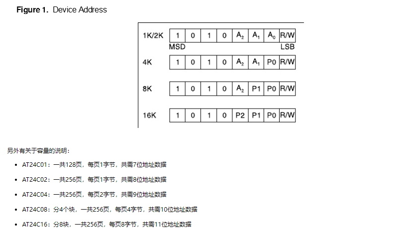

## USB

### 概况

参考链接：

[*https://www.cnblogs.com/shenLong1356/p/11287833.html#_label0*](https://www.cnblogs.com/shenLong1356/p/11287833.html#_label0)

#### USB 通信过程简介

设备插到主机上

主机开始检测设备类型（高速/全速/低速）

复位设备

主机开始对设备枚举（根据枚举得到的各种信息加载合适的驱动程序，比如根据信息知道是一个鼠标设备，则加载鼠标的驱动程序对接下来的数据进行处理）

枚举完成后主机要发送令牌包（IN / OUT）查询有效端点是否有数据，有数据时设备自然会返还给主机

#### USB 枚举过程简介

1.  **主机获取设备描述符（部分）**

2.  **主机对从机设置设备地址（非零，相当于我们的学号 id）**

3.  **主机再次获取从机设备描述符（全部）**

4.  **主机获取配置描述符（了解从机配置，接口，端点）情况**

5.  如果有字符串描述符还有获取字符串描述符

6.  **设置配置请求，就是激活配置，如果没有这一步对应的配置就不可用**

7.  针对不同的类，获取它们独特的类描述符（比如 HID 报告描述符）

注意：

上面的枚举 1-4，6 步骤是必须的，

主机和从机通信时，从机时不能主动发数据给主机的，必须要等主机给从机发送令牌包后，根据主机的需求发送相应的数据

### **传输速度**

▪ 低速设备

例如：键盘、鼠标和游戏等外设

总线速率：1.5 Mb/s

最大的有效数据速率：800 B/s

▪ 全速设备

例如：手机、音频设备和压缩视频

总线速率：12 Mb/s

最大的有效数据速率：1.2 MB/s

▪ 高速设备

例如：视频、影像和存储设备

总线速率：480 Mb/s

最大的有效数据速率：53 MB/s

建立好了 USB 设备和主机间的连接后，需要使用 D+或 D-信号线上的上拉电阻来检测设备的速度。 D+信号线上的 1.5 k Ω 大小的上拉电阻表示所连接的是一个全速设备，D-线上 1.5 k Ω 大小的上拉电阻表示所连接的是一个低速设备。

### 描述符

在 USB 中，USB HOST 是通过各种描述符来识别设备的，有设备描述符，配置描述符，接口描述符，端点描述符，字符串描述符，报告描述符等等。USB 报告描述符(Report Descriptor)是 HID 设备中的一个描述符，它是比较复杂的一个描述符。

|        Descriptor         |     Translate      | Value |
| :-----------------------: | :----------------: | :---: |
|          DEVICE           |     设备描述符     |   1   |
|      CONFIGUARATION       |     配置描述符     |   2   |
|          STRING           |    字符串描述符    |   3   |
|         INTERFACE         |     接口描述符     |   4   |
|         ENDPOINT          |     断点描述符     |   5   |
|     DEVICE_QUALIFIER      |   设备限定描述符   |   6   |
| OTHER_SPEED_CONFIGURATION | 其它速度配置描述符 |   7   |
|      INTERFACE_POWER      |   接口电源描述符   |   8   |

#### 设备描述符

只有一个设备描述符，设备描述符共 14 个字段，长 18 Byte。包括有 PID、VID。

| 偏移 | 字段               | 大小字节 | 说明                    |
| ---- | ------------------ | -------- | ----------------------- |
| 0    | bLength            | 1        | 该描述符的长度 = 18byte |
| 1    | bDescriptorType    | 1        | 描述符类型 = 设备(01h)  |
| 2    | bcdUSB             | 2        | USB 规范版本(BCD)        |
| 4    | bDeviceClasss      | 1        | 设备类型                |
| 5    | bDeviceSubClass    | 1        | 设备子类别              |
| 6    | bDeviceProtocol    | 1        | 设备协议                |
| 7    | bMaxPacketSize0    | 1        | 端点 0 的最大数据包大小   |
| 8    | idVendor           | 2        | 供应商 ID(VID)           |
| 10   | idProduct          | 2        | 产品 ID(PID)             |
| 12   | bcdDevice          | 2        | 设备释放编号(BID)       |
| 14   | iManufacturer      | 1        | 制造商字符串索引        |
| 15   | iProduct           | 1        | 产品字符串索引          |
| 16   | iSerialNumber      | 1        | 序列号字符串索引        |
| 17   | bNumconfigurations | 1        | 受支持的配置数量        |

#### 配置描述符

提供特定设备配置的信息，如接口数量、设备由总线供电还是自供电、设备能否启动一个远程唤醒以及设备功耗。

| 序号 | 字段                | 长度（字节） | 说明                                                  |
| ---- | ------------------- | ------------ | ----------------------------------------------------- |
| 1    | bLength             | 1            | 该描述符的长度 = 9 个字节                               |
| 2    | bDesriptorType      | 1            | 指迷符类型 = 配置(02h)                                |
| 3    | wTotalLength        | 2            | 总长度包括接口和端点描述符在内                        |
| 4    | bNumInterfaces      | 1            | 本配置中接口的数量                                    |
| 5    | bConflgurationValue | 1            | SET_CONFIGURATION 请求所使用的配置值，用于选择该配置  |
| 6    | iConfiguration      | 1            | 描述该配置的字符串索引                                |
| 7    | bmAttributes        | 1            | 位 7: 预留(设置为 1)<br /> 位 6: 自供电 <br/> 位 5: 远程唤醒 |
| 8    | bMaxPower           | 1            | 最大功率（单位为 2 mA）                                |

#### 接口关联描述符（IAD）

该描述符介绍两个或多个接口，这些接口与单个设备功能相关。接口关联描述符（IAD）会通知给主机各个接口已经连接好。例如，USB UART 具有两个与其相关的接口：控制接口和数据接口。IAD 通知主机这两个接口与同一个功能（USBUART）相关，并属于通信设备类别（CDC）。

并非所有情况下都需要使用该描述符。

| 序号 | 项目名称          | 说明               |
| ---- | ----------------- | ------------------ |
| 0    | bLength           | 描述符长度(字节)   |
| 1    | Descriptor Type   | 描述符类型 (0BH)   |
| 2    | bFirstInterface   | 首个接口编号的索引 |
| 3    | bInterfaceCount   | 接口数量           |
| 4    | bFunctionClass    | 功能类别           |
| 5    | bFunctionProtocol | 功能协议           |
| 6    | bFunction         | 功能标识           |
| 7    | iFunction         | 功能描述符         |

#### 端点描述符

在一个设备中所使用的全部端点都有自己的描述符。该描述符会提供主机必须获取的端点信息。这些信息包括端点的方向、传输类型和数据包的最大尺寸。

#### 字符串描述符

字符串描述符是另一种可选的描述符，它为用户提供了有关设备的可读信息。该描述符中所包含的信息显示了以下内容：设备名称、生产厂家、序列号或不同接口、配置的名称。如果设备没有使用字符串，必须将前面所述的所有描述符中的字符串附加字段的值设置为 00h。

| 编号 | 字段            | 大小 (字节) | 说明                      |
| ---- | --------------- | ----------- | ------------------------- |
| 0    | bLength         | 1           | 标识该结构长度 = 7 个字节 |
| 1    | bDescriptorType | 1           | 标识该结构 = STRING (03h) |
| 2.n  | bString         | Unicode     | LANGID 代码               |

#### 其他杂项描述符类型

#### 使用多个 USB 描述符

各个 USB 设备只有一个设备描述符。但是，一个设备可以有多种配置、接口、端点和字符串描述符。设备执行枚举时，终端阶段中有一个步是读取设备描述符，并选择需要使能的设备配置类型。每一次操作只能使能一种配置。例如，某个设计中存在两种配置：一种适用于自供电的设备，另一种适用于由总线供电的设备。这时，用于自供电设备的 USB 的总体性能会与使用于总线供电设备的不一样。拥有多种配置和多种配置描述符可允许设备选择性实现该功能。

同时一个设备可以有多种接口，因此，它也会有多种接口描述符。具有多种接口的 USB 设备（能够执行不同功能）被称为复合设备。USB 头戴式音频耳机便是一个复合设备示例。这种音频耳机包括一个带有两个接口的 USB 设备。其中，一个接口用于音频传输，另一个接口可用于音量调整。可以同时使能多个接口。图 45 显示的是单个 USB 设备中如何分配两种接口。

### **枚举**

枚举指的是被识别

步骤分别是 `供电`、`复位`、`获取设备描述符前8字节`、`复位（可选）`、`分配地址`、`获取设备描述符`、`获取配置描述符`、`获取字符串描述符`、`配置`

#### 动态检测

1.  设备被连接到 USB 端口上，并得到检测。此时，设备可从总线吸收 100 mA 的电流，并处于被供电状态。

2.  集线器通过监控端口的电压来检测设备。

#### 枚举

1.  主机使用中断端点获得集线器状态（包括端口状态的变化），从而了解新连接的设备。主机从集线器获得设备检测情况后，它会向集线器发送一个请求，以便询问在 GET_PORT_STATUS 请求有效时所发生状态变化的详细信息。

2.  主机收集该信息后，它通过“USB 速度”一节中所介绍的方法来检测设备的速度。最初，通过确定上拉电阻位于 D+线还是 D-线，集线器可以检测设备速度是全速还是低速。通过另一个 GET_PORT_STATUS 请求，该信息被报告给主机。

3.  主机向集线器发送 SET_PORT_FEATURE 请求，要求它复位新连接的设备。通过将 D+和 D-线下拉至 GND（0 V），使设备进入复位状态。这些线处于低电平状态的时间长达 2.5 us，因此发生复位条件。集线器在 10 ms 内维持复位状态。

4.  复位期间发生一系列 J-State 和 K-State，这样是为了确定设备是否支持高速传输。如果设备支持高速，它会发出一个单一的 K-State。高速集线器检测该 K-State 并用 J 和 K 顺序（组成“KJKJKJ”格式）来回应。设备检测到该格式后，它会移除 D+线上的上拉电阻。低速设备和全速设备则会忽略这一步。

5.  通过发送 GET_PORT_STATUS 请求，主机检查设备是否仍处于复位状态。如果设备仍处于复位状态，则主机会继续发送请求，直到它得知设备退出复位状态为止。设备退出复位状态后，它便进入默认状态，如 USB 电源一节所述。现在，设备可以回应主机的请求，具体是对其默认地址 00h 进行控制传输。所有 USB 设备的起始地址均等于该默认地址。每次只能有一个 USB 设备使用该地址。因此，同时将多个 USB 设备连接到同一个端口时，它们会轮流进行枚举，而不是同时枚举。

6.  主机开始了解有关设备的更多信息。首先，它要知道默认管道（端点 0）的最大数据包大小。主机先向设备发送 GET_DESCRIPTOR 请求。设备发给主机相应应用笔记 USB 描述符一节所介绍的描述符。在设备描述符中，第八个字节（bMaxPacketSize0）包含了有关 EP0 最大数据包尺寸的信息。Windows 主机要求 64 字节，但仅在收到 8 字节设备描述符后它才转换到控制传输的状态阶段，并要求集线器复位设备。USB 规范要求，如果设备的默认地址为 00h，当它得到请求时，设备至少要返回 8 字节设备描述符。要求 64 字节是为了防止设备发生不确定行为。此外，仅在收到 8 字节后才进行复位的操作是早期 USB 设备遗留的特性。在早期 USB 设备中，当发送第二个请求来询问设备描述符时，某些设备没有正确回应。为了解决该问题，在第一个设备描述符请求后需要进行一次复位。被传输的 8 字节包含 bMaxPacketSize0 的足够信息。

7.  主机通过 SET_ADDRESS 请求为设备分配地址。在使用新分配地址前，设备使用默认地址 00h 完成所请求的状态阶段。在该阶段后进行的所有通信均会使用新地址。如果断开与设备的连接、端口被复位或者 PC 重启，该地址可能被更改。现在，设备处于地址状态。

#### 配置

1.  设备退出复位状态后，主机会发送 GET_DESCRIPTOR 命令，以便使用新分配地址读取设备的描述符。

2.  为了让主机 PC（此情况是 Windows PC）成功使用设备，主机必须加载设备驱动程序。

3.  收到所有描述符后，主机使用 SET_CONFIGURATION 请求进行特殊的设备配置。

4.  此时设备将处于配置状态。

### 获取设备 pid 和 vid

使用 USB TreeView 软件，方便直观可以看到 USB 设备的插拔和定位

下载链接：<https://www.majorgeeks.com/files/details/usb_device_tree_viewer.html>

### **HID 人机类**

### **MSD 大容量类**

### **CDC 通信设备类**

### HIDAPI

开源地址：

<https://github.com/signal11/hidapi>

注意事项：

需要链接 gcc 静态库，

cmake 添加为，

```cmake
target_link_libraries(${PROJECETNAME} setupapi)
```

其中，${PROJECETNAME}为工程名

qmake 添加

```qmake
 QT += -lsetupapi
```


### DFU

参考链接：https://cloud.tencent.com/developer/article/2197665

## 芯片或模块

### EEPROM

通信：`IIC`

设备地址：`0XA0` 已经左移一位



图 17-1

参考链接：https://www.cnblogs.com/schips/p/at24cxx.html

## 网络

### git

```shell
动代理
git config --global http.proxy http://127.0.0.1:7890
git config --global https.proxy https://127.0.0.1:7890

#取消代理
git config --global --unset http.proxy
git config --global --unset https.proxy

#查询代理
git config --global http.proxy
git config --global https.proxy
```

### linux

```shell
export http_proxy=http://127.0.0.1:7890
export https_proxy=https://127.0.0.1:7890
```

### ssh

修改{user}/.ssh/config，添加如下内容

```config
Host github.com
  Hostname ssh.github.com
  Port 443
  User git
  ProxyCommand connect -S 192.168.1.3:7890 %h %p
```

提示：这个是修改 github 的 ssh 代理，使用 git 链接的时候使用的是 ssh 连接，因此需要设置 ssh

### sudo

一般来说，将代理配置在.zshrc 或者 .bashrc 上，sudo 命令是无法使用代理的，sudo 代理配置如下

使用命令 sudo vim 打开/etc/sudoers 文件，将以下行添加到文件末尾：

```bash
Defaults env_keep += "http_proxy https_proxy"
```

或者，使用命令 sudo vim /etc/environment 打开/etc/environment 文件，并在其中添加以下行：

```bash
http_proxy="http://127.0.0.1:7890"
https_proxy="https://127.0.0.1:7890"
```

## 启动盘烧写

### 分区

```bash
lsblk ## 查看设备名称
fdisk /dev/sdb #进入 fdisk
d #删除所有分区
n #新建分区
	p #选择主要分区
	1 #第几块分区
	40960 #起始点
	303104 #结束点 也可以用 `+262144`
w #保存退出
```

40960 表示 20MB，303104 是 148MB 因为是以扇区为单位，一般来说扇区大小是 512B，计算如下

（20 * 1024 * 1024）/  512 = 40960

（148 * 1024 * 1024 ）/ 512 = 303104

### 直接刻录

```bash
sudo dd if=./uboot.bin of=/dev/sdb bs=8K seek=1
```

这个命令的意思是：

1. 将 uboot.bin 烧录进 sdb 中
2. 设置块大小为 8K，意味着每次烧写数据块的大小为 8K
3. 设置偏单位为 1，用于跳过引导扇区

！这个命令比较危险，需要谨慎使用。

### 存放内核

```bash
sudo mount /dev/sdb1 /mnt
sudo cp ${KERN_DIR}/arch/arm64/boot/Image /mnt/
sudo cp ${KERN_DIR}/arch/arm64/boot/dts/xxx.dtb /mnt/
sudo umount /mnt
```

## 正则表达式

### 基本字符匹配

- `abc`：匹配字符串 "abc"。

### 2. 任意字符

- `.`：匹配任意单个字符（除了换行符）。

例如，`a.c` 可以匹配 "abc"、"a1c"、"a_c" 等。

### 3. 字符集

- `[abc]`：匹配 "a"、"b" 或 "c" 中的任意一个字符。
- `[a-z]`：匹配任何小写字母。
- `[0-9]`：匹配任何数字。

### 4. 否定字符集

- `[^abc]`：匹配除了 "a"、"b" 和 "c" 以外的任何字符。

### 5. 数量限定符

- `*`：匹配前面的元素零次或多次。例，`a*` 可以匹配 ""、"a"、"aa" 等。

- `+`：匹配前面的元素一次或多次。例，`a+` 可以匹配 "a"、"aa" 等，但不匹配 ""。

- `?`：匹配前面的元素零次或一次。例，`a?` 可以匹配 "" 或 "a"。

- `{n}`：匹配前面的元素恰好 n 次。例，`a{3}` 匹配 "aaa"。

- `{n,}`：匹配前面的元素至少 n 次。例，`a{2,}` 匹配 "aa"、"aaa" 等。

- `{n,m}`：匹配前面的元素至少 n 次，至多 m 次。例，`a{2,4}` 匹配 "aa"、"aaa" 或 "aaaa"。

### 6. 边界匹配

- `^`：匹配行的开头。例，`^abc` 匹配以 "abc" 开头的字符串。

- `$`：匹配行的结尾。例，`abc$` 匹配以 "abc" 结尾的字符串。

### 7. 分组和捕获

- `(abc)`：匹配 "abc"，并将其作为一个组捕获，方便后续引用。
- `(?:abc)`：非捕获组，匹配 "abc" 但不捕获。

### 8. 或逻辑

- `a|b`：匹配 "a" 或 "b"。

### 9. 转义字符

- `\`：用于转义特殊字符，例如 `\.`, `\*`, `\?` 等，以匹配字面量。

## KDE

安装

```bash
sudo apt install kde-plasma-desktop
```

选择 sddm 登陆

切换登陆管理器，即桌面环境

```bash
sudo dpkg-reconfigure lightdm 
sudo dpkg-reconfigure gdm3 # Ubuntu
sudo dpkg-reconfigure sddm # KDE
```