| 信息         | 内容                          |
| ------------ | ----------------------------- |
| **姓名**     | 黄远灿                        |
| **联系方式** | 18878448766                   |
| **邮箱**     | hthousandflame@gmail.com   |
| **Github**   | https://github.com/FlameKm |

# 单片机（STM32 为主）

## 编码器

### 相关函数

```c
void TIM_EncoderInterfaceConfig(TIM_TypeDef* TIMx, uint16_t TIM_EncoderMode, uint16_t TIM_IC1Polarity, uint16_t TIM_IC2Polarity)
```

`TIMx` 参数就是使用哪个定时器作为编码器接口的捕捉定时器.

`TIM_EncoderMode` 参数是模式, 是单相计数（只能反映速度）还是两相计数（速度和方向）.

`TIM_IC1Polarity` 和 `TIM_IC2Polarity` 参数就是通道 1、2 的捕捉极性.

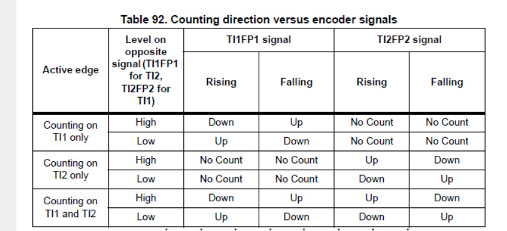

图 1-1

## PWM

### 注意事项

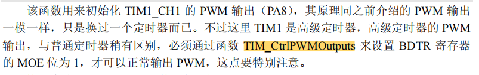

### 代码框架

```c
//TIM1 CH1 PWM 输出设置
//PWM 输出初始化
//arr：自动重装值
//psc：时钟预分频数
void TIM1_PWM_Init(u16 arr,u16 psc)
{
GPIO_InitTypeDef GPIO_InitStructure;
TIM_TimeBaseInitTypeDef TIM_TimeBaseStructure;
TIM_OCInitTypeDef TIM_OCInitStructure;
RCC_APB2PeriphClockCmd(RCC_APB2Periph_TIM1, ENABLE); //使能 TIMx 外设
RCC_APB2PeriphClockCmd(RCC_APB2Periph_GPIOB, ENABLE); //使能 PA 时钟
//设置该引脚为复用输出功能, 输出 TIM1 CH1 的 PWM 脉冲波形
GPIO_InitStructure.GPIO_Pin = GPIO_Pin_8; //TIM1_CH1
GPIO_InitStructure.GPIO_Mode = GPIO_Mode_AF_PP; //复用功能输出
GPIO_InitStructure.GPIO_Speed = GPIO_Speed_50MHz;
GPIO_Init(GPIOA, &GPIO_InitStructure); //初始化 GPIO
TIM_TimeBaseStructure.TIM_Period = arr; //设置自动重装载周期值
TIM_TimeBaseStructure.TIM_Prescaler =psc; //设置预分频值 不分频
TIM_TimeBaseStructure.TIM_ClockDivision = 0; //设置时钟分割: TDTS = Tck_tim
TIM_TimeBaseStructure.TIM_CounterMode = TIM_CounterMode_Up; //向上计数
TIM_TimeBaseInit(TIM1, &TIM_TimeBaseStructure); //初始化 TIMx
TIM_OCInitStructure.TIM_OCMode = TIM_OCMode_PWM2; //CH1 PWM2 模式
TIM_OCInitStructure.TIM_OutputState = TIM_OutputState_Enable; //比较输出使能
TIM_OCInitStructure.TIM_Pulse = 0; //设置待装入捕获比较寄存器的脉冲值
TIM_OCInitStructure.TIM_OCPolarity = TIM_OCPolarity_Low; //OC1 低电平有效
TIM_OC1Init(TIM1, &TIM_OCInitStructure); //根据指定的参数初始化外设 TIMx
TIM_OC1PreloadConfig(TIM1, TIM_OCPreload_Enable); //CH1 预装载使能
TIM_ARRPreloadConfig(TIM1, ENABLE); //使能 TIMx 在 ARR 上的预装载寄存器
TIM_CtrlPWMOutputs(TIM1,ENABLE); //MOE 主输出使能, 高级定时器必须开启
TIM_Cmd(TIM1, ENABLE); //使能 TIMx
}
```

## **复用功能**

中文手册 105 页

## 时钟

在 STM32 中

APB1(低速外设)上的设备有：电源接口、备份接口、CAN、USB、I2C1、I2C2、UART2、UART3、SPI2、窗口看门狗、Timer2、Timer3、Timer4 。

APB2(高速外设)上的设备有：GPIO_A-E、USART1、ADC1、ADC2、ADC3、TIM1、TIM8、SPI1、ALL。

具体参考时钟树

## CAN

参考链接

https://zhuanlan.zhihu.com/p/548772223

CAN 不能与 USB 从设备同时使用，因为他们共用一组 RAM，如果需要使用 USB 功能时，需要调用关闭 CAN 总线的初始化函数。需要使用 CAN 的时候，需要调用开启 CAN 总线的初始化函数。

在 HAL 库中，

```c
HAL_CAN_MspDeInit(&hcan); //关闭
HAL_CAN_MspInit(&hcan)； //初始化
```

### 标准帧

### 报文

报文是短帧结构，短的传送时间使其受干扰概率低，CAN 有很好的校验机制，这些都保证了 CAN 通信的可靠性。

### 邮箱

有两个队列，fifo0 和 fifo1，每一个队列又存在三个邮箱 BOX1-BOX3。

fifo0 和 fifo1 不同的中断

### 波特率

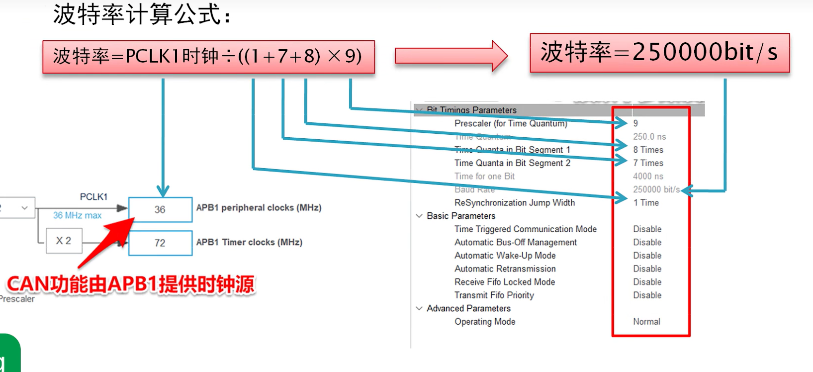

波特率 = PCLK1 时钟 / （（1 + 7 + 8）*9）

### 过滤器

### 模式

Lookback，用于测试代码，无法从接收外部数据

### **过滤器**

```c
static void CANFilter_Config(void)
{
    CAN_FilterTypeDef sFilterConfig;
    sFilterConfig.FilterBank = 0; //CAN 过滤器编号，范围 0-27
    sFilterConfig.FilterMode = CAN_FILTERMODE_IDMASK; //CAN 过滤器模式，掩码模式或列表模式
    sFilterConfig.FilterScale = CAN_FILTERSCALE_32BIT; //CAN 过滤器尺度，16 位或 32 位
    sFilterConfig.FilterIdHigh = 0x000 << 5; //32 位下，存储要过滤 ID 的高 16 位
    sFilterConfig.FilterIdLow = 0x0000; //32 位下，存储要过滤 ID 的低 16 位
    sFilterConfig.FilterMaskIdHigh = 0x0000; //掩码模式下，存储的是掩码
    sFilterConfig.FilterMaskIdLow = 0x0000;
    sFilterConfig.FilterFIFOAssignment = 0; //报文通过过滤器的匹配后，存储到哪个 FIFO
    sFilterConfig.FilterActivation = ENABLE; //激活过滤器
    sFilterConfig.SlaveStartFilterBank = 0;
    if (HAL_CAN_ConfigFilter(&hcan1, &sFilterConfig) != HAL_OK) {
        printf("CAN Filter Config Fail!rn");
        Error_Handler();
    }
    printf("CAN Filter Config Success!rn");
}
```

## **固件升级**

参考链接：

<https://zhuanlan.zhihu.com/p/73037424>

CMSIS-DAP 调试器是有单独的一条复位线的，但是当时没考虑它可能采用了这种方式，只考虑可能采用了内核复位

## ADC

### 周期

采集固定 12.5 个周期，间隔可以选择 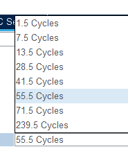，计算采样频率的时候为：ADC 时钟频率/（55.5+12.2）

## BootLoader

### 跳转方式

```c
typedef void (*fp_t)(void);

__IO uint32_t BootloaderAddr = 0x08004000; *// 32k = 0x8000*

void jump_app()

{

volatile uint32_t jump_addr;

fp_t jump;

jump_addr = *(volatile uint32_t *) (BootloaderAddr + 4);

jump = (fp_t) jump_addr;

__set_MSP(*(volatile uint32_t *) BootloaderAddr);

jump();

}
```

此时可以跳转，但是跳转后会出现问题，笔者的开发环境下中断会在 bootload 程序中，可以定位问题为中断定位错误，解决方式是将 APP 程序的中断向量表进行偏移，具体方式请查看 **中断向量表** 一节。

上面值得注意的有跳转+4 是表示前面有中断跳转，此时才是真正的 main 函数开端

### 跳转前准备

需要清除全部中断与中断标志位。

### 程序烧录 XModem、YModem

两种烧录协议

## 中断向量表

更改中断向量表起始地址，需要取消注释，并修改偏移地址，修改的文件为 system_stm32f1xx.c。

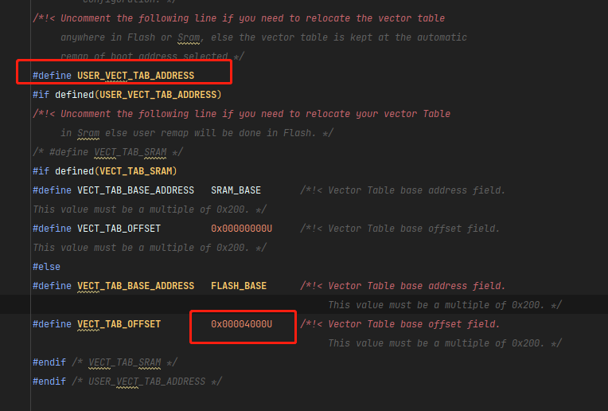

stm32cube+clion 环境中，修改.ld 文件可以修改烧录起始地址

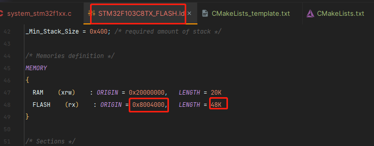

# STM32Cube MX

## 初尝试

### 晶振配置

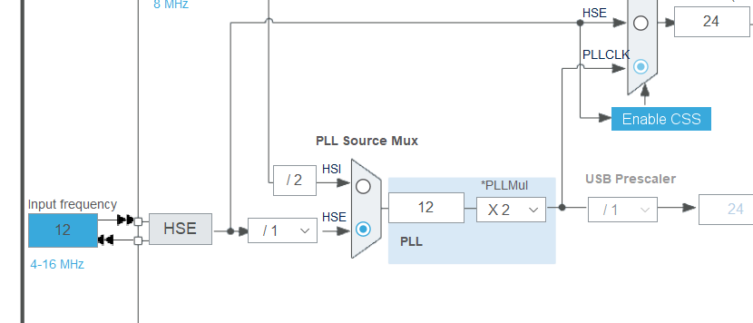

### 工程

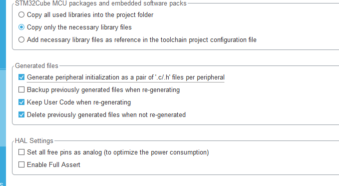

## 串口

原文链接：<https://blog.csdn.net/as480133937/article/details/99073783>

### 配置

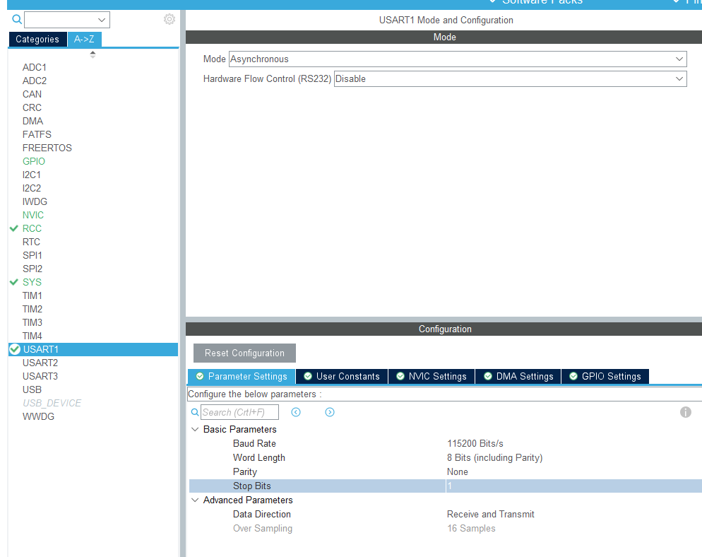

### 中断

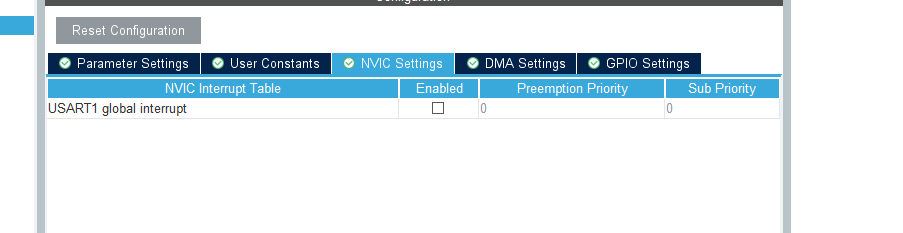

### HAL 库 UART 函数库介绍

UART 结构体定义

`UART_HandleTypeDef huart1;`

UART 的名称定义，这个结构体中存放了 UART 所有用到的功能，后面的别名就是我们所用的 uart 串口的别名，默认为 huart1 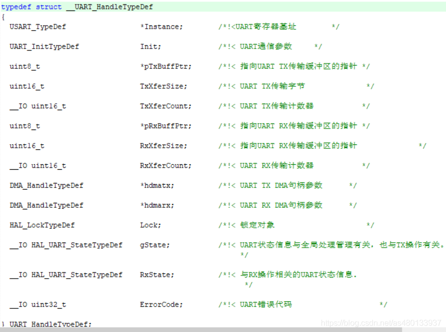

### UART 接收中断

原文链接：

<https://blog.csdn.net/as480133937/article/details/99073783>

中断函数

`void HAL_UART_RxCpltCallback(UART_HandleTypeDef *huart)`

### 串口发送/接收函数

`HAL_UART_Receive_IT(&huart1, (uint8_t *)&aRxBuffer, 1)` 

`HAL_UART_Transmit()` //串口发送数据，使用超时管理机制

`HAL_UART_Receive()`//串口接收数据，使用超时管理机制

`HAL_UART_Transmit_IT()` //串口中断模式发送

`HAL_UART_Receive_IT()` //串口中断模式接收

`HAL_UART_Transmit_DMA()`//串口 DMA 模式发送`

`HAL_UART_Transmit_DMA()`//串口 DMA 模式接收

这几个函数的参数基本都是一样的，我们挑两个讲解一下

串口发送数据：

`HAL_UART_Transmit(UART_HandleTypeDef *huart, uint8_t *pData, uint16_t Size, uint32_t Timeout)`

功能：串口发送指定长度的数据。如果超时没发送完成，则不再发送，返回超时标志（HAL_TIMEOUT）。

参数：

`UART_HandleTypeDef *huart ` UATR 的别名

 如 : UART_HandleTypeDef huart1; 别名就是 `huart1`

`*pData` 需要发送的数据

`Size` 发送的字节数

`Timeout` 最大发送时间，发送数据超过该时间退出发送

举例：` HAL_UART_Transmit(&huart1, (uint8_t *)ZZX, 3, 0xffff);`//串口发送三个字节数据，最大传输时间 0xffff

中断接收数据：

`HAL_UART_Receive_IT(UART_HandleTypeDef *huart, uint8_t *pData, uint16_t Size)`

功能：串口中断接收，以中断方式接收指定长度数据。

大致过程是，设置数据存放位置，接收数据长度，然后使能串口接收中断。接收到数据时，会触发串口中断。

再然后，串口中断函数处理，直到接收到指定长度数据，而后关闭中断，进入中断接收回调函数，不再触发接收中断。(只触发一次中断)

### 重新定义 printf 函数

在 stm32f4xx_hal.c 中包含#include <stdio.h>

在 stm32f4xx_hal.c 中重写 fget 和 fput 函数

```c
#include "stm32f4xx_hal.h"
#include <stdio.h>
extern UART_HandleTypeDef huart1; //声明串口

/**
* 函数功能: 重定向 c 库函数 printf 到 DEBUG_USARTx
* 输入参数: 无
* 返 回 值: 无
* 说 明：无
*/
int fputc(int ch, FILE *f)
{
    HAL_UART_Transmit(&huart1, (uint8_t *)&ch, 1, 0xffff);
    return ch;
}
/**
* 函数功能: 重定向 c 库函数 getchar, scanf 到 DEBUG_USARTx
* 输入参数: 无
* 返 回 值: 无
* 说 明：无
*/
int fgetc(FILE *f)
{
    uint8_t ch = 0;
    HAL_UART_Receive(&huart1, &ch, 1, 0xffff);
    return ch;
}
```

### 串口再使用的笔记

配置好需主动开启中断


通过自己写的函数实现获取数据

注意最后一句

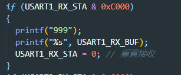

文件在 stm32f1xx_it.c 和 stm32f1xx_it.h 里面

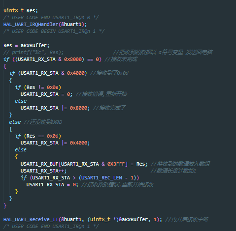

注意再调用

###  DMA 串口使用

**配置**

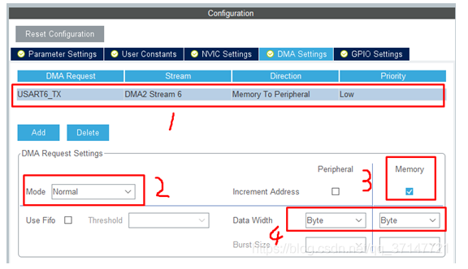

Normal 正常模式，DMA 发送一次就停止发送；

Circular 循环模式，会一直发送数据；

**发送函数:**

``HAL_UART_Transmit_DMA( &huart6, (uint8_t *)"hello DISCO by DMArn", sizeof("hello DISCO by DMArn") );``

**注意事项:**

打开 DMA 会自动开启 DMA 中断, 此时应该打开对应串口中断。

## PWM

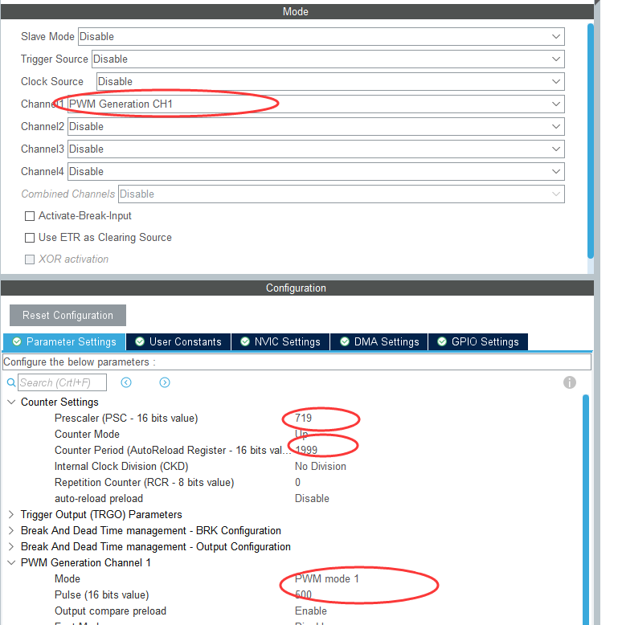

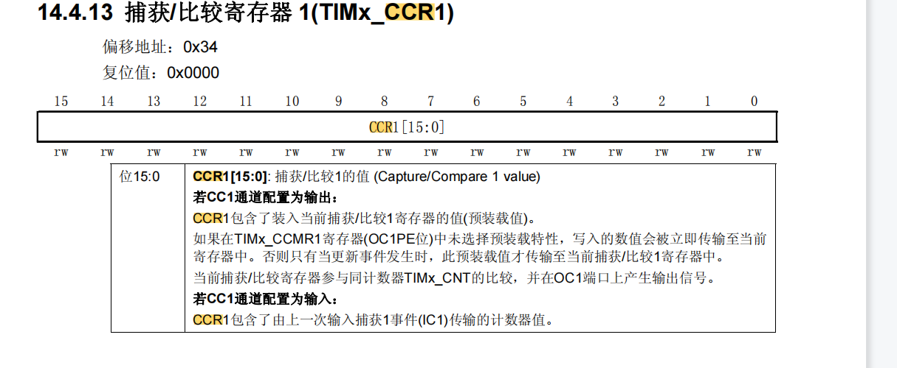

`HAL_TIM_PWM_Start(&htim1,TIM_CHANNEL_1);`


or

`__HAL_TIM_SetCompare(&htim3, TIM_CHANNEL_1, pwmVal);`

## ADC

### 单通道采样（不用 DMA）

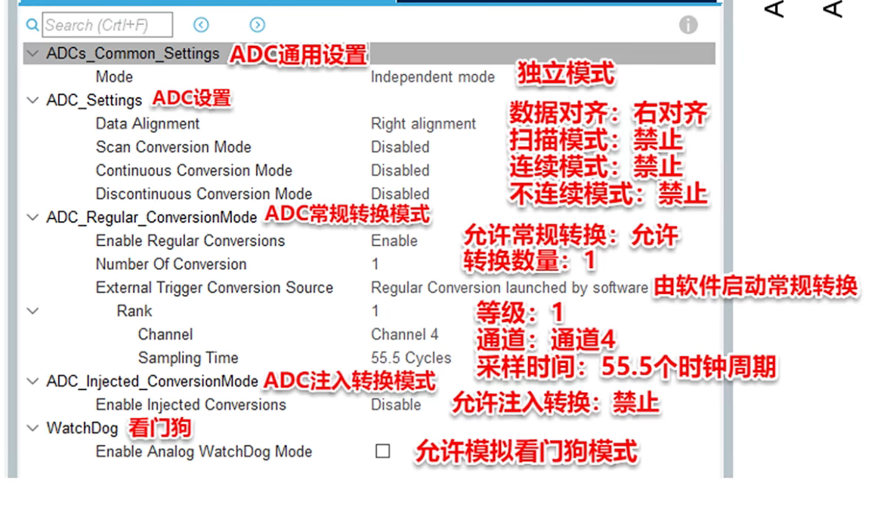

使用函数

Init：

`HAL_ADCEx_Calibration_Start(&hadc1);`

Begin：

```c
HAL_ADC_Start(&hadc1);//启动 ADC 转换
HAL_ADC_PollForConversion(&hadc1, 50);//等待转换完成，50 为最大等待时间，单位为 ms
```

Get：

```c
if (HAL_IS_BIT_SET(HAL_ADC_GetState(&hadc1), HAL_ADC_STATE_REG_EOC)) {
    adcValue = HAL_ADC_GetValue(&hadc1); //获取 AD 值
    logi("ADC1 Reading : %d", adcValue);
}
```

### 多通道（非 DMA）

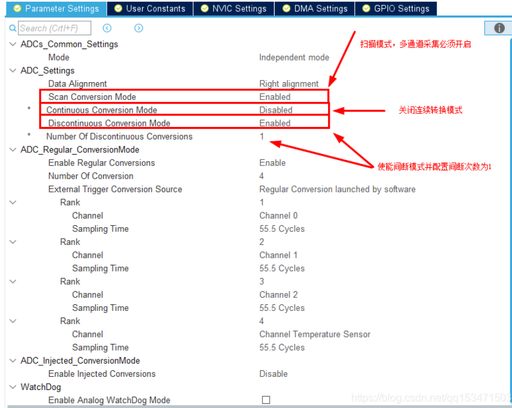

如图设置，只需要按照 1 的方法多次读取即可。

轮询读取

### 多通道（DMA）

#### 配置

需要先 **开启连续转换模式**

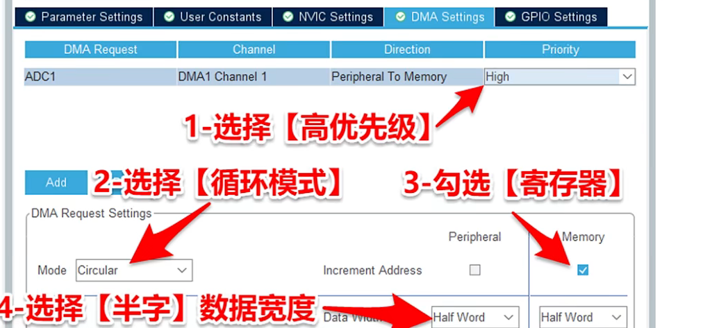

1.  高级优先级

2.  循环模式，读取完成后继续重新读取。

3.  勾选寄存器模式：如果不勾选，每次都只存放在一个寄存器。勾选后，每次存放的地址增加

4.  16 位宽带寄存器，12 位的 ADC 足够。

#### 使用

Init：

```C
HAL_ADCEx_Calibration_Start(&hadc1); //校准
uint16_t adcValue[2];
HAL_ADC_Start_DMA(&hadc1, (uint32_t*)adcValue, 2);
```

Get：

直接使用数据。

#### 注意

1.  自动生成的 DMA 和 ADC 的初始化顺序不能相反。先 DMA 再 ADC

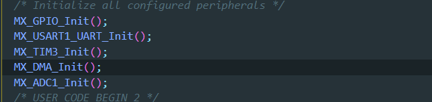

2.  小心一直进入中断！

3.  传输的数值选择的是半字节的话，需要对应的内存去存储

## IIC

默认配置即可

发送函数

方法一

```c
while (HAL_I2C_Mem_Write(&hi2c1, 0x78, 0x00,I2C_MEMADD_SIZE_8BIT, &IIC_Command,sizeof(IIC_Command), 10) != HAL_OK) {
    if (HAL_I2C_GetError(&hi2c1) != HAL_I2C_ERROR_AF) {
    Error_Handler();
    }
}
```

方法二

发送单个数据, 数据的第一个数据为内存地址

0x78 是设备地址

`HAL_I2C_Master_Transmit(&hi2c1,0x78, c, *sizeof*(c), 10)`

方法三

需要在 CUBEMX 配置 slave 的地址

```c
uint8_t c[2] = {0x40, IIC_Data};
HAL_I2C_Slave_Transmit(&hi2c1, c, *sizeof*(c), 10);
```

## 定时器

定时器回调函数：

`void HAL_TIM_PeriodElapsedCallback(TIM_HandleTypeDef *htim)`

中断

`HAL_TIM_Base_Start_IT`

PWM

`HAL_TIM_PWM_Start`

## CAN

### 时钟

使用 APB1 时钟


### 发送

添加到邮箱

`HAL_StatusTypeDef HAL_CAN_AddTxMessage(CAN_HandleTypeDef *hcan, const CAN_TxHeaderTypeDef *pHeader, const uint8_t aData[], uint32_t *pTxMailbox)`

### 中断


# **计算机语言**

## **C 语言**

### 优先级

| 优先级 | 运算符                                                       | 结合律   |
| ------ | ------------------------------------------------------------ | -------- |
| 1      | 后缀运算符：[]   ()   ·   ->   ++   --(类型名称){列表}       | 从左到右 |
| 2      | 一元运算符：++   --   !   ~   +   -   *   &   sizeof_Alignof | 从右到左 |
| 3      | 类型转换运算符：(类型名称)                                   | 从右到左 |
| 4      | 乘除法运算符：*   /   %                                      | 从左到右 |
| 5      | 加减法运算符：+   -                                          | 从左到右 |
| 6      | 移位运算符：<<   > >                                          | 从左到右 |
| 7      | 关系运算符： <  <=   >  >=                                   | 从左到右 |
| 8      | 相等运算符：==   !=                                          | 从左到右 |
| 9      | 位运算符 AND：&                                              | 从左到右 |
| 10     | 位运算符 XOR：^                                              | 从左到右 |
| 11     | 位运算符 OR：\|                                              | 从左到右 |
| 12     | 逻辑运算符 AND：&&                                           | 从左到右 |
| 13     | 逻辑运算符 OR：\|\|                                          | 从左到右 |
| 14     | 条件运算符：?:                                               | 从右到左 |
| 15     | 赋值运算符：   =     +=     -=    *=    /=    %=    &=    ^=    \|=   <<=    > >= | 从右到左 |
| 16     | 逗号运算符：，                                               | 从左到右 |

### qsort

函数用法

```c
qsort(buf, n, sizeof(int16_t), filter_cmp);
```

`filter_cmp` 是比较函数

具体为

```c
int openmv_filter_cmp(const void *a, const void *b) {
	return (*(int16_t *) a - *(int16_t *) b);
}
```

这个表示：

a > b 的话则替换，即从小到大排序

### 数据类型

wchar_t 直译过来是宽字符，在 linux 系统中 4 字节，在 windows 中 2 字节

参考链接：[*https://zh.wikipedia.org/wiki/%E5%AF%AC%E5%AD%97%E5%85%83*](https://zh.wikipedia.org/wiki/%E5%AF%AC%E5%AD%97%E5%85%83)

### 编译器优化

| 优化等级 | 优化内容                                                     |
| :--------: | ------------------------------------------------------------ |
|    -O1     | 在不影响编译速度的前提下，尽量采用一些优化算法降低代码大小和可执行代码的运行速度。 |
|    -O2     | 该优化选项会牺牲部分编译速度，除了执行-O1 所执行的所有优化之外，还会采用几乎所有的目标配置支持的优化算法，用以提高目标代码的运行速度。 |
|    -O3     | 该选项除了执行-O2 所有的优化选项之外，一般都是采取很多向量化算法，提高代码的并行执行程度，利用现代 CPU 中的流水线，Cache 等。这个选项会提高执行代码的大小，当然会降低目标代码的执行时间。 |
|    -Os     | 这个选项是在-O2 的基础之上，尽量的降低目标代码的大小，这对于存储容量很小的设备来说非常重要。 |
|   -Ofast   | 该选项将不会严格遵循语言标准，除了启用所有的-O3 优化选项之外，也会针对某些语言启用部分优化。 |
|    -Og     | 该标识会精心挑选部分与-g 选项不冲突的优化选项，当然就能提供合理的优化水平，同时产生较好的可调试信息和对语言标准的遵循程度。 |

## **JAVA**

### 安装

```shell
sudo apt install openjdk-xx-jdk
```

### 选择版本

```shell
sudo update-alternatives --config java
```

## OOP FOR C++

### 多态

参考链接：[override finial - 多态 - Wokwi Arduino and ESP32 Simulator](https://wokwi.com/projects/336414219117265492)

精简做法：

父类: `virtual` 放在 函数 + `destructor`

子类: `override` 放在 函数

推荐：

父类: `virtual` 放在 函数 + `destructor`

子类: ` virtual` 放在 函数 + `destructor`， `override` 放在 函数

# **数据结构和算法**

## 抽象数据类型 ATD

参考链接：

<https://book.itheima.net/course/223/1276707762369208322/1276707936655122434>

抽象数据类型有两个重要特征：数据抽象和数据封装。

能够很大程度上实现代码的 **移植性、通用性和拓展性**。

所谓数据抽象是指用 ADT 描述程序处理的实体时，强调的是其本质的特征，无论内部结构如何变化，只要本质特性不变，就不影响其外部使用。例如，在程序设计语言中经常使用的数据类型 int，它就可以理解为是一个抽象数据类型，在不同的计算机或操作系统中，它的实现方式可能会有所不同，但它本质上的数学特性是保持不变的， int 类型的数据指的是整数，可以进行加减乘除模等一些运算，int 类型数据的这些数学特性保持不变，那么在编程者来看，它们都是相同的。因此数据抽象的意义在于数据类型的数学抽象特性。

而另一方面，所谓的数据封装是指用户在软件设计时从问题的数学模型中抽象出来的逻辑数据结构和逻辑数据结构上的运算，需要通过固有数据类型（高级编程语言中已实现的数据类型）来实现，它在定义时必须要给出名字及其能够进行的运算操作。一旦定义了一个抽象数据类型，程序设计中就可以像使用基本数据类型那样来使用它。例如，在统计学生信息时，经常会使用姓名、学号、成绩等信息，我们可以定义一个抽象数据类型“student”，它封装了姓名、学号、成绩三个不同类型的变量，这样我们操作 student 的变量就能很方便地知道这些信息了。C 语言中的结构体以及 C++语言中的类等都是这种形式。

## **PID 算法**

### P（比例）

比例控制

### I（积分）

误差累计

### D（微分）

PD 控制: ``U(t) = Kp * err(t) + Kd * derr(t)/dt``

### 增量式和位置式

参考链接：[(70 条消息) 位置式 PID 与增量式 PID 区别浅析_Z 小旋的博客-CSDN 博客_增量式 pid 和位置式 pid 的区别](https://blog.csdn.net/as480133937/article/details/89508034)

增量式

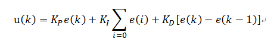

位置式

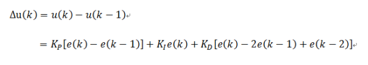

**位置式 PID 优缺点：**

**优点：**

位置式 PID 是一种非递推式算法，可直接控制执行机构（如平衡小车），u(k)的值和执行机构的实际位置（如小车当前角度）是一一对应的，因此在执行机构不带积分部件的对象中可以很好应用

**缺点：**

每次输出均与过去的状态有关，计算时要对 e(k)进行累加，运算工作量大。

**增量式 PID 优缺点**：

优点：

1. 误动作时影响小，必要时可用逻辑判断的方法去掉出错数据。

2. 手动/自动切换时冲击小，便于实现无扰动切换。当计算机故障时，仍能保持原值。

3. 算式中不需要累加。控制增量Δ u(k)的确定仅与最近 3 次的采样值有关。

缺点：

1. 积分截断效应大，有稳态误差；

2. 溢出的影响大。有的被控对象用增量式则不太好；

### 调参口诀

**实际应用，进行 PID 参数调节时，一般使用试凑法，PID 参数整定口诀如下：**

参数整定找最佳，从小到大顺序查，

先是比例后积分，最后再把微分加，

曲线振荡很频繁，比例度盘要放大，

曲线漂浮绕大湾，比例度盘往小扳，

曲线偏离回复慢，积分时间往下降，

曲线波动周期长，积分时间再加长，

曲线振荡频率快，先把微分降下来，

动差大来波动慢，微分时间应加长，

理想曲线两个波，前高后低 4 比 1，

一看二调多分析，调节质量不会低。

## 环形缓冲区

### 裸机中利用 DMA 使用环形缓冲区实现异步发送


```c
/* 定义数据 */
static uint8_t uart_buffer[UART_BUFFER_SIZE];
static uint16_t left, right;
static uint16_t pack_size; //每次出队个数
/**
* 发送中断回调, 用于维护环形缓冲区
* @param huart
* @param size
*/
void HAL_UART_TxCpltCallback(UART_HandleTypeDef *huart)
{
    if (huart == uart_handle) {
        left = (left + pack_size) % UART_BUFFER_SIZE;
        transmit_mutex = false;
        if (left != right) { //检查环形队列中是否还有数据
            uart_transmit_start();
        }
    }
}
/**
* 发送当前需要发送的数据
* @return
*/
static int uart_transmit_start()
{
    HAL_StatusTypeDef ret;
    if (transmit_mutex == true) {
    	return -1;
    }
    transmit_mutex = true;
    // 计算发送的个数
    if (right > left) {
    	pack_size = right - left;
    }
    else {
    	pack_size = UART_BUFFER_SIZE - left;
    }
    ret = HAL_UART_Transmit_DMA(uart_handle, (uint8_t *) uart_buffer + left, pack_size);
    if (ret != HAL_OK) {
    	return -1;
    }
    return 0;
}
/**
* 添加数据到环形缓冲区，这个函数是 api 的接口
* @param com
* @param buf
* @param size
* @return
*/
static int uart_transmit(com_buffer_cb_t *com, uint8_t *buf, uint16_t size)
{
    UNUSED(com);
    int err;
    int next_index = (right + size) % UART_BUFFER_SIZE;
    // *保存数据
    if (next_index > right) { // 没有超限循环
        if (next_index >= left && right < left) {
        	return -1;
        }
        memcpy(uart_buffer + right, buf, size);
    }
    else { // 超限循环
        if (next_index > left && right > left) {
       		return -1;
        }
        memcpy(uart_buffer + right, buf, UART_BUFFER_SIZE - right);
        memcpy(uart_buffer, buf + UART_BUFFER_SIZE - right, size - (UART_BUFFER_SIZE - right));
    }
    right = next_index;
    // *开启尝试发送
    err = uart_transmit_start();
    return err;
}
```

# 其它(单片机)

## 高级定时器注意事项


## ROM 烧录

早期一般是将调试好的单片机程序写入到 ROM、EPROM, 中，这种操作就像刻制光盘一样，实在高电压方式下写入，PROM%20 是一次性写入，存储内部发生变化，有些线路或元件就被烧断，不可再恢复，所以叫做烧写，EPROM%20 可以使用紫外线将原来写入的内容擦除，重新烧写，目前大量采用%20EEPROM，是可以电擦写的存储器。 


# USB

## 概况

参考链接欸：

[*https://www.cnblogs.com/shenLong1356/p/11287833.html#_label0*](https://www.cnblogs.com/shenLong1356/p/11287833.html#_label0)

### USB 通信过程简介

设备插到主机上

主机开始检测设备类型（高速/全速/低速）

复位设备

主机开始对设备枚举（根据枚举得到的各种信息加载合适的驱动程序，比如根据信息知道是一个鼠标设备，则加载鼠标的驱动程序对接下来的数据进行处理）

枚举完成后主机要发送令牌包（IN / OUT）查询有效端点是否有数据，有数据时设备自然会返还给主机

### USB 枚举过程简介

1.  **主机获取设备描述符（部分）**

2.  **主机对从机设置设备地址（非零，相当于我们的学号 id）**

3.  **主机再次获取从机设备描述符（全部）**

4.  **主机获取配置描述符（了解从机配置，接口，端点）情况**

5.  如果有字符串描述符还有获取字符串描述符

6.  **设置配置请求，就是激活配置，如果没有这一步对应的配置就不可用**

7.  针对不同的类，获取它们独特的类描述符（比如 HID 报告描述符）

注意：

上面的枚举 1-4，6 步骤是必须的，

主机和从机通信时，从机时不能主动发数据给主机的，必须要等主机给从机发送令牌包后，根据主机的需求发送相应的数据

## **传输速度**

▪ 低速设备

例如：键盘、鼠标和游戏等外设

总线速率：1.5 Mb/s

最大的有效数据速率：800 B/s

▪ 全速设备

例如：手机、音频设备和压缩视频

总线速率：12 Mb/s

最大的有效数据速率：1.2 MB/s

▪ 高速设备

例如：视频、影像和存储设备

总线速率：480 Mb/s

最大的有效数据速率：53 MB/s

建立好了 USB 设备和主机间的连接后，需要使用 D+或 D-信号线上的上拉电阻来检测设备的速度。 D+信号线上的 1.5 k Ω 大小的上拉电阻表示所连接的是一个全速设备，D-线上 1.5 k Ω 大小的上拉电阻表示所连接的是一个低速设备。

## 描述符

在 USB 中，USB HOST 是通过各种描述符来识别设备的，有设备描述符，配置描述符，接口描述符，端点描述符，字符串描述符，报告描述符等等。USB 报告描述符(Report Descriptor)是 HID 设备中的一个描述符，它是比较复杂的一个描述符。

|        Descriptor         |     Translate      | Value |
| :-----------------------: | :----------------: | :---: |
|          DEVICE           |     设备描述符     |   1   |
|      CONFIGUARATION       |     配置描述符     |   2   |
|          STRING           |    字符串描述符    |   3   |
|         INTERFACE         |     接口描述符     |   4   |
|         ENDPOINT          |     断点描述符     |   5   |
|     DEVICE_QUALIFIER      |   设备限定描述符   |   6   |
| OTHER_SPEED_CONFIGURATION | 其它速度配置描述符 |   7   |
|      INTERFACE_POWER      |   接口电源描述符   |   8   |

### 设备描述符

只有一个设备描述符，设备描述符共 14 个字段，长 18 Byte。包括有 PID、VID。

| 偏移 | 字段               | 大小字节 | 说明                    |
| ---- | ------------------ | -------- | ----------------------- |
| 0    | bLength            | 1        | 该描述符的长度 = 18byte |
| 1    | bDescriptorType    | 1        | 描述符类型 = 设备(01h)  |
| 2    | bcdUSB             | 2        | USB 规范版本(BCD)        |
| 4    | bDeviceClasss      | 1        | 设备类型                |
| 5    | bDeviceSubClass    | 1        | 设备子类别              |
| 6    | bDeviceProtocol    | 1        | 设备协议                |
| 7    | bMaxPacketSize0    | 1        | 端点 0 的最大数据包大小   |
| 8    | idVendor           | 2        | 供应商 ID(VID)           |
| 10   | idProduct          | 2        | 产品 ID(PID)             |
| 12   | bcdDevice          | 2        | 设备释放编号(BID)       |
| 14   | iManufacturer      | 1        | 制造商字符串索引        |
| 15   | iProduct           | 1        | 产品字符串索引          |
| 16   | iSerialNumber      | 1        | 序列号字符串索引        |
| 17   | bNumconfigurations | 1        | 受支持的配置数量        |

### 配置描述符

提供特定设备配置的信息，如接口数量、设备由总线供电还是自供电、设备能否启动一个远程唤醒以及设备功耗。

| 序号 | 字段                | 长度（字节） | 说明                                                  |
| ---- | ------------------- | ------------ | ----------------------------------------------------- |
| 1    | bLength             | 1            | 该描述符的长度 = 9 个字节                               |
| 2    | bDesriptorType      | 1            | 指迷符类型 = 配置(02h)                                |
| 3    | wTotalLength        | 2            | 总长度包括接口和端点描述符在内                        |
| 4    | bNumInterfaces      | 1            | 本配置中接口的数量                                    |
| 5    | bConflgurationValue | 1            | SET_CONFIGURATION 请求所使用的配置值，用于选择该配置  |
| 6    | iConfiguration      | 1            | 描述该配置的字符串索引                                |
| 7    | bmAttributes        | 1            | 位 7: 预留(设置为 1)<br /> 位 6: 自供电 <br/> 位 5: 远程唤醒 |
| 8    | bMaxPower           | 1            | 最大功率（单位为 2 mA）                                |

### 接口关联描述符（IAD）

该描述符介绍两个或多个接口，这些接口与单个设备功能相关。接口关联描述符（IAD）会通知给主机各个接口已经连接好。例如，USB UART 具有两个与其相关的接口：控制接口和数据接口。IAD 通知主机这两个接口与同一个功能（USBUART）相关，并属于通信设备类别（CDC）。

并非所有情况下都需要使用该描述符。

| 序号 | 项目名称          | 说明               |
| ---- | ----------------- | ------------------ |
| 0    | bLength           | 描述符长度(字节)   |
| 1    | Descriptor Type   | 描述符类型 (0BH)   |
| 2    | bFirstInterface   | 首个接口编号的索引 |
| 3    | bInterfaceCount   | 接口数量           |
| 4    | bFunctionClass    | 功能类别           |
| 5    | bFunctionProtocol | 功能协议           |
| 6    | bFunction         | 功能标识           |
| 7    | iFunction         | 功能描述符         |

### 端点描述符

在一个设备中所使用的全部端点都有自己的描述符。该描述符会提供主机必须获取的端点信息。这些信息包括端点的方向、传输类型和数据包的最大尺寸。

### 字符串描述符

字符串描述符是另一种可选的描述符，它为用户提供了有关设备的可读信息。该描述符中所包含的信息显示了以下内容：设备名称、生产厂家、序列号或不同接口、配置的名称。如果设备没有使用字符串，必须将前面所述的所有描述符中的字符串附加字段的值设置为 00h。

| 编号 | 字段            | 大小 (字节) | 说明                      |
| ---- | --------------- | ----------- | ------------------------- |
| 0    | bLength         | 1           | 标识该结构长度 = 7 个字节 |
| 1    | bDescriptorType | 1           | 标识该结构 = STRING (03h) |
| 2.n  | bString         | Unicode     | LANGID 代码               |

### 其他杂项描述符类型

### 使用多个 USB 描述符

各个 USB 设备只有一个设备描述符。但是，一个设备可以有多种配置、接口、端点和字符串描述符。设备执行枚举时，终端阶段中有一个步是读取设备描述符，并选择需要使能的设备配置类型。每一次操作只能使能一种配置。例如，某个设计中存在两种配置：一种适用于自供电的设备，另一种适用于由总线供电的设备。这时，用于自供电设备的 USB 的总体性能会与使用于总线供电设备的不一样。拥有多种配置和多种配置描述符可允许设备选择性实现该功能。

同时一个设备可以有多种接口，因此，它也会有多种接口描述符。具有多种接口的 USB 设备（能够执行不同功能）被称为复合设备。USB 头戴式音频耳机便是一个复合设备示例。这种音频耳机包括一个带有两个接口的 USB 设备。其中，一个接口用于音频传输，另一个接口可用于音量调整。可以同时使能多个接口。图 45 显示的是单个 USB 设备中如何分配两种接口。

## **枚举**

枚举指的是被识别

步骤分别是 `供电`、`复位`、`获取设备描述符前8字节`、`复位（可选）`、`分配地址`、`获取设备描述符`、`获取配置描述符`、`获取字符串描述符`、`配置`

### 动态检测

1.  设备被连接到 USB 端口上，并得到检测。此时，设备可从总线吸收 100 mA 的电流，并处于被供电状态。

2.  集线器通过监控端口的电压来检测设备。

### 枚举

1.  主机使用中断端点获得集线器状态（包括端口状态的变化），从而了解新连接的设备。主机从集线器获得设备检测情况后，它会向集线器发送一个请求，以便询问在 GET_PORT_STATUS 请求有效时所发生状态变化的详细信息。

2.  主机收集该信息后，它通过“USB 速度”一节中所介绍的方法来检测设备的速度。最初，通过确定上拉电阻位于 D+线还是 D-线，集线器可以检测设备速度是全速还是低速。通过另一个 GET_PORT_STATUS 请求，该信息被报告给主机。

3.  主机向集线器发送 SET_PORT_FEATURE 请求，要求它复位新连接的设备。通过将 D+和 D-线下拉至 GND（0 V），使设备进入复位状态。这些线处于低电平状态的时间长达 2.5 us，因此发生复位条件。集线器在 10 ms 内维持复位状态。

4.  复位期间发生一系列 J-State 和 K-State，这样是为了确定设备是否支持高速传输。如果设备支持高速，它会发出一个单一的 K-State。高速集线器检测该 K-State 并用 J 和 K 顺序（组成“KJKJKJ”格式）来回应。设备检测到该格式后，它会移除 D+线上的上拉电阻。低速设备和全速设备则会忽略这一步。

5.  通过发送 GET_PORT_STATUS 请求，主机检查设备是否仍处于复位状态。如果设备仍处于复位状态，则主机会继续发送请求，直到它得知设备退出复位状态为止。设备退出复位状态后，它便进入默认状态，如 USB 电源一节所述。现在，设备可以回应主机的请求，具体是对其默认地址 00h 进行控制传输。所有 USB 设备的起始地址均等于该默认地址。每次只能有一个 USB 设备使用该地址。因此，同时将多个 USB 设备连接到同一个端口时，它们会轮流进行枚举，而不是同时枚举。

6.  主机开始了解有关设备的更多信息。首先，它要知道默认管道（端点 0）的最大数据包大小。主机先向设备发送 GET_DESCRIPTOR 请求。设备发给主机相应应用笔记 USB 描述符一节所介绍的描述符。在设备描述符中，第八个字节（bMaxPacketSize0）包含了有关 EP0 最大数据包尺寸的信息。Windows 主机要求 64 字节，但仅在收到 8 字节设备描述符后它才转换到控制传输的状态阶段，并要求集线器复位设备。USB 规范要求，如果设备的默认地址为 00h，当它得到请求时，设备至少要返回 8 字节设备描述符。要求 64 字节是为了防止设备发生不确定行为。此外，仅在收到 8 字节后才进行复位的操作是早期 USB 设备遗留的特性。在早期 USB 设备中，当发送第二个请求来询问设备描述符时，某些设备没有正确回应。为了解决该问题，在第一个设备描述符请求后需要进行一次复位。被传输的 8 字节包含 bMaxPacketSize0 的足够信息。

7.  主机通过 SET_ADDRESS 请求为设备分配地址。在使用新分配地址前，设备使用默认地址 00h 完成所请求的状态阶段。在该阶段后进行的所有通信均会使用新地址。如果断开与设备的连接、端口被复位或者 PC 重启，该地址可能被更改。现在，设备处于地址状态。

### 配置

1.  设备退出复位状态后，主机会发送 GET_DESCRIPTOR 命令，以便使用新分配地址读取设备的描述符。

2.  为了让主机 PC（此情况是 Windows PC）成功使用设备，主机必须加载设备驱动程序。

3.  收到所有描述符后，主机使用 SET_CONFIGURATION 请求进行特殊的设备配置。

4.  此时设备将处于配置状态。

## 获取设备 pid 和 vid

使用 USB TreeView 软件，方便直观可以看到 USB 设备的插拔和定位

下载链接：<https://www.majorgeeks.com/files/details/usb_device_tree_viewer.html>

## **HID 人机类**

## **MSD 大容量类**

## **CDC 通信设备类**

## HIDAPI

开源地址：

<https://github.com/signal11/hidapi>

注意事项：

需要链接 gcc 静态库，

cmake 添加为，

```cmake
target_link_libraries(${PROJECETNAME} setupapi)
```

其中，${PROJECETNAME}为工程名

qmake 添加

```qmake
 QT += -lsetupapi
```


## DFU

参考链接：https://cloud.tencent.com/developer/article/2197665

# 芯片或模块

## EEPROM

通信：`IIC`

设备地址：`0XA0` 已经左移一位


图 17-1

参考链接：https://www.cnblogs.com/schips/p/at24cxx.html

# 网络

## git

```shell
#启动代理
git config --global http.proxy http://127.0.0.1:7890
git config --global https.proxy https://127.0.0.1:7890

#取消代理
git config --global --unset http.proxy
git config --global --unset https.proxy

#查询代理
git config --global http.proxy
git config --global https.proxy
```

## linux

```shell
export http_proxy=http://127.0.0.1:7890
export https_proxy=https://127.0.0.1:7890
```

## ssh

修改{user}/.ssh/config，添加如下内容

```config
Host github.com
  Hostname ssh.github.com
  Port 443
  User git
  ProxyCommand connect -S 192.168.1.3:7890 %h %p
```

提示：这个是修改 github 的 ssh 代理，使用 git 链接的时候使用的是 ssh 连接，因此需要设置 ssh

### sudo

一般来说，将代理配置在.zshrc 或者 .bashrc 上，sudo 命令是无法使用代理的，sudo代理配置如下

使用命令sudo vim打开/etc/sudoers文件，将以下行添加到文件末尾：

```bash
Defaults env_keep += "http_proxy https_proxy"
```

或者，使用命令sudo vim /etc/environment打开/etc/environment文件，并在其中添加以下行：

```bash
http_proxy="http://127.0.0.1:7890"
https_proxy="https://127.0.0.1:7890"
```


# 动静态编译

## 编译步骤

预 编 译：``gcc -E c源文件 -o 输出i目标文件；``

编译阶段：``gcc -S i源文件 -o 输出s目标文件；``

汇编阶段：``gcc -c s源文件 -o 输出o目标文件；``

链接阶段：``gcc o源文件 -o 输出可执行文件；``

动态链接库

c 语言中存在 `静态库(.a)` 和 `动态库(.so)`。

动态库也叫共享库（share object）, 在程序链接的时候只是作些标记，然后在程序开始启动运行的时候，动态地加载所需库（模块）。

特性：

- 应用程序在运行的时候需要共享库

- 共享库链接出来的可执行文件比静态库链接出来的要小得多，运行多个程序时占用内存空间比也比静态库方式链接少(因为内存中只有一份共享库代码的拷贝)

- 由于有一个动态加载的过程所以速度稍慢

- 更换动态库不需要重新编译程序，只需要更换相应的库即可

  **相关命令**

  产生动态库：`-shared -fPIC`

  使用动态库：`-l name -L.`

**用法举例**

现有两个.c 文件

```c
// main.c
#include <stdio.h>
int fun(int x);

int main()
{
    printf"hello world");
    int val = fun(3);
    printf("%d", val);
    return 0;
}
```

```c
int fun(int x)
{
    return 2 * x;
}
```

1. **制作静态链接库**

   生成动态链接库，命名必须为 libxx.so 其中，xx 为自定义名字(注意！！！windows 下的命名为 xx.dll)

```shell	
gcc fun.c -shared -fPIC -o libxx.so
```

2. **编译应用**

   编译使用动态库的文件, 下面的 xx 为上面的名字

   ```shell
   gcc main.c -o main -L . -l xx
   ```

3. **改变环境**

   此时程序无法运行，根据提示可以知道程序会去 lib 目录下查找，将 `libxx.so` 放入到 `/lib` 目录下，程序才能够正常运行

## 静态链接库

静态库实际上是一些目标文件的集合，只用于链接生成可执行文件阶段。链接器会将程序中使用到函数的代码从库文件中拷贝到应用程序中，一旦链接完成生成可执行文件之后，在执行程序的时候就不需要静态库了。

特性：

- 由于每个使用静态库的应用程序都需要拷贝所用函数的代码，所以静态链接的生成的可执行文件会比较大，多个程序运行时占用内存空间比较大(每个程序在内存中都有一份重复的静态库代码)

- 由于运行的时候不用从外部动态加载额外的库了，速度会比共享库快一些

- 更换一个静态库或者修改一个静态库后，需要重新编译应用程序

**静态编译**

无需库的支持，即里面没有库，编译的时候加上-static

需要使用二进制代码进行生成静态链接。

下面过程以上面代码举例

静态链接库文件名称是 `libxx.a`，（windows 下是 `libxx.lib`)

1. 制作静态链接库

   ```shell
   gcc -c fun.c -o fun.o #生成目标文件 fun.o
   ar -crv libfun.a fun.o #生成静态链接文件 libfun.a
   ```

2. 编译应用文件

```shell
   gcc main.c -o main -static -L . -l fun #生成静态链接的可执行文件
```


3. 执行程序

   生成 main 可以在无需打包的情况下运行，无需外部添加链接文件
