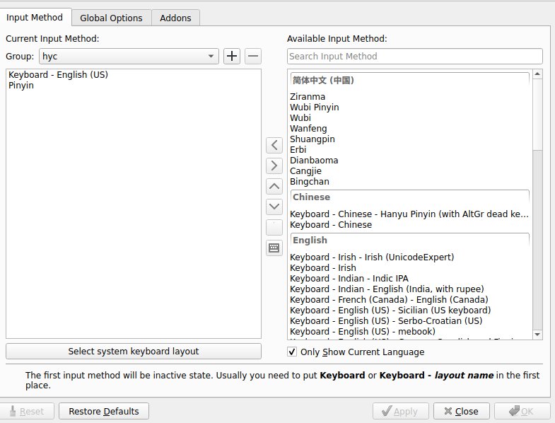
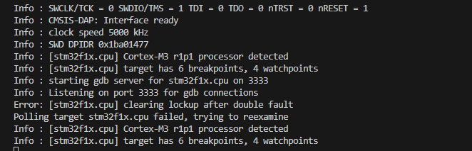
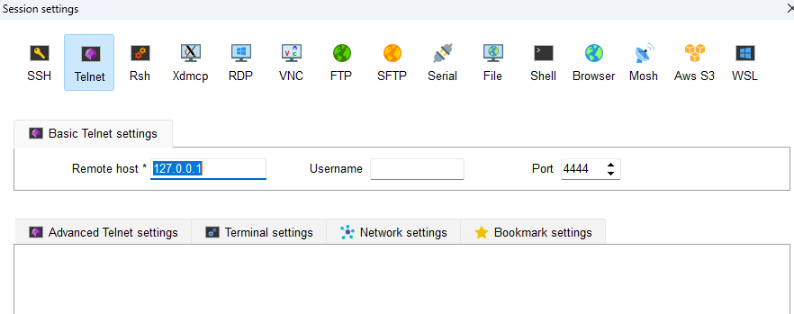

## Ubuntu

### 输入法

https://zhuanlan.zhihu.com/p/508797663

1. 安装

```bash
sudo apt install fcitx5
```

2. 配置

```bash
im-config
```

选择 `fcitx 5`，添加中文语言支持

打开配置添加



3. 美化

[github]: https://github.com/search?q=fcitx5+theme&amp;type=Repositories

4. All In One Config

[web from]:https://www.debuggerx.com/2023/09/20/fcitx5-customizer/

```
curl -sSL https://www.debuggerx.com/fcitx5_customizer/fcitx5_customizer.sh | bash -s -- recommend
```

包括添加词库，关闭非常用快捷键，emoji表情，常用符号，更换主题等多种配置，一键配置解决烦恼。

### 截图

1. 安装

   ```bash
   sudo apt install flameshot
   ```

2. 快捷截图命令，在系统中设置为快捷方式

   ```bash
   flameshot gui -p /home/hyc/Pictures/flameshot -c
   ```

-p 保存路径

gui 顾名思义

-c 复制图片路径

### 剪切板历史记录

1. 安装

   ```bash
   sudo apt install diodon
   ```

2. 快捷键(命令)	

   ```bash
   /usr/bin/diodonrr
   ```

### ZSH

1. 安装

   ```bash
   sudo apt install zsh
   git clone https://github.com/ohmyzsh/oh-my-zsh.git ~/.oh-my-zsh
   cp ~/.oh-my-zsh/templates/zshrc.zsh-template ~/.zshrc
   ```

2. 设置默认

   ```bash
   sudo chsh -s /bin/zsh
   ```

3. 主题

   ```bash
   ## ZSH_THEME = "robbyrussell"
   ## ZSH_THEME = "random"
   ## ZSH_THEME = "refined"
   ## ZSH_THEME = "jtriley"
   ZSH_THEME="pygmalion-virtualenv"
   ```

4. 插件

zsh-syntax-highlighting 高亮

```bash
git clone https://github.com/zsh-users/zsh-syntax-highlighting.git ${ZSH_CUSTOM:-~/.oh-my-sh/custom}/plugins/zsh-syntax-highlighting
```

zsh-autosuggestions 自动补全

```bash
git clone https://github.com/zsh-users/zsh-autosuggestions ${ZSH_CUSTOM:-~/.oh-my-zsh/custom}/plugins/zsh-autosuggestions
```

git-open

```bash
git clone https://github.com/paulirish/git-open.git ${ZSH_CUSTOM:-~/.oh-my-zsh/custom}/plugins/git-open
```


~/.zshrc 处添加 `plugins=(git zsh-syntax-highlighting zsh-autosuggestions)`

5. 配置习惯

    ```bash
    ## close history share
    setopt no_share_history
    ```

6. 开发板前缀设置

   write below in `.bashrc`

```bash
PS1="[%n@%m:%~]"
```

`%n` meaning user name

`%m` meaning machine name

`%~` meaning current path

### Meld - 比较文件差异

一个比较的软件

```bash
sudo apt install meld
```

### Terminator - 终端

```bash
sudo apt install terminator
```

右键个性化设置，有快捷命令

有以下常用命令

```bash
terminator -s #打开布局选项面板
terminator -l single #打开 single 面板
```


### Minicom - 串口

1. 安装

```bash
sudo apt install minicom
```

2. 使用

**打开**：`sudo minicom -D /dev/ttyUSB0 -b 921600`

**退出**：`CTRL + A X`

**菜单**：`CTRL + A`

### SSH

#### 安装

```shell
sudo apt-get install openssh-server
```

#### 登录

ssh 到指定端口 ``ssh xx user@ip``

**如果是转发的流量 加上 -p**

#### 创建公钥

- 配置

``sudo vim /etc/ssh/sshd_config``

PermitRootLogin yes 改为 no

- 重启

``systemctl restart sshd.service``

- 生成公钥

ssh-keygen

- 删除旧的连接认证, 重新生成新的

``ssh-keygen -R +输入服务器的IP``

一个 key 对应一个，需要连接的对应上就行

#### 使用公钥

原理：如果使用私钥 `id_rsa` 登录服务器时候，服务器会检查所登录的用户的 `~/.ssh/authorized_keys` 里搜索是否存在本地的 `id_rsa.pub` 文本，存在的话则允许登录。

```shell
mkdir .ssh
touch authorized_keys
echo id_rsa.pub >> authorized_keys
```

或者主机上执行

```bash
ssh-copy-id ${username}@${remote-server}
```

### 自动登陆

https://blog.csdn.net/deephacking/article/details/134108938

### 桌面图标

创建桌面图标文件, 以 clion 举例，需要注意的有 Exec、Icon

`sudo gedit /usr/share/applictions/clion.desktop`

```bash
[Desktop Entry]
Name=Clion
Exec=/usr/local/bin/clion --no-sandbox %U
Terminal=false
Type=Application
Icon=/usr/local/bin/icon/clion.png
Comment=clion
Categories=Application;
```

重启后加载

### Typora Plugin

地址：https://github.com/obgnail/typora_plugin

使用 **方法二** 安装

1. *[下载](https://github.com/obgnail/typora_plugin/releases/latest) 插件源码的压缩包，并解压。*
2. *进入 Typora 安装路径，找到包含 `window.html` 的文件夹 A（一般是 `Typora/resources/window.html` 或者 `Typora/resources/app/window.html`，推荐使用 everything 找一下）*
3. *打开文件夹 A，将源码的 plugin 文件夹粘贴进该文件夹下。*
4. 打开文件 `A/window.html`。搜索文件内容 `<script src="./app/window/frame.js" defer="defer"></script>` 或者 `<script src="./appsrc/window/frame.js" defer="defer"></script>`，并在后面加入 `<script src="./plugin/index.js" defer="defer"></script>` 保存。
5. *验证：重启 Typora，在正文区域点击鼠标右键，弹出右键菜单栏，如果能看到 `常用插件` 栏目，说明一切顺利。*

ubuntu 的 apt 默认安装的位置为 /usr/share/typora/

```bash 
git clone https://github.com/obgnail/typora_plugin.git
sudo cp -r typora_plugin/plugin /usr/share/typora/resources/
sudo gedit /usr/share/typora/resources/window.html
```


### Balena Etcher

一款烧写镜像的软件

下载地址:

[github]:(https://github.com/balena-io/etcher/releases)

### System Monitor

[web]:https://www.cnblogs.com/jsdy/p/11461277.html

```
sudo add-apt-repository ppa:fossfreedom/indicator-sysmonitor 
sudo apt-get update
sudo apt-get install indicator-sysmonitor
```

多了两个程序，暂不知道是否一定要添加源，怀疑安装这两个程序即可。

System Monitor：在apt中 `gnome-system-monitor`

System Monitor Indicator： 在apt中 `indicator-sysmonitor`

### 剪切板

gnome 下用 copyq，输入 `copyq menu` 可以快速打开。

kde 有自带的


## VSCode

### clangd

#### Setting.json

This is setting.json in vscode, please view [clangd web](https://fanlumaster.github.io/2023/11/30/clangd-all-command-line-options/) for more information. According to the prompt, we should use command `clangd --help` to get more

```json
    "clangd.arguments": [
        "--compile-commands-dir=${workspaceFolder}/build", // 设置.compile-commands.json文件的路径
        // "--completion-style=detailed", // 更详细的补全
        "--header-insertion=never", // 不插入头文件
        "--clang-tidy", // 启用clang-tidy
        "--function-arg-placeholders=false", // 不显示函数参数的占位符
        "--background-index", // 启用后台索引
    ],
   "clangd.fallbackFlags": [
        "-I/home/hyc/Project/X3MKernel_RCID/boot/kernel/include" // add include dir
    ],
```

#### .clangd

In drivers develop, need create `.clangd` like below in work directory,  because there parameters are not supported by clangd.

```bash
CompileFlags:
  Remove: [-fconserve-stack, -fno-allow-store-data-races, -fno-ipa-sra, -fno-var-tracking-assignments, -mpc-relative-literal-loads, -march=*, -mabi=*]
```

#### .clang-tidy (More Tips).

 Also, the file `.clangd` has these configurations of diagnostics. If you need more related information, please view .clangd-tidy document.

[使用 clang-tidy 在 CI 中自动修复代码中简单问题和检测代码问题](https://lrita.github.io/2023/03/21/auto-clang-tidy-cpp-code/)

```bash
Diagnostics:
  ClangTidy:
    Add:
      [
        performance-*,
        bugprone-*,
        portability-*,
        modernize-*,
      ]
    Remove: [
      modernize-use-trailing-return-type,
      Declaration uses identifier*,
      bugprone-reserved-identifier,
      bugprone-easily-swappable-parameters,
      bugprone-assignment-in-if-condition,
      performance-no-int-to-ptr,
    ]
    CheckOptions:
      WarnOnFloatingPointNarrowingConversion: false
```


#### .clang-format (Format code)

clangd 自带 clang-format 程序，使用.clang-format 配置文件即可格式化程序，或者另外安装此拓展。笔者猜测，存在 .clangd 中添加 clang-format 的方法，但由于时间关系并没有尝试或查阅。

### GDB

需要 C/C++插件和 GDB DEBUG 插件

```json
    "configurations": [
        {
            "name": "kernel-debug",
            "type": "cppdbg",
            "request": "launch",
            "miDebuggerServerAddress": "127.0.0.1:1234", //gdb远程连接
            "miDebuggerPath": "aarch64-linux-gnu-gdb", // 调试器路径
            "program": "${workspaceFolder}/vmlinux", // 可执行文件
            "args": [], // 附加参数
            "stopAtEntry": false,
            "cwd": "${workspaceFolder}", // 工作目录
            "environment": [],
            "externalConsole": false,
            "logging": {
                "engineLogging": false
            },
            "MIMode": "gdb",
        }
    ]
```

## ToolChain

### Ninja

使用 `cmake` 生成 `Ninja` 工程文件

```shell
cmake -G Ninja ..
```

使用 ninja 编译工程，会去检索当前目录下的 build.ninja 去构建

```shell
ninja
```

### CMake

#### 交叉编译

参考链接：https://cmake.org/cmake/help/v3.25/manual/cmake.1.html#options

<https://zhuanlan.zhihu.com/p/100367053>

#### 构建静态库和动态库

假设目录结构是

```shell
.
├── build
├── CMakeLists.txt
└── lib
├── CMakeLists.txt
├── hello.cpp
└── hello.h
```

其中 hello 为一个简单的库

**外部 cmake 为**

```cmake
PROJECT(HELLO)
ADD_SUBDIRECTORY(lib bin) #lib为包含目录，bin为构建生成的目录
```

**内部 cmake 为**

```cmake
SET(LIBHELLO_SRC hello.cpp)
ADD_LIBRARY(hello SHARED ${LIBHELLO_SRC})
```

此时直接执行 cmake 可以在 build 生成可执行程序

**解析**

```cmake
## - hello：就是正常的库名，⽣成的名字前⾯会加上lib，最终产⽣的⽂件是libhello.so
## - SHARED，动态库 STATIC，静态库
## - ${LIBHELLO_SRC} ：源⽂件
ADD_LIBRARY(hello SHARED ${LIBHELLO_SRC})
```

#### **添加非标准库**

```cmake
## 对应gcc的-L指定目录
target_link_directories(prj_test PRIVATE lib)
target_link_libraries(prj_test PRIVATE libfun.a)
```

#### Create compile-commands.json

just define `CMAKE_EXPORT_COMPILE_COMMANDS` in cmake。

```bash
cmake ${ohter_para} -DCMAKE_EXPORT_COMPILE_COMMANDS=1
```

or, in txt

```bash
set(CMAKE_EXPORT_COMPILE_COMMANDS true)
```

#### Debug Info

Add text below in CMakeLists.txt

```bash
set(CMAKE_CXX_FLAGS "${CMAKE_CXX_FLAGS} -g")
set(CMAKE_C_FLAGS "${CMAKE_C_FLAGS} -g")
```

or add the text in cmake parameter.

```bash
-DCMAKE_CXX_FLAGS="${CMAKE_CXX_FLAGS} -g"
-DCMAKE_CXX_FLAGS="${CMAKE_CXX_FLAGS} -g"
```

Just like this, gcc's way also.

#### static

相当于编译的时候添加的命令

```
#SET(CMAKE_EXE_LINKER_FLAGS "-static")
```

### **OpenOCD**

**vscode 使用 openocd 的方法链接：**

[**https://www.jianshu.com/p/ca26b2227a58**](https://www.jianshu.com/p/ca26b2227a58)

#### 开启

```shell
openocd -f openocd.cfg
```



openocd 会默认在当前路径搜索 `openocd.cfg` 如果有的话会执行此程序，除非使用命令-f 指定。

#### 进入后台

比如使用 MobaXterm



#### 烧录

在后台输入此命令即可烧录

```shell
program build/HELLO.elf verify reset
exit
```

或者输入

```shell
openocd -f openocd.cfg -c 'program build/HELLO.elf reset exit'
```

注意：这个方法需要指定 `cfg`，也就是前面的 `-f openocd.cfg`，这个必须要被包含，否则会导致初始化失败

#### 更简单的方法（本地）

openocd.cfg 配置文件里面能够写入执行程序，比如 reset run shutdown 等

值得注意的是，如果使用这个方法并写入 `shutdown`，只是烧录程序，没办法调试。

比如烧录程序的例子

```shell
择 cmsis-dap
adapter driver cmsis-dap

#swd 模式
transport select swd

source [find target/stm32f1x.cfg]

#10M xk
adapter speed 10000

program build/HELLO.elf

reset run

shutdown
```

### MakeFile

参考链接：<https://www.cnblogs.com/QG-whz/p/5461110.html>

命令：

| 指令                                                         | 内容原文                                          | 意思                                          |
| ------------------------------------------------------------ | ------------------------------------------------- | --------------------------------------------- |
| -b, -m                                                       | Ignored for compatibility.                        | 为了兼容性而忽略。                            |
| -B, --always-make                                            | Unconditionally make all targets.                 | 无条件地构建所有目标。                        |
| -C DIRECTORY                                                 | Change to DIRECTORY before doing anything.        | 在执行任何操作之前切换到 DIRECTORY 目录。     |
| -d                                                           | Print lots of debugging information.              | 打印大量调试信息。                            |
| --debug [= FLAGS]                                            | Print various types of debugging information.     | 打印各种类型的调试信息。                      |
| -e, --environment-overrides                                  | Environment variables override makefiles.         | 环境变量覆盖 makefiles 中的定义。             |
| -f FILE, --file = FILE, --makefile = FILE                    | Read FILE as a makefile.                          | 以 FILE 作为 makefile 读取。                  |
| -h, --help                                                   | Print this message and exit.                      | 打印此消息并退出。                            |
| -i, --ignore-errors                                          | Ignore errors from commands.                      | 忽略命令中的错误。                            |
| -I DIRECTORY                                                 | Search DIRECTORY for included makefiles.          | 在 DIRECTORY 中搜索包含的 makefile。          |
| -j [N], --jobs [= N]                                         | Allow N jobs at once; infinite jobs with no arg.  | 允许同时进行 N 个作业；不带参数表示无限作业。 |
| -k, --keep-going                                             | Keep going when some targets can't be made.       | 在某些目标无法构建时继续。                    |
| -l [N], --load-average [= N], --max-load [= N]               | Don't start multiple jobs unless load is below N. | 除非负载低于 N，否则不启动多个作业。          |
| -L, --check-symlink-times                                    | Use the latest mtime between symlinks and target. | 在符号链接和目标之间使用最新的修改时间。      |
| -n, --just-print, --dry-run, --recon                         | Don't actually run any commands; just print them. | 不实际运行任何命令；仅打印命令。              |
| -o FILE, --old-file = FILE, --assume-old = FILE              | Consider FILE to be very old and don't remake it. | 将 FILE 视为非常旧，不重新构建。              |
| -p, --print-data-base                                        | Print make's internal database.                   | 打印 make 的内部数据库。                      |
| -q, --question                                               | Run no commands; exit status says if up to date.  | 不执行任何命令；退出状态表示是否为最新。      |
| -r, --no-builtin-rules                                       | Disable the built-in implicit rules.              | 禁用内置的隐含规则。                          |
| -R, --no-builtin-variables                                   | Disable the built-in variable settings.           | 禁用内置的变量设置。                          |
| -s, --silent, --quiet                                        | Don't echo commands.                              | 不回显命令。                                  |
| -S, --no-keep-going, --stop                                  | Turns off -k.                                     | 关闭-k 选项。                                 |
| -t, --touch                                                  | Touch targets instead of remaking them.           | 触摸目标，而不是重新构建。                    |
| -v, --version                                                | Print the version number of make and exit.        | 打印 make 的版本号并退出。                    |
| -w, --print-directory                                        | Print the current directory.                      | 打印当前目录。                                |
| --no-print-directory                                         | Turn off -w, even if it was turned on implicitly. | 关闭-w 选项，即使它是隐含开启的。             |
| -W FILE, --what-if = FILE, --new-file = FILE, --assume-new = FILE | Consider FILE to be infinitely new.               | 将 FILE 视为无限新。                          |
| --warn-undefined-variables                                   | Warn when an undefined variable is referenced.    | 当引用未定义的变量时发出警告。                |

## DOCKER 容器

### 添加容器

举例：

```shell
docker run --restart always -d --name=OpenWRT --network macnet --privileged unifreq/openwrt-aarch64 /sbin/init
```

名字：`OpenWRT` 使用网络模式：`macnet ` 镜像名字：`unifreq/openwrt-aarch64`

### 进入容器

```shell
doker exec -it [容器名或者id] bash
```

### 退出容器

快捷键 `ctrl+p+q`

或命令 输入命令 `exit`

### 查看容器

```shell
doker ps
```

#### **镜像**

```shell
拉取镜像
docker pull xxx:tag

## 镜像保存为 tar
docker save -o xxx.tar xxx:tag

## 导入本地镜像
docker load --input xxx.tar
## or
cat xxx.tar.gz | docker import - openwrt/lede

## 查看镜像
docker image ls
```

## Clang Format

Use the file named .clang-format for formatting , and the configuration file is shown below.

```bash
## Generated from CLion C/C++ Code Style settings
BasedOnStyle: LLVM                         ## 基于 LLVM 样式设置
AccessModifierOffset: -4                   ## 访问修饰符偏移量
AlignAfterOpenBracket: Align               ## 对齐开放括号
AlignConsecutiveAssignments: None          ## 不对齐连续赋值
AlignOperands: DontAlign                   ## 不对齐操作数
AllowAllArgumentsOnNextLine: false         ## 不允许所有参数在下一行
AllowAllConstructorInitializersOnNextLine: false  ## 不允许所有构造函数初始化器在下一行
AllowAllParametersOfDeclarationOnNextLine: false  ## 不允许声明的所有参数在下一行
AllowShortBlocksOnASingleLine: Always      ## 总是允许短块在一行
AllowShortCaseLabelsOnASingleLine: true    ## 允许短 case 标签在一行
AllowShortFunctionsOnASingleLine: All      ## 允许所有短函数在一行
AllowShortIfStatementsOnASingleLine: Always  ## 总是允许短 if 语句在一行
AllowShortLambdasOnASingleLine: All       ## 允许所有短 lambda 表达式在一行
AllowShortLoopsOnASingleLine: true        ## 允许短循环在一行
AlwaysBreakAfterReturnType: None           ## 不总是在返回类型后换行
AlwaysBreakTemplateDeclarations: Yes       ## 总是在模板声明后换行
BreakBeforeBraces: Custom                 ## 自定义大括号前换行设置
BraceWrapping:
  AfterCaseLabel: false                    ## case 标签后不换行
  AfterClass: true                         ## 类后换行
  AfterControlStatement: Never             ## 控制语句后不换行
  AfterEnum: true                          ## 枚举后换行
  AfterFunction: true                      ## 函数后换行
  AfterNamespace: true                     ## 命名空间后换行
  AfterUnion: true                         ## 联合体后换行
  BeforeCatch: true                        ## catch 前换行
  BeforeElse: true                         ## else 前换行
  IndentBraces: false                      ## 不缩进大括号
  SplitEmptyFunction: false                ## 不在空函数体内换行
  SplitEmptyRecord: true                   ## 在空记录内换行
BreakBeforeBinaryOperators: NonAssignment  ## 在非赋值二元运算符前换行
BreakBeforeTernaryOperators: true         ## 在三元运算符前换行
BreakConstructorInitializers: BeforeColon  ## 在冒号前换行
BreakInheritanceList: BeforeColon          ## 在冒号前换行
ColumnLimit: 0                            ## 列限制为 0
CompactNamespaces: false                  ## 命名空间不紧凑
ContinuationIndentWidth: 4                ## 续行缩进宽度为 4
IndentCaseLabels: true                    ## 缩进 case 标签
IndentPPDirectives: None                  ## 不缩进预处理指令
IndentWidth: 4                            ## 缩进宽度为 4
KeepEmptyLinesAtTheStartOfBlocks: true    ## 在块开始保留空行
MaxEmptyLinesToKeep: 2                    ## 保留的最大空行数为 2
NamespaceIndentation: None                ## 不缩进命名空间
ObjCSpaceAfterProperty: false             ## 属性后没有空格
ObjCSpaceBeforeProtocolList: true         ## 协议列表前有空格
PointerAlignment: Right                   ## 指针右对齐
ReflowComments: false                     ## 不重新排列注释
SpaceAfterCStyleCast: false               ## C 风格类型转换后没有空格
SpaceAfterLogicalNot: false               ## 逻辑非后没有空格
SpaceAfterTemplateKeyword: false          ## 模板关键字后没有空格
SpaceBeforeAssignmentOperators: true      ## 赋值运算符前有空格
SpaceBeforeCpp11BracedList: false         ## C++11 花括号列表前没有空格
SpaceBeforeCtorInitializerColon: true     ## 构造函数初始化列表冒号前有空格
SpaceBeforeInheritanceColon: false        ## 继承列表冒号前没有空格
SpaceBeforeParens: ControlStatements      ## 控制语句前的括号有空格
SpaceBeforeRangeBasedForLoopColon: true   ## 基于范围的 for 循环冒号前有空格
SpaceInEmptyParentheses: false            ## 空括号内没有空格
SpacesBeforeTrailingComments: 0           ## 尾注释前有 0 个空格
SpacesInAngles: false                     ## 尖括号内没有空格
SpacesInCStyleCastParentheses: false      ## C 风格类型转换的括号内没有空格
SpacesInContainerLiterals: false          ## 容器文字中没有空格
SpacesInParentheses: false                ## 括号内没有空格
SpacesInSquareBrackets: false             ## 方括号内没有空格
TabWidth: 4                               ## 制表符宽度为 4
UseTab: Never                             ## 不使用制表符
SortIncludes: false						  ## 不排序头文件 

```

## GIT 版本控制

### 常用命令

| 命令                  | 功能                                                         |
| --------------------- | ------------------------------------------------------------ |
| git init              | 创建为可管理仓库                                             |
| git status            | 查看当前版本状态                                             |
| git add               | 添加内容到仓库 一般 ``git add . `` 表示全部添加              |
| git commit            | 提交到本地仓库 需要添加注释 具体为 ``git commit -m “user commit`` |
| git remote add origin | 与网络仓库绑定 ``git remote add origin git@github.com:FlameKm/test.git`` |
| git push              | 提交到网上 一般举例 ``git push origin master``               |
| git log               | 日志                                                         |
| git clone             | 克隆到本地                                                   |

### 下载

有些需要绑定, 即 ``ssh key``

使用命令

```shell
git clone
```

指定分支

```bash
git clone -b <指定分支名> <远程仓库地址> 
```

### 上传

[如何使用 git 命令行上传项目到 github_DreamMakers 的博客-CSDN 博客_git 新建仓库上传代码](https://blog.csdn.net/majinggogogo/article/details/81152938)

新建文件夹 test

在 test 内输入 ``git init``


放入代码

```shell
加全部内容
git add . 

#添加到本地仓库
git commit -m “注释内容” 

## 绑定本地仓库
git remote add origin <git@github.com:FlameKm/test.git>

## 更新
git pull --rebase origin 分支名

## 分支
git branch -M main

## 提交
git push -u origin main
```

**在 github 新建一个仓库, 与本地关联**

**似乎需要 github(或其它)ssh key 绑定本地, 否则不安全**，（是可以直接通过 ssh 访问 github 帐号，不需要密码登陆，一种安全验证）

总结如下, GitHub 新建文件夹时也会提醒

```shell
git init
git add README.md
git commit -m "first commit"
git branch -M main
git remote add origin git@github.com:xxx.git
git push -u origin main
```

### 更新

更新到仓库

```shell
查变更
git status

#更新全部修改到本地仓库 
git add .

#提交
git commit -m "说明信息"

#上传到指定分支
git push origin master
```

更新到本地

```bash
git pull 
git pull origin <分支名称>
```


### 版本回退

[Git 使用教程, 最详细，最傻瓜，最浅显，真正手把手教 - 知乎 (zhihu.com)](https://zhuanlan.zhihu.com/p/30044692)

### 子模块 submodule

- 添加

```shell
git submodule add <https://github.com/xxx/child.git>
```

- 拉取方式一

```shell
git submodule init & git submodule update
```

- 拉取方式二

```shell
git clone --recurse-submodules <https://github.com/xxx/parent.git>
```

  也可以设置 `submodule.recurse` 为 `true`，这样每次拉去都是带这个参数的拉去 `--recurse-submodules`

- 删除：

```shell
rm -rf 子模块目录 #删除子模块目录及源码
vim .gitmodules ## 删除项目目录下.gitmodules 文件中子模块相关条目
vim .git/config ## 删除配置项中子模块相关条目
rm .git/modules/xxx #删除模块下的子模块目录，每个子模块对应一个目录，注意只删除对应的子模块目录即可

## 执行完成后，再执行添加子模块命令即可，如果仍然报错，执行如下：
git rm -f --cached 子模块名称
```


### 重新排除.gitignore

```shell
git rm -r --cached .
git add .
```

### 主干开发

1. 新建分支

```Shell
## 检查
git checkout main
git pull #仅主分支可用不带--base
## 新建分支
git checkout -b myfeature
```

2. 分支正常开发后提交

```Shell
git add files.c
git commit -m "[xx]: xxx"
```

3. 同步主干

```Shell
git fetch origin
```

4. 同步主干内容

```Shell
git rebase origin/main
```

5. 推送到仓库

```Shell
git push -u origin myfeature 
```

### Commit 撤销

1. 只改变注释 `git commit --amend` 
2. 撤回到上一个分支 `git reset --soft HEAD^`， soft 参数查看 RESET 章节, 

### RESET

- **--mixed**  不删除工作空间改动代码，撤销 commit，并且撤销 git add . 操作
- **--soft** 不删除工作空间改动代码，撤销 commit，不撤销 git add . 
- **--hard ** 删除工作空间改动代码，撤销 commit，撤销 git add .

### Commit Head

- feat - 新功能 feature

- fix - 修复 bug

- docs - 文档注释

- style - 代码格式(不影响代码运行的变动)

- refactor - 重构、优化(既不增加新功能，也不是修复 bug)

- perf - 性能优化

- test - 增加测试

- chore - 构建过程或辅助工具的变动

- revert - 回退

- build - 打包

